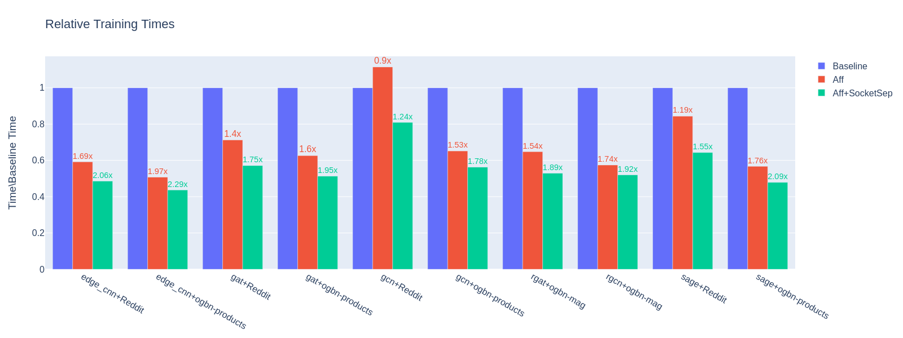

CPU Affinity for PyG Workloads
==============================

The performance of :pyg:`PyG` workloads using CPU can be significantly improved by setting a proper affinity mask.
Processor affinity, or core binding, is a modification of the native OS queue scheduling algorithm that enables an application to assign a specific set of cores to processes or threads launched during its execution on the CPU.
In consequence, it increases the overall effective hardware utilisation by minimizing core stalls and memory bounds.
It also secures CPU resources to critical processes or threads, even if the system is under heavy load.

CPU affinity targets the two main performance-critical regions:

* **Execution bind:** Indicates a core where process/thread will run.
* **Memory bind:** Indicates a preferred memory area where memory pages will be bound (local areas in NUMA machine).

The following article discusses readily available tools and environment settings that one can use to maximize the performance of Intel CPUs with :pyg:`PyG`.

.. note::
    Overall, CPU affinity can be a useful tool for improving the performance and predictability of certain types of applications, but one configuration does not necessarily fit all cases: it is important to carefully consider whether CPU affinity is appropriate for your use case, and to test and measure the impact of any changes you make.

Using CPU affinity and :attr:`filter_per_worker`
------------------------------------------------

Each :pyg:`PyG` workload can be parallelized using the :pytorch:`PyTorch` iterator class :class:`MultiProcessingDataLoaderIter`, which is automatically enabled in case :obj:`num_workers > 0` is passed to a :class:`torch.utils.data.DataLoader`.
Under the hood, it creates :obj:`num_workers` many sub-processes that will run in parallel to the main process.
Setting a CPU affinity mask for the data loading processes places :class:`~torch.utils.data.DataLoader` worker threads on specific CPU cores.
In effect, it allows for more efficient data batch preparation by allocating pre-fetched batches in local memory.
Every time a process or thread moves from one core to another, registers and caches need to be flushed and reloaded.
This can become very costly if it happens often, and threads may also no longer be close to their data, or be able to share data in a cache.

Since :pyg:`PyG` (2.3 and beyond), :class:`~torch_geometric.loader.NodeLoader` and :class:`~torch_geometric.loader.LinkLoader` classes officially support a native solution for CPU affinity using the :class:`torch_geometric.loader.AffinityMixin` context manager.
CPU affinity can be enabled via the :meth:`~torch_geometric.loader.AffinityMixin.enable_cpu_affinity` method for :obj:`num_workers > 0` use-cases,
and will guarantee that a separate core is assigned to each worker at initialization.
A user-defined list of core IDs may be assigned using the :attr:`loader_cores` argument.
Otherwise, cores will be assigned automatically, starting at core ID 0.
As of now, only a single core can be assigned to a worker, hence multi-threading is disabled in workers' processes by default.
The recommended number of workers to start with lies between :obj:`[2, 4]`, and the optimum may vary based on workload characteristics:

.. code-block:: python

    loader = NeigborLoader(
        data,
        num_workers=3,
        filter_per_worker=True,
        ...,
    )

    with loader.enable_cpu_affinity(loader_cores=[0, 1, 2]):
        for batch in loader:
            pass

It is generally adivisable to use :obj:`filter_per_worker=True` when enabling multi-process dataloaders.
The workers then prepare each mini-batch: first by sampling the node indices using pre-defined a sampler, and secondly filtering node and edge features according to sampled nodes and edges.
The filtering function selects node feature vectors from the complete input :class:`~torch_geometric.data.Data` tensor loaded into DRAM.
This is a memory-expensive call which takes a significant time of each :class:`~torch.utisl.data.DataLoader` iteration.
By default :attr:`filter_per_worker` is set to :attr:`False`, which causes that this execution is sent back to the main process.
However, this can cause performance issues, because the main process will not be able to process all requests efficiently, especially with larger number of workers.
When :attr:`filter_per_worker` is set to :attr:`True`, each worker's subprocess performs the filtering within it's CPU resource.
This, main process resources are relieved and can be secured only for GNN computation.

Binding processes to physical cores
-----------------------------------

Following general performance tuning principles, it is advisable to use only physical cores for deep learning workloads.
For example, while two logical threads run :obj:`GEMM` at the same time, they will be sharing the same core resources causing front end bound, such that the overhead from this front end bound is greater than the gain from running both logical threads at the same time.
This is because OpenMP threads will contend for the same :obj:`GEMM` execution units, see `here <https://pytorch.org/tutorials/intermediate/torchserve_with_ipex.html>`__.

The binding can be done in many ways, however the most common tools are:

* :obj:`numactl` (only on Linux):

  .. code-block:: console

     --physcpubind=<cpus>, -C <cpus>  or --cpunodebind=<nodes>, -N <nodes>

* `Intel OMP <https://www.intel.com/content/www/us/en/developer/articles/technical/how-to-get-better-performance-on-pytorchcaffe2-with-intel-acceleration.html>`__ :obj:`libiomp`:

  .. code-block:: console

     export KMP_AFFINITY=granularity=fine,proclist=[0-<physical_cores_num-1>],explicit

* GNU :obj:`libgomp`:

  .. code-block:: console

     export GOMP_CPU_AFFINITY="0-<physical_cores_num-1>"

Isolating the :class:`~torch.utils.data.DataLoader` process
-----------------------------------------------------------

For best performance, it is required combine main process affinity using the tools listed above, with the multi-process :class:`~torch.utils.data.DataLoader` affinity settings.
In each parallelized :pyg:`PyG` workload execution, the main process performs message passing updates over GNN layers, while the :class:`~torch.utils.data.DataLoader` workers sub-processes take care of fetching and pre-processing data to be passed to a GNN model.
It is advisable to isolate the CPU resources made available to these two processes to achieve the best results.
To do this, CPUs assigned to each affinity mask should be mutually exclusive.
For example, if four :class:`~torch.utils.data.DataLoader` workers are assigned to CPUs :obj:`[0, 1, 2, 3]`, the main process should use the rest of available cores, *i.e.* by calling:

.. code-block:: console

   numactl -C 4-(N-1) --localalloc python …

where :obj:`N` is the total number of physical cores, with the last CPU having core ID :obj:`N-1`.
Adding :obj:`--localalloc` improves local memory allocation and keeps the cache closer to active cores.

Dual socket CPU separation
~~~~~~~~~~~~~~~~~~~~~~~~~~

With dual-socket CPUs, it might be beneficial to further isolate the processes between the sockets.
This leads to decreased frequency of remote memory calls for the main process.
The goal is to `utilize high-speed cache on local memory and reduces memory bound caused by migrating cached data between NUMA nodes <https://pytorch.org/tutorials/intermediate/torchserve_with_ipex.html>`__.
This can be achieved by using :class:`~torch.utils.data.DataLoader` affinity, and launching main process on the cores of the second socket, *i.e.* with:

.. code-block:: console

   numactl -C M-(N-1) -m 1 python …

where :obj:`M` is the :obj:`cpuid` of the first core of the second CPU socket.
Adding a complementary memory-allocation flag :obj:`-m 1` prioritizes cache allocation on the same NUMA node, where the main process is running (alternatively for less strict memory allocation use :obj:`--preferred 1`).
This makes the data readily available on the same socket where the computation takes place.
Using this setting is very workload-specific and may require some fine-tuning, as one needs to manage a trade-off between using more OMP threads vs. limiting the number of remote memory calls.

Improving memory bounds
-----------------------

Following the CPU performance optimization guidelines for :pytorch:`PyTorch`, it is also advised for :pyg:`PyG` to use :obj:`jemalloc` or :obj:`TCMalloc`.
These generally can reach better memory usage than the default :pytorch:`PyTorch` `memory allocator <https://pytorch.org/tutorials/intermediate/torchserve_with_ipex_2.html>`__ :obj:`PTMalloc`.
A `non-default memory allocator <https://pytorch.org/tutorials/recipes/recipes/tuning_guide.html>`__ can be specified using :obj:`LD_PRELOAD` prior to script execution.

Quick start guidelines
----------------------

The general guidelines for achieving the best performance with CPU affinity can be summarized in the following steps:

#. Test if your dataset benefits from using parallel data loaders.
   For some datasets, it might be more beneficial to use a plain serial data loader, especially when the dimensions of the input :class:`~torch_geometric.data.Data` are relatively small.
#. Enable multi-process data loaders by setting :attr:`num_workers > 0`.
   A good estimate for :obj:`num_workers` lies in the range :obj:`[2, 4]`.
   However, for more complex datasets you might want to experiment with larger number of workers.
   Enable :pyg:`PyG` data loaders with :obj:`filter_per_worker=True` and use the :meth:`~torch_geometric.loader.AffinityMixin.enable_cpu_affinity` feature to affinitize :class:`~torch.utils.data.DataLoader` cores.
#. Bind execution to physical cores.
   Alternatively, hyperthreading can be disabled completely at a system-level.
#. Separate the cores used for main process from the data loader workers' cores by using :obj:`numactl`, :obj:`KMP_AFFINITY` of the :obj:`libiomp5` library, or :obj:`GOMP_CPU_AFFINITY` of the :obj:`libgomp` library.
#. Find the optimum number of OMP threads for your workload.
   A good starting point is :obj:`N - num_workers`.
   Generally, well-parallelized models will benefit from many OMP threads.
   However, if your model computation flow has interlaced parallel and serial regions, the performance will decrease due to resource allocation needed for spawning and maintaining threads between parallel regions.
#. When using a dual-socket CPU, you might want to experiment with assigning data loading to one socket and main process to another socket with memory allocation (:obj:`numactl -m`) on the same socket where the main process is executed.
   This leads to best cache-allocation and often overweighs the benefit of using more OMP threads.
#. An additional boost in performance can be obtained by using non-default memory allocator, such as :obj:`jemalloc` or :obj:`TCMalloc`.
#. Finding an optimal setup for the CPU affinity mask is a problem of managing the proportion of CPU time spent in each iteration for loading and preparing the data vs. time spent during GNN execution.
   Different results may be obtained by changing model hyperparameters, such as the batch size, number of sampled neighbors, and the number of layers.
   As a general rule, workloads which require sampling a complex graph may benefit more from reserving some CPU resources just for the data preparation step.

Example results
---------------

The figure below presents the outcome of applying CPU affinity mask to :obj:`benchmark/training/training_benchmark.py`.
Measurements were taken for a variable number of workers, while other hyperparameters for each benchmark were constant: :obj:`--warmup 0 --use-sparse-tensor --num-layers 3 --num-hidden-channels 128 --batch-sizes 2048`.
Three different affinity configurations are presented:

* **Baseline** - only :obj:`OMP_NUM_THREADS` changes:

.. code-block:: console

   OMP_NUM_THREADS=(N-num_workers) python training_benchmark.py --num-workers …

* **Aff** - data loader process on first socket, main process on first and second socket, 98-110 threads:

.. code-block:: console

   LD_PRELOAD=(path)/libjemalloc.so (path)/libiomp5.so MALLOC_CONF=oversize_threshold:1,background_thread:true,metadata_thp:auto OMP_NUM_THREADS=(N-num_workers) KMP_AFFINITY=granularity=fine,compact,1,0 KMP_BLOCKTIME=0 numactl -C <num_workers-(N-1)> --localalloc python training_benchmark.py --cpu-affinity --filter_per_worker --num-workers …

* **Aff+SocketSep** - data loader process on first socket, main process on second socket, 60 threads:

.. code-block:: console

   LD_PRELOAD=(path)/libjemalloc.so (path)/libiomp5.so MALLOC_CONF=oversize_threshold:1,background_thread:true,metadata_thp:auto OMP_NUM_THREADS=(N-M) KMP_AFFINITY=granularity=fine,compact,1,0 KMP_BLOCKTIME=0 numactl -C <M-(N-1)> -m 1 python training_benchmark.py --cpu-affinity --filter_per_worker --num-workers ...

Training times for each model/dataset combination were obtained by taking a mean of results at a variable number of dataloader workers: :obj:`[0, 2, 4, 8, 16]` for the baseline and :obj:`[2, 4, 8, 16]` workers for each affinity configuration.
Then, the affinity means were normalized with respect to the mean baseline measurement.
This value is denoted on the :math:`y`-axis.
The labels above each result indicate the end-to-end performance gain from using the discussed configuration.
Over all model/dataset samples, the average training time is decreased by **1.53x** for plain affinity and **1.85x** for the affinity with socket separation.

    Pre-production dual-socket Intel(R) Xeon(R) Platinum 8481C @ 2.0Ghz (2 x 56) cores CPU.
