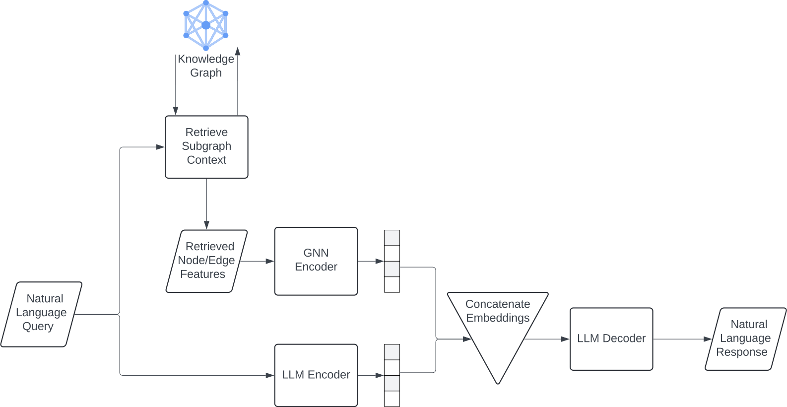
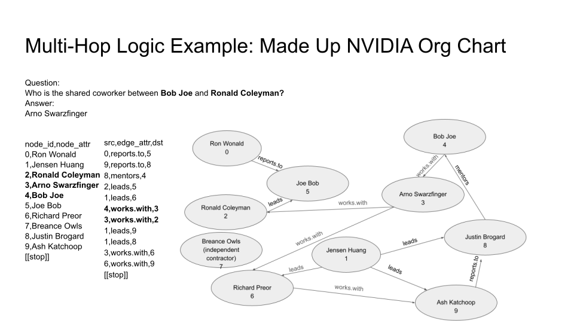
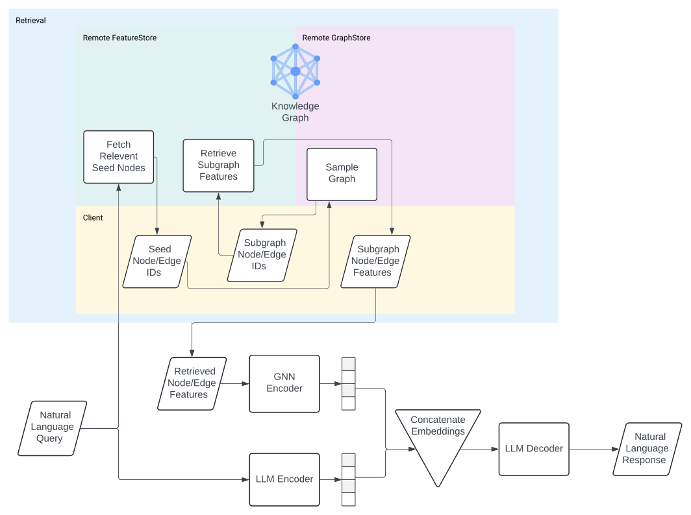

Working with LLM RAG in Pytorch Geometric
=========================================

This series aims to provide a starting point and for
multi-step LLM Retrieval Augmented Generation
(RAG) using Graph Neural Networks.

Motivation
----------

As Large Language Models (LLMs) quickly grow to dominate industry, they
are increasingly being deployed at scale in use cases that require very
specific contextual expertise. LLMs often struggle with these cases out
of the box, as they will hallucinate answers that are not included in
their training data. At the same time, many business already have large
graph databases full of important context that can provide important
domain-specific context to reduce hallucination and improve answer
fidelity for LLMs. Graph Neural Networks (GNNs) provide a means for
efficiently encoding this contextual information into the model, which
can help LLMs to better understand and generate answers. Hence, theres
an open research question as to how to effectively use GNN encodings
efficiently for this purpose, that the tooling provided here can help
investigate.

Architecture
------------

To model the use-case of RAG from a large knowledge graph of millions of
nodes, we present the following architecture:

Graph RAG as shown in the diagram above follows the following order of
operations:

0. To start, not pictured here, there must exist a large knowledge graph
   that exists as a source of truth. The nodes and edges of this
   knowledge graph

During inference time, RAG implementations that follow this architecture
are composed of the following steps:

1. Tokenize and encode the query using the LLM Encoder
2. Retrieve a subgraph of the larger knowledge graph (KG) relevant to
   the query and encode it using a GNN
3. Jointly embed the GNN embedding with the LLM embedding
4. Utilize LLM Decoder to decode joint embedding and generate a response

Encoding a Large Knowledge Graph
================================

To start, a Large Knowledge Graph needs to be created from triplets or
multiple subgraphs in a dataset.

Example 1: Building from Already Existing Datasets
--------------------------------------------------

In most RAG scenarios, the subset of the information corpus that gets
retrieved is crucial for whether the appropriate response to the LLM.
The same is true for GNN based RAG. For example, consider the
WebQSPDataset.

.. code:: python

    from torch_geometric.datasets import WebQSPDataset

    num_questions = 100
    ds = WebQSPDataset('small_sample',
                    load_dataset_kwargs={
                        'split': {'train': f'train[:{num_questions}]',
                        'validation': f'validation[:{num_questions}]',
                        'test': f'test[:{num_questions}]'}
                        })

    ds.raw_dataset

WebQSP is a dataset that is based off of a subset of the Freebase
Knowledge Graph, which is an open-source knowledge graph formerly
maintained by Google. For each question-answer pair in the dataset, a
subgraph was chosen based on a Semantic SPARQL search on the larger
knowledge graph, to provide relevent context on finding the answer. So
each entry in the dataset consists of:
- A question to be answered
- The answer
- A knowledge graph subgraph of Freebase that has the context
needed to answer the question.

.. code:: python

    ds.raw_dataset['train']

    >>> Dataset({
        features: ['id', 'question', 'answer', 'q_entity', 'a_entity', 'graph', 'choices'],
        num_rows: 100
    })

.. code:: python

    ds.raw_dataset['train'][0]

    >>> {'id': 'WebQTrn-0',
     'question': 'what is the name of justin bieber brother',
     'answer': ['Jaxon Bieber'],
     'q_entity': ['Justin Bieber'],
     'a_entity': ['Jaxon Bieber'],
     'graph': [['P!nk', 'freebase.valuenotation.is_reviewed', 'Gender'],
      ['1Club.FM: Power', 'broadcast.content.artist', 'P!nk'],
      ...],
     'choices': []}

Although this dataset can be trained on as-is, a couple problems emerge
from doing so:
1. A retrieval algorithm needs to be implemented and
executed during inference time, that might not appropriately correspond
to the algorithm that was used to generate the dataset subgraphs.
1. The dataset as is not stored computationally efficiently, as there will
exist many duplicate nodes and edges that are shared between the
questions.

As a result, it makes sense in this scenario to be able to encode all
the entries into a large knowledge graph, so that duplicate nodes and
edges can be avoided, and so that alternative retrieval algorithms can
be tried. We can do this with the LargeGraphIndexer class:

.. code:: python

    from torch_geometric.data import LargeGraphIndexer, Data, get_features_for_triplets_groups
    from torch_geometric.nn.nlp import SentenceTransformer
    import time
    import torch
    import tqdm
    from itertools import chain
    import networkx as nx

.. code:: python

    raw_dataset_graphs = [[tuple(trip) for trip in graph] for graph in ds.raw_dataset['train']['graph']]
    print(raw_dataset_graphs[0][:10])

    >>> [('P!nk', 'freebase.valuenotation.is_reviewed', 'Gender'), ('1Club.FM: Power', 'broadcast.content.artist', 'P!nk'), ...]

To show the benefits of this indexer in action, we will use the
following model to encode this sample of graphs using LargeGraphIndexer,
along with naively.

.. code:: python

    device = torch.device("cuda" if torch.cuda.is_available() else "cpu")
    model = SentenceTransformer(model_name='sentence-transformers/all-roberta-large-v1').to(device)

First, we compare the clock times of encoding using both methods.

.. code:: python

    # Indexing question-by-question
    dataset_graphs_embedded = []
    start = time.time()
    for graph in tqdm.tqdm(raw_dataset_graphs):
        nodes_map = dict()
        edges_map = dict()
        edge_idx_base = []

        for src, edge, dst in graph:
            # Collect nodes
            if src not in nodes_map:
                nodes_map[src] = len(nodes_map)
            if dst not in nodes_map:
                nodes_map[dst] = len(nodes_map)

            # Collect edge types
            if edge not in edges_map:
                edges_map[edge] = len(edges_map)

            # Record edge
            edge_idx_base.append((nodes_map[src], edges_map[edge], nodes_map[dst]))

        # Encode nodes and edges
        sorted_nodes = list(sorted(nodes_map.keys(), key=lambda x: nodes_map[x]))
        sorted_edges = list(sorted(edges_map.keys(), key=lambda x: edges_map[x]))

        x = model.encode(sorted_nodes, batch_size=256)
        edge_attrs_map = model.encode(sorted_edges, batch_size=256)

        edge_attrs = []
        edge_idx = []
        for trip in edge_idx_base:
            edge_attrs.append(edge_attrs_map[trip[1]])
            edge_idx.append([trip[0], trip[2]])

        dataset_graphs_embedded.append(Data(x=x, edge_index=torch.tensor(edge_idx).T, edge_attr=torch.stack(edge_attrs, dim=0)))

    print(time.time()-start)

    >>> 121.68579435348511

.. code:: python

    # Using LargeGraphIndexer to make one large knowledge graph
    from torch_geometric.data.large_graph_indexer import EDGE_RELATION

    start = time.time()
    all_triplets_together = chain.from_iterable(raw_dataset_graphs)
    # Index as one large graph
    print('Indexing...')
    indexer = LargeGraphIndexer.from_triplets(all_triplets_together)

    # first the nodes
    unique_nodes = indexer.get_unique_node_features()
    node_encs = model.encode(unique_nodes, batch_size=256)
    indexer.add_node_feature(new_feature_name='x', new_feature_vals=node_encs)

    # then the edges
    unique_edges = indexer.get_unique_edge_features(feature_name=EDGE_RELATION)
    edge_attr = model.encode(unique_edges, batch_size=256)
    indexer.add_edge_feature(new_feature_name="edge_attr", new_feature_vals=edge_attr, map_from_feature=EDGE_RELATION)

    ckpt_time = time.time()
    whole_knowledge_graph = indexer.to_data(node_feature_name='x', edge_feature_name='edge_attr')
    whole_graph_done = time.time()
    print(f"Time to create whole knowledge_graph: {whole_graph_done-start}")

    # Compute this to make sure we're comparing like to like on final time printout
    whole_graph_diff = whole_graph_done-ckpt_time

    # retrieve subgraphs
    print('Retrieving Subgraphs...')
    dataset_graphs_embedded_largegraphindexer = [graph for graph in tqdm.tqdm(get_features_for_triplets_groups(indexer=indexer, triplet_groups=raw_dataset_graphs), total=num_questions)]
    print(time.time()-start-whole_graph_diff)

    >>> Indexing...
    >>> Time to create whole knowledge_graph: 114.01080107688904
    >>> Retrieving Subgraphs...
    >>> 114.66037964820862

The large graph indexer allows us to compute the entire knowledge graph
from a series of samples, so that new retrieval methods can also be
tested on the entire graph. We will see this attempted in practice later
on.

It’s worth noting that, although the times are relatively similar right
now, the speedup with largegraphindexer will be much higher as the size
of the knowledge graph grows. This is due to the speedup being a factor
of the number of unique nodes and edges in the graph.

We expect the two results to be functionally identical, with the
differences being due to floating point jitter.

.. code:: python

    def results_are_close_enough(ground_truth: Data, new_method: Data, thresh=.8):
        def _sorted_tensors_are_close(tensor1, tensor2):
            return torch.all(torch.isclose(tensor1.sort(dim=0)[0], tensor2.sort(dim=0)[0]).float().mean(axis=1) > thresh)
        def _graphs_are_same(tensor1, tensor2):
            return nx.weisfeiler_lehman_graph_hash(nx.Graph(tensor1.T)) == nx.weisfeiler_lehman_graph_hash(nx.Graph(tensor2.T))
        return _sorted_tensors_are_close(ground_truth.x, new_method.x) \
            and _sorted_tensors_are_close(ground_truth.edge_attr, new_method.edge_attr) \
            and _graphs_are_same(ground_truth.edge_index, new_method.edge_index)

    all_results_match = True
    for old_graph, new_graph in tqdm.tqdm(zip(dataset_graphs_embedded, dataset_graphs_embedded_largegraphindexer), total=num_questions):
        all_results_match &= results_are_close_enough(old_graph, new_graph)
    all_results_match

    >>> True

When scaled up to the entire dataset, we see a 2x speedup with indexing
this way on the WebQSP Dataset.

Example 2: Building a new Dataset from Questions and an already-existing Knowledge Graph
----------------------------------------------------------------------------------------

Motivation
~~~~~~~~~~

One potential application of knowledge graph structural encodings is
capturing the relationships between different entities that are multiple
hops apart. This can be challenging for an LLM to recognize from
prepended graph information. Here’s a motivating example (credit to
@Rishi Puri):

In this example, the question can only be answered by reasoning about
the relationships between the entities in the knowledge graph.

Question: How do we extract a contextual subgraph for a given query?
~~~~~~~~~~~~~~~~~~~~~~~~~~~~~~~~~~~~~~~~~~~~~~~~~~~~~~~~~~~~~~~~~~~~

The chosen retrieval algorithm is a critical component in the pipeline
for affecting RAG performance. In the next section, we will
demonstrate a naive method of retrieval for a large knowledge graph.

Retrieval Algorithms and Scaling Retrieval
==========================================

Motivation
----------

When building a RAG Pipeline for inference, the retrieval component is
important for the following reasons:
1. A given algorithm for retrieving subgraph context can have a
marked effect on the hallucination rate of the responses in the model
2. A given retrieval algorithm needs to be able to scale to larger
graphs of millions of nodes and edges in order to be practical for production.

In this section, we will explore how to construct a RAG retrieval
algorithm from a given subgraph, and conduct some experiments to
evaluate its runtime performance.

We want to do so in-line with Pytorch Geometric’s in-house framework for
remote backends:

.. figure:: ../_figures/remote_2.png
  :align: center
  :width: 100%

As seen here, the GraphStore is used to store the neighbor relations
between the nodes of the graph, whereas the FeatureStore is used to
store the node and edge features in the graph.

Let’s start by loading in a knowledge graph dataset for the sake of our
experiment:

.. code:: python

    from torch_geometric.data import LargeGraphIndexer
    from torch_geometric.datasets import WebQSPDataset
    from itertools import chain

    num_questions = 10
    ds = WebQSPDataset('demo',
                    load_dataset_kwargs={
                        'split': {'train': f'train[:{num_questions}]',
                        'validation': f'validation[:{num_questions}]',
                        'test': f'test[:{num_questions}]'}
                        })

Let’s set up our set of questions and graph triplets:

.. code:: python

    questions = ds.raw_dataset['train']['question']
    questions

    >>> ['what is the name of justin bieber brother',
     'what character did natalie portman play in star wars',
     'what country is the grand bahama island in',
     'what kind of money to take to bahamas',
     'what character did john noble play in lord of the rings',
     'who does joakim noah play for',
     'where are the nfl redskins from',
     'where did saki live',
     'who did draco malloy end up marrying',
     'which countries border the us']

    ds.raw_dataset['train']['graph'][0][:10]

    >>> [['P!nk', 'freebase.valuenotation.is_reviewed', 'Gender'],
     ['1Club.FM: Power', 'broadcast.content.artist', 'P!nk'],
     ['Somebody to Love', 'music.recording.contributions', 'm.0rqp4h0'],
     ['Rudolph Valentino', 'freebase.valuenotation.is_reviewed', 'Place of birth'],
     ['Ice Cube', 'broadcast.artist.content', '.977 The Hits Channel'],
     ['Colbie Caillat', 'broadcast.artist.content', 'Hot Wired Radio'],
     ['Stephen Melton', 'people.person.nationality', 'United States of America'],
     ['Record producer',
      'music.performance_role.regular_performances',
      'm.012m1vf1'],
     ['Justin Bieber', 'award.award_winner.awards_won', 'm.0yrkc0l'],
     ['1.FM Top 40', 'broadcast.content.artist', 'Geri Halliwell']]

    all_triplets = chain.from_iterable((row['graph'] for row in ds.raw_dataset['train']))

With these questions and triplets, we want to:
1. Consolidate all the relations in these triplets into a Knowledge Graph
2. Create a FeatureStore that encodes all the nodes and edges in the knowledge graph
3. Create a GraphStore that encodes all the edge indices in the knowledge graph

In order to create a remote backend, we need to define a FeatureStore
and GraphStore locally, as well as a method for initializing its state
from triplets. The code methods used in this tutorial can be found in
`examples/llm`.

.. code:: python

    from torch_geometric.datasets.web_qsp_dataset import preprocess_triplet
    from rag_construction_utils import create_remote_backend_from_triplets, RemoteGraphBackendLoader

    # We define this GraphStore to sample the neighbors of a node locally.
    # Ideally for a real remote backend, this interface would be replaced with an API to a Graph DB, such as Neo4j.
    from rag_graph_store import NeighborSamplingRAGGraphStore

    # We define this FeatureStore to encode the nodes and edges locally, and perform appoximate KNN when indexing.
    # Ideally for a real remote backend, this interface would be replaced with an API to a vector DB, such as Pinecone.
    from rag_feature_store import SentenceTransformerFeatureStore

.. code:: python

    device = torch.device("cuda" if torch.cuda.is_available() else "cpu")
    model = SentenceTransformer(model_name="sentence-transformers/all-roberta-large-v1").to(device)

    knowledge_graph: Data = create_graph_from_triples(
        triples=all_triplets, # All the triplets to insert into the backend
        embedding_model=model.encode, # Embedding model to process triplets with
        embedding_method_kwargs={'batch_size': 256}, # Keyword arguments to pass to the embedding model.
        pre_transform=preprocess_triplet, # Preprocessing function to apply to triplets before invoking embedding model.
    )

    backend_loader: RemoteGraphBackendLoader = create_remote_backend_from_graph_data(
        graph_data=knowledge_graph, # The graph data to insert into the backend
        graph_db=NeighborSamplingRAGGraphStore, # Graph Store to use
        feature_db=KNNRAGFeatureStore, # Feature Store to use
        path='backend', # Save path
    )

    # This loader saves a copy of the processed data locally to be transformed into a graphstore and featurestore when load() is called.
    feature_store, graph_store = backend_loader.load()

Now that we have initialized our remote backends, we can now retrieve
from them using a Loader to query the backends, as shown in this
diagram:

.. figure:: ../_figures/remote_3.png
  :align: center
  :width: 100%

.. code:: python

    from torch_geometric.loader import RAGQueryLoader

    config_for_query = {
        # Arguments to pass into the seed node/edge retrieval methods for the FeatureStore.
        # In this case, it's k for the KNN on the nodes and edges.
        'k_nodes': 10,
        'k_edges': 10,
        'encoder_model': model,
        # Arguments to pass into the GraphStore's Neighbor sampling method.
        # In this case, the GraphStore implements a NeighborLoader, so it takes the same arguments.
        'num_neighbors': [40]*3,
        # Arguments to pass into the FeatureStore's feature loading method.
        'loader_kwargs': {},
        # An optional local transform that can be applied on the returned subgraph.
        'local_filter': None,
    }

    query_loader = RAGQueryLoader(
        graph_data=(feature_store, graph_store), # Remote Rag Graph Store and Feature Store
        config=config_for_query,
    )

To make better sense of this loader’s arguments, let’s take a closer
look at the retrieval process for a remote backend:

As we see here, there are 3 important steps to any remote backend
procedure for graphs:
1. Retrieve the seed nodes and edges to begin our retrieval process from.
2. Traverse the graph neighborhood of the seed nodes/edges to gather local context.
3. Fetch the features associated with the subgraphs obtained from the traversal.

We can see that our Query Loader construction allows us to specify
unique hyperparameters for each unique step in this retrieval.

Now we can submit our queries to the remote backend to retrieve our
subgraphs:

.. code:: python

    sub_graphs = []
    for q in tqdm.tqdm(questions):
        sub_graphs.append(query_loader.query(q))

    sub_graphs[0]

    >>> Data(x=[2251, 1024], edge_index=[2, 7806], edge_attr=[7806, 1024], node_idx=[2251], edge_idx=[7806])

These subgraphs are now retrieved using a different retrieval method
when compared to the original WebQSP dataset. Can we compare the
properties of this method to the original WebQSPDataset’s retrieval
method? Let’s compare some basics properties of the subgraphs:

.. code:: python

    def _eidx_helper(subg: Data, ground_truth: Data):
        subg_eidx, gt_eidx = subg.edge_idx, ground_truth.edge_idx
        if isinstance(subg_eidx, torch.Tensor):
            subg_eidx = subg_eidx.tolist()
        if isinstance(gt_eidx, torch.Tensor):
            gt_eidx = gt_eidx.tolist()
        subg_e = set(subg_eidx)
        gt_e = set(gt_eidx)
        return subg_e, gt_e
    def check_retrieval_accuracy(subg: Data, ground_truth: Data, num_edges: int):
        subg_e, gt_e = _eidx_helper(subg, ground_truth)
        total_e = set(range(num_edges))
        tp = len(subg_e & gt_e)
        tn = len(total_e-(subg_e | gt_e))
        return (tp+tn)/num_edges
    def check_retrieval_precision(subg: Data, ground_truth: Data):
        subg_e, gt_e = _eidx_helper(subg, ground_truth)
        return len(subg_e & gt_e) / len(subg_e)
    def check_retrieval_recall(subg: Data, ground_truth: Data):
        subg_e, gt_e = _eidx_helper(subg, ground_truth)
        return len(subg_e & gt_e) / len(gt_e)

    ground_truth_graphs = get_features_for_triplets_groups(ds.indexer, (d['graph'] for d in ds.raw_dataset['train']), pre_transform=preprocess_triplet)
    num_edges = len(ds.indexer._edges)

    for subg, ground_truth in tqdm.tqdm(zip((query_loader.query(q) for q in questions), ground_truth_graphs)):
        print(f"Size: {len(subg.x)}, Ground Truth Size: {len(ground_truth.x)}, Accuracy: {check_retrieval_accuracy(subg, ground_truth, num_edges)}, Precision: {check_retrieval_precision(subg, ground_truth)}, Recall: {check_retrieval_recall(subg, ground_truth)}")

    >>> Size: 2193, Ground Truth Size: 1709, Accuracy: 0.6636780705203827, Precision: 0.22923807012918535, Recall: 0.1994037381034285
    >>> Size: 2682, Ground Truth Size: 1251, Accuracy: 0.7158736400576746, Precision: 0.10843513670738801, Recall: 0.22692963233503774
    >>> Size: 2087, Ground Truth Size: 1285, Accuracy: 0.7979813868134749, Precision: 0.0547879177377892, Recall: 0.15757855822550831
    >>> Size: 2975, Ground Truth Size: 1988, Accuracy: 0.6956088609254162, Precision: 0.14820555621795636, Recall: 0.21768826619964973
    >>> Size: 2594, Ground Truth Size: 633, Accuracy: 0.78849128326124, Precision: 0.04202616198163095, Recall: 0.2032301480484522
    >>> Size: 2462, Ground Truth Size: 1044, Accuracy: 0.7703499803381832, Precision: 0.07646643109540636, Recall: 0.19551861221539574
    >>> Size: 2011, Ground Truth Size: 1382, Accuracy: 0.7871804954777821, Precision: 0.10117783355860205, Recall: 0.13142713819914723
    >>> Size: 2011, Ground Truth Size: 1052, Accuracy: 0.802831301612269, Precision: 0.06452691407556001, Recall: 0.16702726092600606
    >>> Size: 2892, Ground Truth Size: 1012, Accuracy: 0.7276182985974571, Precision: 0.10108615156751419, Recall: 0.20860927152317882
    >>> Size: 1817, Ground Truth Size: 1978, Accuracy: 0.7530475815965395, Precision: 0.1677807486631016, Recall: 0.11696178937558248

Note that, since we’re only comparing the results of 10 graphs here,
this retrieval algorithm is not taking into account the full corpus of
nodes in the dataset. If you want to see a full example, look at
``rag_generate.py``, or ``rag_generate_multihop.py`` These examples
generate datasets for the entirety of the WebQSP dataset, or the
WikiData Multihop datasets that are discussed in Section 0.

Evaluating Runtime Performance
------------------------------

Pytorch Geometric provides multiple methods for evalutaing runtime
performance. In this notebook, we utilize NVTX to profile the different
components of our RAG Query Loader.

The method ``nvtxit`` allows for profiling the utilization and timings
of any methods that get wrapped by it in a Python script.

To see an example of this, check out
``examples/llm/nvtx_examples/nvtx_rag_backend_example.py``.

This script mirrors this notebook’s functionality, but notably, it
includes the following code snippet:

.. code:: python

   # Patch FeatureStore and GraphStore

   SentenceTransformerFeatureStore.retrieve_seed_nodes = nvtxit()(SentenceTransformerFeatureStore.retrieve_seed_nodes)
   SentenceTransformerFeatureStore.retrieve_seed_edges = nvtxit()(SentenceTransformerFeatureStore.retrieve_seed_edges)
   SentenceTransformerFeatureStore.load_subgraph = nvtxit()(SentenceTransformerFeatureStore.load_subgraph)
   NeighborSamplingRAGGraphStore.sample_subgraph = nvtxit()(NeighborSamplingRAGGraphStore.sample_subgraph)
   rag_loader.RAGQueryLoader.query = nvtxit()(rag_loader.RAGQueryLoader.query)

Importantly, this snippet wraps the methods of FeatureStore, GraphStore,
and the Query method from QueryLoader so that it will be recognized as a
unique frame in NVTX.

This can be executed by the included shell script ``nvtx_run.sh``:

.. code:: bash

   ...

   # Get the base name of the Python file
   python_file=$(basename "$1")

   # Run nsys profile on the Python file
   nsys profile -c cudaProfilerApi --capture-range-end repeat -t cuda,nvtx,osrt,cudnn,cublas --cuda-memory-usage true --cudabacktrace all --force-overwrite true --output=profile_${python_file%.py} python "$1"

   echo "Profile data saved as profile_${python_file%.py}.nsys-rep"

The generated resulting ``.nsys-rep`` file can be visualized using tools
like Nsight Systems or Nsight Compute, that can show the relative
timings of the FeatureStore, GraphStore, and QueryLoader methods.
