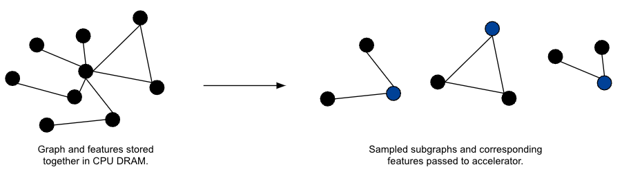
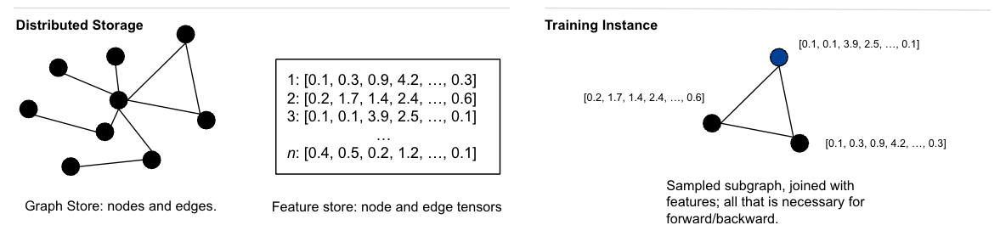
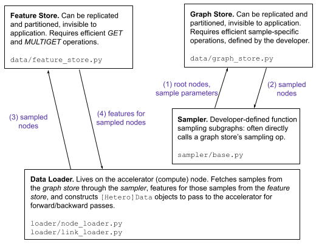

Scaling Up GNNs via Remote Backends
===================================

PyG (2.2 and beyond) includes numerous primitives to easily integrate with simple paradigms for scalable graph machine learning, enabling users to train GNNs on graphs far larger than the size of their machine's available memory.
It does so by introducing simple, easy-to-use, and extensible abstractions of a :class:`torch_geometric.data.FeatureStore` and a :class:`torch_geometric.data.GraphStore` that plug directly into existing familiar PyG interfaces.
Defining a :class:`~torch_geometric.data.FeatureStore` allows users to leverage node (and soon, edge) features stored remotely, and defining a :class:`~torch_geometric.data.GraphStore` allows users to leverage graph structure information stored remotely.
Together, they allow for powerful GNN scalability with low developer friction.

.. warning::

    The remote backend APIs discussed here may change in the future as we continuously work to improve their ease-of-use and generalizability.

.. note::

    Currently, the :class:`~torch_geometric.data.FeatureStore` and :class:`~torch_geometric.data.GraphStore` only support *heterogeneous graphs*, and do not support edge features.
    Homogeneous graph and edge feature support is coming soon.

Background
----------

An instantiated Graph Neural Network consists of two types of data:

- **Node and/or edge feature information:** Dense vectors corresponding to attributes of the nodes and edges in a graph
- **Graph structure information:** The nodes in the graph and the edges that connect them

An immediate observation of GNNs is that scaling to data larger than the available memory of a chosen accelerator requires training on sampled subgraphs (which form mini-batches), instead of the full graph at once (full-batch training).
While this method adds stochasticity to the learning process, it reduces the memory requirements of the accelerator to those of the sampled subgraphs.

  **Figure 1:** The classical mini-batch GNN training paradigm.

However, while mini-batch training reduces the memory requirements of the chosen accelerator, it is not a silver bullet for all graph learning scalability problems.
In particular, since one must sample subgraphs to pass to the accelerator at each iteration of the learning process, the graph and features are traditionally required to be stored in the CPU DRAM of a user's machine.
At large scale, this requirement can become quite burdensome:

- Acquiring instances with enough CPU DRAM to store a graph and features is challenging
- Training with data parallelism requires replicating the graph and features in each compute node
- Graphs and features can easily be much larger than the memory of a single machine

Scalability to very large graphs and features beyond the memory requirements of a single machine thus requires moving these data structures out-of-core and only processing sampled subgraphs on a node that performs computation.
In order to achieve this goal, PyG relies on two primary abstractions to store feature information and graph structure:
Features are stored in a key-value :class:`~torch_geometric.data.FeatureStore`, which must support efficient random access.
Graph information is stored in a :class:`~torch_geometric.data.GraphStore`, which must support efficient sampling for the samplers defined to operate on the :class:`~torch_geometric.data.GraphStore` instance.

  **Figure 2:** Graph data storage layout between remote storage and a training instance.

In PyG 2.2 and beyond, the separation of graph data into its features and structure information, the storage of this information in locations potentially remote to the actual training node, and the interactions between these components, are all completely abstracted from the end user.
As long as the :class:`~torch_geometric.data.FeatureStore` and :class:`~torch_geometric.data.GraphStore` are defined appropriately (keeping in mind the aforementioned performance requirements), PyG handles the rest!

Feature Store
-------------

A :class:`torch_geometric.data.FeatureStore` holds features for the nodes and edges of a graph.
Feature storage is often the primary storage bottleneck in graph learning applications, as storing a graph's layout information (*i.e.* the :obj:`edge_index`) is relatively cheap (~32 bytes per edge).
PyG provides a common interface for various :class:`~torch_geometric.data.FeatureStore` implementations to interface with its core learning API.

The implementation details of a :class:`~torch_geometric.data.FeatureStore` are abstracted from PyG through a CRUD-like interface.
In particular, implementors of the :class:`~torch_geometric.data.FeatureStore` abstraction are expected to primarily override :meth:`~torch_geometric.data.FeatureStore.put_tensor`, :meth:`~torch_geometric.data.FeatureStore.get_tensor`, and :meth:`~torch_geometric.data.FeatureStore.remove_tensor` functionalities.
Doing so both enables PyG to leverage the features stored in the inmplementation and allows a user to employ a pythonic interface to inspect and modify the :class:`~torch_geometric.data.FeatureStore` elements:

.. code-block:: python

    feature_store = CustomFeatureStore()

    paper_features = ...  # [num_papers, num_paper_features]
    author_features = ...  # [num_authors, num_author_features]

    # Add features:
    feature_store['paper', 'x', None] = paper_features
    feature_store['author', 'x', None] = author_features

    # Access features:
    assert torch.equal(feature_store['paper', 'x'], paper_features)
    assert torch.equal(feature_store['paper'].x, paper_features)
    assert torch.equal(feature_store['author', 'x', 0:20], author_features[0:20])

Common implementations of the :class:`~torch_geometric.data.FeatureStore` abstractions are key-value stores, *e.g.*, backends such as :obj:`memcached`, :obj:`LevelDB`, :obj:`RocksDB` are all viable performant options.

Graph Store and Sampler
-----------------------

A :class:`torch_geometric.data.GraphStore` holds the edge indices that define relationships between nodes in a graph.
The goal of the :class:`~torch_geometric.data.GraphStore` is to store graph information in a manner that allows for efficient sampling from root nodes, according to a sampling algorithm of the developer's choice.

Similar to the :class:`~torch_geometric.data.FeatureStore`, PyG provides a common interface for various :class:`~torch_geometric.data.GraphStore` implementations to interface with its core learning API.
However, unlike the :class:`~torch_geometric.data.FeatureStore`, the :class:`~torch_geometric.data.GraphStore` does not need to provide efficient random access for all its elements; rather, it needs to define a representation that provides efficient subgraph sampling.
An example usage of the interface is shown below:

.. code-block:: python

    graph_store = CustomGraphStore()

    edge_index = torch.tensor([[0, 1, 1, 2], [1, 0, 2, 1]])

    # Put edges:
    graph_store['edge', 'coo'] = coo

    # Access edges:
    row, col = graph_store['edge', 'coo']
    assert torch.equal(row, edge_index[0])
    assert torch.equal(col, edge_index[1])

Common implementations of the :class:`~torch_geometric.data.GraphStore` are graph databases, *e.g.*, :obj:`Neo4j`, :obj:`TigerGraph`, :obj:`ArangoDB` are all viable performant options.

A graph sampler is tightly coupled to the given :class:`~torch_geometric.data.GraphStore`, and operates on the :class:`~torch_geometric.data.GraphStore` to produce sampled subgraphs from input nodes.
Different sampling algorithms are implemented behind the :class:`torch_geometric.sampler.BaseSampler` interface.
By default, PyG's default in-memory sampler pulls all edge indices from the :class:`~torch_geometric.data.GraphStore` into the training node memory, converts them to compressed sparse column (CSC) format, and leverages pre-built in-memory sampling routines.
However, custom sampler implementations may choose to call specialized :class:`~torch_geometric.data.GraphStore` methods by implementing the :meth:`~torch_geometric.sampler.BaseSampler.sample_from_nodes` and/or :meth:`~torch_geometric.sampler.BaseSampler.sample_from_edges` of the :class:`~torch_geometric.sampler.BaseSampler` class for efficiency reasons (*e.g.*, for performing sampling directly on the remote :class:`~torch_geometric.data.GraphStore`):

.. code-block:: python

    # `CustomGraphSampler` knows how to sample on `CustomGraphStore`:
    node_sampler = CustomGraphSampler(
        graph_store=graph_store,
        num_neighbors=[10, 20],
        ...
    )

Data Loader
-----------

PyG does not define a domain-specific language for sampling that must be implemented by the :class:`~torch_geometric.data.GraphStore`; rather, the sampler and the :class:`~torch_geometric.data.GraphStore` are tightly coupled together through a data loader.

PyG provides two data loaders out-of-the-box: a :class:`torch_geometric.loader.NodeLoader` that samples subgraphs from input nodes for use in node classification tasks, and a :class:`torch_geometric.loader.LinkLoader` that samples subgraphs from either side of an edge for use in link prediction tasks.
These data loaders require a :class:`~torch_geometric.data.FeatureStore`, a :class:`~torch_geometric.data.GraphStore`, and a graph sampler as input, and internally call the sampler's :meth:`~torch_geometric.sampler.BaseSampler.sample_from_nodes` or :meth:`~torch_geometric.sampler.BaseSampler.sample_from_edges` method to perform subgraph sampling:

.. code-block:: python

    # Instead of passing PyG data objects, we now pass a tuple
    # of the `FeatureStore` and `GraphStore as input data:
    loader = NodeLoader(
        data=(feature_store, graph_store),
        node_sampler=node_sampler,
        batch_size=20,
        input_nodes='paper',
    )

    for batch in loader:
        pass

Putting it All Together
-----------------------

At a high level, the components listed above all work together to provide support for scaling up GNNs within PyG.

- The **data loader** (precisely, each worker) leverages a :class:`~torch_geometric.sampler.BaseSampler` to make a sampling request to the :class:`~torch_geometric.data.GraphStore`.
- Upon receipt of a response, the data loader subsequently queries the :class:`~torch_geometric.data.FeatureStore` for features associated with the nodes and edges of the sampled subgraphs.
- The data loader subsequently constructs a final mini-batch from graph structure and feature information to send to the accelerator for forward/backward passes.
- Repeat until convergence.

All of the outlined classes speak through common interfaces, making them extensible, generalizable, and easy to integrate with the PyG you use today:

  **Figure 3:** The common interfaces (and data flow) uniting the :class:~torch_geometric.data.`FeatureStore`, :class:`~torch_geometric.data.GraphStore`, graph sampler, and data loader.

To get started with scalability, we recommend inspecting the interfaces listed above and defining your own :class:`~torch_geometric.data.FeatureStore`, :class:`~torch_geometric.data.GraphStore`, and :class:`~torch_geometric.sampler.BaseSampler` implementations behind them.
Once a :class:`~torch_geometric.data.FeatureStore`, a :class:`~torch_geometric.data.GraphStore`, and a :class:`~torch_geometric.sampler.BaseSampler` are correctly implemented, simply pass them as parameters to a :class:`~torch_geometric.loader.NodeLoader` or a :class:`~torch_geometric.loader.LinkLoader`, and the rest of PyG will work seamlessly and similar to any pure in-memory application.

Since this feature is still undergoing heavy development, please feel free to reach out to the PyG core team either on `GitHub <https://github.com/pyg-team/pytorch_geometric/discussions>`_ or `Slack <https://data.pyg.org/slack.html>`_ if you have any questions, comments or concerns.
