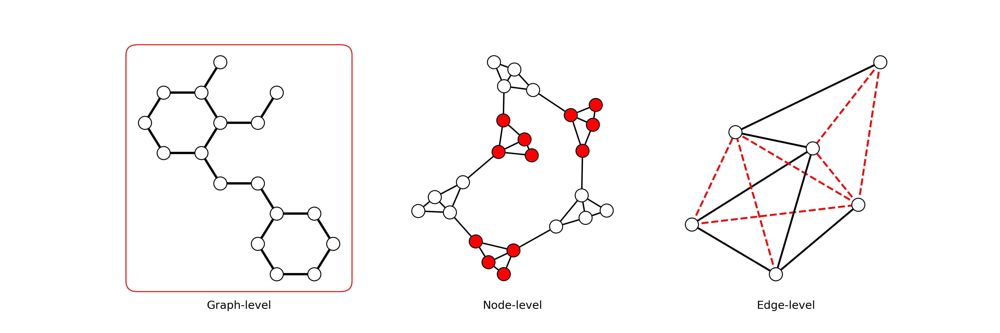

Application Overview
====================

Graphs are highly versatile representations. Many problems can be modelled with graphs and, incidently, solved using Graph Neural Networks.

Three types of tasks can be distinguished: **node-level**, **edge-level**, and **graph-level** tasks. :pyg:`PyG` provides a framework able to tackle each of them.

We will demonstrate how by going through an example of each, showing how PyG's toolbox can adapt to their specifities.

.. contents::
    :local:

Node-Level Tasks
----------------

Node-level tasks deal with predicting properties for each node within a graph. Examples of that are:

* **Node Classification**: predicting a discrete class for each node. An example of that task can be found in `examples/gcn.py <https://github.com/pyg-team/pytorch_geometric/tree/master/examples/gcn.py>`_.

* **Node Regression**: predicting a continuous quantity for each node. For example, one could predict the age of individuals in a social network, where each individual corresponds to a node.

* **Node Embedding**: providing a vector representation to each node. You can find a Node2Vec embedding example in `examples/node2vec.py <https://github.com/pyg-team/pytorch_geometric/tree/master/examples/node2vec.py>`_ and a tutorial for `shallow node embeddings <https://pytorch-geometric.readthedocs.io/en/latest/tutorial/shallow_node_embeddings.html>`_.

* **Node Clustering**: splitting nodes into different groups. You can find an example using Adversarially Regularized Graph Autoencoder for clustering in `examples/argva_node_clustering.py <https://github.com/pyg-team/pytorch_geometric/tree/master/examples/argva_node_clustering.py>`_.

Node Classification
~~~~~~~~~~~~~~~~~~~

Diving more into node classification, we will use the `classification of scientific publications <https://paperswithcode.com/dataset/cora>`_ as our pilot example.

We will describe the specificities of that task in terms of dataset, model, training and testing pipelines.

#. **Dataset**

    We first need a dataset containing labeled nodes and node features. Node classification can make use of either:

    * *Multi-graph datasets*, containing a list of different graphs. An example of that is the :class:`COCO-SP` dataset.

    * *Single-graph datasets*, containing one single large graph. Examples of that are the :class:`Cora` and :class:`~torch_geometric.datasets.KarateClub` datasets.

    In our example, we load the :class:`Cora` dataset, a single-graph dataset containing 2,708 nodes, 10,556 edges 1,433 features and 7 classes. We need to download that dataset from its parent class, :class:`~torch_geometric.datasets.Planetoid`.

    A good practice is to normalize features. That is achieved here using the :class:`torch_geometric.transforms.NormalizeFeatures` transformation.

    Finally, we can extract the data at index 0 since we are dealing with a single graph.

    .. code-block:: python

        import torch_geometric.transforms as T
        from torch_geometric.datasets import Planetoid

        dataset = Planetoid("data/Planetoid", "Cora", transform=T.NormalizeFeatures())
        data = dataset[0]

    Once the dataset is ready, the user needs to define a model architecture capable of predicting a label for each node of its graph input.

#. **Model**

    To define this model, the user can employ the `many convolutional layers <https://pytorch-geometric.readthedocs.io/en/latest/modules/nn.html#convolutional-layers>`_ available in :pyg:`PyG` or define its own layers (c.f. `Creating Message Passing Networks <https://pytorch-geometric.readthedocs.io/en/latest/tutorial/create_gnn.html>`_).

    Here, we defined our model architecture by alternating :class:`~torch_geometric.nn.conv.GCNConv` layers, :class:`~torch.nn.ReLU` activation functions and :class:`~torch.nn.Dropout` layers to predict classes:

    .. code-block:: python

        import torch
        from torch_geometric.nn import GCNConv
        import torch.nn.functional as F

        class GCN(torch.nn.Module):
            def __init__(self, in_channels, hidden_channels, out_channels):
                super().__init__()
                self.conv1 = GCNConv(in_channels, hidden_channels, cached=True,
                                    normalize=not args.use_gdc)
                self.conv2 = GCNConv(hidden_channels, out_channels, cached=True,
                                    normalize=not args.use_gdc)

            def forward(self, x, edge_index, edge_weight=None):
                x = F.dropout(x, p=0.5, training=self.training)
                x = self.conv1(x, edge_index, edge_weight).relu()
                x = F.dropout(x, p=0.5, training=self.training)
                x = self.conv2(x, edge_index, edge_weight)
                return x

        hidden_channels = 16
        model = GCN(dataset.num_features, hidden_channels, dataset.num_classes)

    Given a graph :math:`G(N, E)`, this models takes in a tensor of shape :obj:`(N, dataset.num_features)` as well as an edge index tensor of shape :obj:`(2, E)`. It then outputs a tensor of shape: :obj:`(N, dataset.num_classes)`.

#. **Training pipeline**

    In order to train our model, we then need to pick a loss function and evaluate our predictions. We can use any regular classification loss function: : :class:`~torch.nn.NLLLoss`, :class:`~torch.nn.CrossEntropyLoss` and :class:`~torch.nn.BCELoss` to name a few. In this example we are using the :func:`~torch.nn.functional.cross_entropy` function.

    We apply the loss to each node predictions, comparing them to their respective label.

    Following that, we need an optimizer to update our model weights. In this example we choose :class:`~torch.optim.Adam` as a standard.

    The training pipeline can be defined as such:

    .. code-block:: python

        optimizer = torch.optim.Adam(lr=0.01)

        def train():
            model.train()
            optimizer.zero_grad()
            out = model(data.x, data.edge_index, data.edge_attr)
            loss = F.cross_entropy(out[data.train_mask], data.y[data.train_mask])
            loss.backward()
            optimizer.step()
            return float(loss)

    Note that we use a **transductive** setting (all nodes can be used as neighbours while training). Therefore, we need to select the training nodes when computing the loss using :obj:`[data.train_mask]`.

#. **Test pipeline**

    To finish with, we define a test pipeline that computes the model's accuracy for training, validation and test sets.

    We get the predicted class using :meth:`~torch.argmax` on the output logits, and compare it to its corresponding label.

    .. code-block:: python

        @torch.no_grad()
        def test():
            model.eval()
            pred = model(data.x, data.edge_index, data.edge_attr).argmax(dim=-1)

            accs = []
            for mask in [data.train_mask, data.val_mask, data.test_mask]:
                accs.append(int((pred[mask] == data.y[mask]).sum()) / int(mask.sum()))
            return accs

Just like that, we have now trained and tested a node classification Graph Neural Network!

.. note::
    The complete code for this example can be found `examples/gcn.py <https://github.com/pyg-team/pytorch_geometric/tree/master/examples/gcn.py>`_ on :pyg:`PyG`'s GitHub repository.

.. note::
    Node regression models can be trained in a very similar fashion, changing the labels and the loss function.

Graph-Level Tasks
-----------------

Graph-level tasks are concerned with predicting the properties of an entire graph.

Just like for node-level tasks, graph-level tasks can be declined in different genres such as:

* **Graph Classification**: predicting a discrete class for a graph. You can find a protein classification example `examples/proteins_topk_pool.py <https://github.com/pyg-team/pytorch_geometric/tree/master/examples/proteins_topk_pool.py>`_.

* **Graph Regression**: predicting a continuous quantity for a graph. You can find a molecule property regression example using Graph GPS in `examples/graph_gps.py <https://github.com/pyg-team/pytorch_geometric/tree/master/examples/graph_gps.py>`_.

* **Graph Generation**: generating a graph drawn from a certain distribution. This tutorial describes how you achieve it. [:youtube:`null` `YouTube <https://www.youtube.com/watch?v=embpBq1gHAE>`__].

Graph Classification
~~~~~~~~~~~~~~~~~~~~

Our guiding example for this task will be that of `Protein Top-k Pooling <https://github.com/pyg-team/pytorch_geometric/tree/master/examples/proteins_topk_pool.py>`_ which task is to predict whether a protein is an enzyme or not.

#. **Dataset**

    Graph Classification can only use datasets containing multiple graphs since each graph corresponds to one training sample.

    We will be using the :class:`PROTEIN` dataset from the :class:`~torch_geometric.datasets.TUDataset` collection. It contains 1,113 different protein graphs, each composed of an average of 39.1 nodes and 145.6 edges.

    Each node contains three features, and our target consists of only two classes.

    .. code-block:: python

        from torch_geometric.datasets import TUDataset
        from torch_geometric.loader import DataLoader

        path = './data/PROTEINS'
        dataset = TUDataset(path, name='PROTEINS')
        dataset = dataset.shuffle()
        n = len(dataset) // 10
        test_dataset = dataset[:n]
        train_dataset = dataset[n:]
        test_loader = DataLoader(test_dataset, batch_size=60)
        train_loader = DataLoader(train_dataset, batch_size=60)

    This time, we are dealing with multiple graphs. Hence, we will use the :class:`~torch_geometric.loader.DataLoader` class to easily create batches for training and test (90% and 10% of the entire dataset).

#. **Model**

    Creating a model for graph classification intially relies on the same alternance of graph convolutional layers and activations, but now follows it up with a **hierarchical pooling** layer as well.

    Hierarchical pooling performs a gradual transition from node-level to graph-level representations. We can consider it as the counterpart of pooling layers in image models.

    .. note::
        You can find multiple pooling layers in the `PyG layer catalog <https://pytorch-geometric.readthedocs.io/en/latest/modules/nn.html?highlight=pooling#pooling-layers>`_.

    Although hierarchical pooling layers progressively downsize the graph, they are not garanteed to reach a single node.

    To definitely summarize the graph information into a single vector, the model uses a **global pooling** layer.

    This last layer aggregates all remaining nodes together. It works like the hierarchical pooling layers explained before, but allows only one *supernode* to remain. This node represents the whole graph. Here, the model ends with a combination of :func:`torch_geometric.nn.pool.global_mean_pool` and :func:`torch_geometric.nn.pool.global_max_pool`.

    .. code-block:: python

        from torch_geometric.nn import GraphConv, TopKPooling
        from torch_geometric.nn import global_max_pool as gmp
        from torch_geometric.nn import global_mean_pool as gap
        import torch
        import torch.nn.functional as F

        class Net(torch.nn.Module):
            def __init__(self):
                super().__init__()

                self.conv1 = GraphConv(dataset.num_features, 128)
                self.pool1 = TopKPooling(128, ratio=0.8)
                self.conv2 = GraphConv(128, 128)
                self.pool2 = TopKPooling(128, ratio=0.8)
                self.conv3 = GraphConv(128, 128)
                self.pool3 = TopKPooling(128, ratio=0.8)

                self.lin1 = torch.nn.Linear(256, 128)
                self.lin2 = torch.nn.Linear(128, 64)
                self.lin3 = torch.nn.Linear(64, dataset.num_classes)

            def forward(self, data):
                x, edge_index, batch = data.x, data.edge_index, data.batch

                x = F.relu(self.conv1(x, edge_index))
                x, edge_index, _, batch, _, _ = self.pool1(x, edge_index, None, batch)
                x1 = torch.cat([gmp(x, batch), gap(x, batch)], dim=1)

                x = F.relu(self.conv2(x, edge_index))
                x, edge_index, _, batch, _, _ = self.pool2(x, edge_index, None, batch)
                x2 = torch.cat([gmp(x, batch), gap(x, batch)], dim=1)

                x = F.relu(self.conv3(x, edge_index))
                x, edge_index, _, batch, _, _ = self.pool3(x, edge_index, None, batch)
                x3 = torch.cat([gmp(x, batch), gap(x, batch)], dim=1)

                x = x1 + x2 + x3

                x = F.relu(self.lin1(x))
                x = F.dropout(x, p=0.5, training=self.training)
                x = F.relu(self.lin2(x))
                x = F.log_softmax(self.lin3(x), dim=-1)

                return x

    Given any graph, this model will take as input a :obj:`data` object that represents a batch of graphs and output a tensor of shape (`batch_size`, `dataset.num_classes`).

#. **Training pipeline**

    Just like for node classification, graph classification makes use of usual classification loss functions such as the ones mentioned above.

    For this example, we will be using the :func:`~torch.nn.functional.nll_loss` function.

    .. code-block:: python

        def train(epoch):
            model.train()

            loss_all = 0
            for data in train_loader:
                data = data.to(device)
                optimizer.zero_grad()
                output = model(data)
                loss = F.nll_loss(output, data.y)
                loss.backward()
                loss_all += data.num_graphs * loss.item()
                optimizer.step()
            return loss_all / len(train_dataset)

#. **Testing pipeline**

    The testing pipeline similarily consists in a loop over the test set that computes some evaluation metric, in our case, the accuracy.

    .. code-block:: python

        def test(loader):
            model.eval()

            correct = 0
            for data in loader:
                data = data.to(device)
                pred = model(data).max(dim=1)[1]
                correct += pred.eq(data.y).sum().item()
            return correct / len(loader.dataset)

    Note that using :obj:`.max(dim=1)[1]` has the same effect as the :meth:`argmax` method previously seen.

That sums up our graph classification example!

.. note::
    The complete code for the example can be found `examples/proteins_topk_pool.py <https://github.com/pyg-team/pytorch_geometric/tree/master/examples/proteins_topk_pool.py>`_ on :pyg:`PyG`'s GitHub repository.

Link-Level Tasks
----------------

Link-level or edge-level tasks complete our overview by looking to predict properties between pairs of nodes. This can happen under different settings:

* **Link prediction**: predicting wether a link exists between two nodes. That could be a connection between two individuals in a social network. You can find an example of link prediction in `this file <https://github.com/pyg-team/pytorch_geometric/tree/master/examples/link_pred.py>`_.

* **Edge classification**: predicting the class of an existing edge. It could be the nature of a connection in a knowledge graph.

* **Edge regression**: estimating a continuous value over an existing edge. For example, one could try to estimate the distance between two points.

Link Prediction
~~~~~~~~~~~~~~~

For this task, we will be taking the `link pred example <https://github.com/pyg-team/pytorch_geometric/tree/master/examples/link_pred.py>`_ as a guide.

#. **Dataset**

    We can learn link-prediction with different kind of datasets:

    * *Multi-graph datasets*, containing multiple distinct graphs. An example of that is the :class:`~torch_geometric.datasets.PPI` dataset.

    * *Single-graph datasets*, containing only one single large graph. An example of that is the :class:`~torch_geometric.datasets.PCQM-Contact` dataset.

    * *Heterogeneous datasets*, containing different type of nodes, each with its own feature dimension. It often occurs in recommendation engine contexts. An example of that is the :class:`~torch_geometric.datasets.MovieLens` dataset, containing nodes for both *users* and *movies*.

    Our example deals with the same :class:`Cora` dataset as for the node classification we have previously seen. However, not performing the same task, it uses different pre-processing steps.

    .. code-block:: python

        import torch_geometric.transforms as T
        from torch_geometric.datasets import Planetoid

        transform = T.Compose([
            T.NormalizeFeatures(),
            T.ToDevice(device),
            T.RandomLinkSplit(num_val=0.05, num_test=0.1, is_undirected=True,
                            add_negative_train_samples=False),
        ])
        path = 'data/Planetoid'
        dataset = Planetoid(path, name='Cora', transform=transform)
        train_data, val_data, test_data = dataset[0]

    Note that we are using an additional transformation :class:`~torch_geometric.transforms.RandomLinkSplit`. It has the effect of splitting the edges of the original graph into three distinct splits (train, validation, test). We call it an **inductive** learning setting since training can only access edges from the training set during propagation.

    Just like for the node classification dataset processing, since :class:`Cora` contains a single graph, we can extract it from the list to simplify things forward.

    We thus end up with three graphs, one for each set.

#. **Model**

    Graph Neural Networks are oriented towards encoding node information by design. Even if edge feature can come into play, there are originally no steps destined to updating their representation.

    In order to turn a node perspective into an edge perspective, link-level models rely on link decoders. These modules turn a pair of node representations into a unified edge representation. Optionally, they can include edge feature as well.

    Link decoders can be categorised as:

    * **Non-learnable decoders**. This is what we will be using, relying on a simple dot-product between the node embeddings at each end of an edge. It makes sense for tasks that boil down to similarity or distance estimation.

    * **Learnable decoders**. They instead use learnable layers to operate the transition. That can take the form of a concatenation of node embeddings followed by a dense layer. It makes for a more complex architecture, and can give richer and multi-dimensional embeddings to edges.

    .. code-block:: python

        import torch
        from torch_geometric.nn import GCNConv

        class Net(torch.nn.Module):
            def __init__(self, in_channels, hidden_channels, out_channels):
                super().__init__()
                self.conv1 = GCNConv(in_channels, hidden_channels)
                self.conv2 = GCNConv(hidden_channels, out_channels)

            def encode(self, x, edge_index):
                x = self.conv1(x, edge_index).relu()
                return self.conv2(x, edge_index)

            def decode(self, z, edge_label_index):
                return (z[edge_label_index[0]] * z[edge_label_index[1]]).sum(dim=-1)

            def decode_all(self, z):
                prob_adj = z @ z.t()
                return (prob_adj > 0).nonzero(as_tuple=False).t()

    In our example, the model provides two alternatives for making link predictions. For both of them, we need to perform node encoding first.
    Then, one :meth:`decode` method computes a targeted edge result using dot-product on selected pairs of nodes only. The other, :meth:`decode_all`, computes the full matrix of all possible pairs of nodes.

    Note that the :meth:`decode_all` method additionally applies a 0 threshold as its decision boundary.

#. **Training pipeline**

    The training setting is probably the most different from the two others.

    Link-prediction tasks require both positive and negative examples to create a balanced training set.

    While the first is naturally provided by our training split, the latter needs to be added. This is called **negative sampling**, where disconnected pairs of nodes are randomly selected. In :pyg:`PyG`, this can be done using the :func:`~torch_geometric.utils.negative_sampling` function.

    .. code-block:: python

        model = Net(dataset.num_features, 128, 64).to(device)
        optimizer = torch.optim.Adam(params=model.parameters(), lr=0.01)
        criterion = torch.nn.BCEWithLogitsLoss()

        def train():
            model.train()
            optimizer.zero_grad()
            z = model.encode(train_data.x, train_data.edge_index)

            # We perform a new round of negative sampling for every training epoch:
            neg_edge_index = negative_sampling(
                edge_index=train_data.edge_index, num_nodes=train_data.num_nodes,
                num_neg_samples=train_data.edge_label_index.size(1), method='sparse')

            edge_label_index = torch.cat(
                [train_data.edge_label_index, neg_edge_index],
                dim=-1,
            )
            edge_label = torch.cat([
                train_data.edge_label,
                train_data.edge_label.new_zeros(neg_edge_index.size(1))
            ], dim=0)

            out = model.decode(z, edge_label_index).view(-1)
            loss = criterion(out, edge_label)
            loss.backward()
            optimizer.step()
            return loss

    A prediction is performed for each pair of nodes, positive and negative, using the node encodings `z`.

    Link prediction assimilates to a binary classification. Therefore, it can rely on the same loss functions we mentioned in other tasks. This particular examples uses :class:`~torch.nn.BCEWithLogitsLoss`.

#. **Test pipeline**

    For testing, the operations are slightly different since the original split we performed includes negative sampling for validation and test already.

    Therefore, we have an :obj:`edge_label` property available for each of the graphs. It contains positive and negative labels already.

    This simplifies this evaluation compared to the training.

    *The motivations for not resorting to that during training is to be able to sample different negative edges at each new epoch.*

    .. code-block:: python

        @torch.no_grad()
        def test(data):
            model.eval()
            z = model.encode(data.x, data.edge_index)
            out = model.decode(z, data.edge_label_index).view(-1).sigmoid()
            return roc_auc_score(data.edge_label.cpu().numpy(), out.cpu().numpy())

        best_val_auc = final_test_auc = 0
        for epoch in range(1, 101):
            loss = train()
            val_auc = test(val_data)
            test_auc = test(test_data)
            if val_auc > best_val_auc:
                best_val_auc = val_auc
                final_test_auc = test_auc
            print(f'Epoch: {epoch:03d}, Loss: {loss:.4f}, Val: {val_auc:.4f}, '
                f'Test: {test_auc:.4f}')

        print(f'Final Test: {final_test_auc:.4f}')

We reached the end of this implementation!

.. note::
    The complete code for the example can be found `examples/link_pred.py <https://github.com/pyg-team/pytorch_geometric/tree/master/examples/link_pred.py>`_ on :pyg:`PyG`'s GitHub repository.

Conclusion
----------

This tutorial provides a quick overview of the three main classes of graph prediction problems. Each of them can easily be implemented using :pyg:`PyG`.

We covered an example of each, but many more can be found in this `example folder <https://github.com/pyg-team/pytorch_geometric/tree/master/examples/>`_.

Exercises
---------

1. How would you implement a learnable link decoder?
2. What needs to change to change a node classification into a node regression pipeline?
3. What type of layer must conclude a graph classification model?
