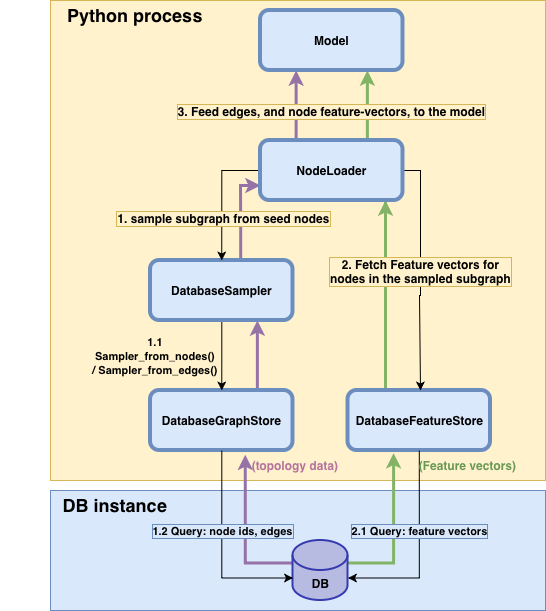

Database-backed graph storage and sampling
==========================================

.. note::
    This tutorial introduces the :class:`~torch_geometric.data.DatabaseGraphStore`,
    :class:`~torch_geometric.data.DatabaseFeatureStore`, and
    :class:`~torch_geometric.sampler.DatabaseSampler` abstractions.
    See `examples/neo4j/cora` for a runnable example using Neo4j as the backend.

A common way to support large-graph GNN training is to keep graph
topology and features in RAM of the training machine(s). This can
enable highly efficient mini-batch computation, but may also require
substantial hardware resources.

The Database classes provide an alternative approach in which
the training process only fetches relevant subgraph data per batch, and
the database backend handles sampling and feature retrieval.
This can drastically reduce the memory requirements
of the training machine, and enable large-graph training on more
modest hardware, at the cost of some additional latency per batch.

Inference Without In-Memory Graphs
~~~~~~~~~~~~~~~~~~~~~~~~~~~~~~~~~~~~~~~~~~~~~~~~~~~~~~

The database abstractions can also be useful when faster in-memory training is
preferred. In this setup, a GNN model can be trained with the full graph in
memory. The graph can then be removed from RAM when keeping it in memory solely
for inference is too costly, especially for infrequent inference requests. With
the database classes, you can host the model on an inference machine without
keeping the graph in memory, moving both neighborhood sampling and feature
retrieval to the database for each inference request.

Key Advantages
--------------

#. **Train on graphs that don't fit in memory** — only sampled subgraphs
   and the features for their nodes are pulled into the trainer at each
   batch. This enables large graph training without the need for a big RAM machine.
#. **Backend-agnostic ABCs** — any database with a query language can be
   plugged in by subclassing three abstract classes
   (:class:`~torch_geometric.data.DatabaseGraphStore`,
   :class:`~torch_geometric.data.DatabaseFeatureStore`,
   :class:`~torch_geometric.sampler.DatabaseSampler`) and writing the
   queries.
#. **Server-side sampling** — the sampler ships a single
   pre-compiled query (e.g. Cypher) per mini-batch.
#. **Pluggable feature cache** — :class:`~torch_geometric.data.FeatureCache`
   is an ABC; an in-memory :class:`LRUFeatureCache` is provided as a
   default, and Redis / on-disk / distributed caches drop in via subclass.
#. **Unchanged training loop** — the stack composes with the standard
   :class:`~torch_geometric.loader.NeighborLoader`; nothing about model
   code changes.
#. **Avoid upfront graph exports** — when the graph already lives in a
   database, PyG can query it directly instead of requiring a separate export
   into a PyG-specific in-memory format.
#. **Lightweight inference deployment** — the model can run without keeping
  the full graph in memory, while sampling and feature retrieval are handled
  by the database.

Architecture Components
-----------------------

.. note::
    The purpose of this tutorial is to walk you through the moving parts.
    For a runnable Cora example see
    `examples/neo4j/cora <https://github.com/pyg-team/pytorch_geometric/tree/master/examples/neo4j>`_.

Overall, the ``Database*`` stack is divided into the following components:

* :class:`~torch_geometric.data.DatabaseGraphStore` — abstract
  :class:`~torch_geometric.data.GraphStore`. Owns the database connection
  and exposes one hook, :meth:`~torch_geometric.data.DatabaseGraphStore.query_db`,
  through which any query (sampling, edge lookup) is executed. In this stack,
  the query is often a database-side sampling algorithm, such as the
  pre-compiled query passed in by :class:`~torch_geometric.sampler.DatabaseSampler`.
  The caller is responsible for decoding the raw record into PyG tensors,
  as the graph store is agnostic to the query semantics and output format.
* :class:`~torch_geometric.data.DatabaseFeatureStore` — abstract
  :class:`~torch_geometric.data.FeatureStore`. Owns the full mini-batch
  retrieval loop: cache lookup -> batched database fetch -> decode -> cache
  fill -> output tensor assembly.
* :class:`~torch_geometric.data.FeatureCache` /
  :class:`~torch_geometric.data.LRUFeatureCache` — pluggable per-node-row
  cache used by :class:`DatabaseFeatureStore` to avoid redundant database queries.
* :class:`~torch_geometric.sampler.DatabaseSampler` — abstract
  :class:`~torch_geometric.sampler.BaseSampler`. Defines the sampling algorithm
  as a single pre-compiled query (e.g. Cypher) and a per-batch parameter builder,
  that is later sent to the :class:`~torch_geometric.data.DatabaseGraphStore`
  to be executed on the backend. The sampler then decodes the raw record into
  ``(node, row, col)`` COO tensors.
* Concrete reference impls in ``examples/neo4j``:
  :class:`Neo4jGraphStore`, :class:`Neo4jFeatureStore`,
  :class:`Neo4jGraphSAGESampler`.

   Schematic breakdown of the ``Database*`` stack and how a mini-batch flows
   from :class:`~torch_geometric.loader.NeighborLoader` through the sampler
   and feature store to the model.

The end-to-end mini-batch path:

#. :class:`~torch_geometric.loader.NeighborLoader` calls
   :meth:`DatabaseSampler.sample_from_nodes` with the seed node IDs.

   * The sampler builds the query parameters and calls
     :meth:`DatabaseGraphStore.query_db` with the pre-compiled sampling query.
   * The graph store executes the query and returns the raw record.
   * The sampler decodes the record into local-COO tensors and returns a
     :class:`~torch_geometric.sampler.SamplerOutput`.

#. The loader's feature-fetch hook calls
   :meth:`DatabaseFeatureStore._multi_get_tensor` with a
   :class:`~torch_geometric.data.TensorAttr` for each requested feature.

   * The feature store narrows the requested node IDs to cache misses and
     calls :meth:`_multi_fetch_remote_attrs` to fetch the missing rows from
     the database.
   * The raw records are decoded into :obj:`np.ndarray` and written to the
     cache.

#. The loader assembles the output tensor in seed order and passes it to
   ``model.forward``.

.. note::
    all operations involving the cache in the database feature store
    are ignored if no cache is passed to the constructor (i.e. ``cache=None``).

Database Graph Store
~~~~~~~~~~~~~~~~~~~~

:class:`~torch_geometric.data.DatabaseGraphStore` exposes a single
:meth:`~torch_geometric.data.DatabaseGraphStore.query_db(query, params)` hook that the
sampler (and any other caller) uses for all database round-trips — sampling,
edge lookups, and ad-hoc inspection alike.

.. warning::
    The :class:`~torch_geometric.data.DatabaseGraphStore` is not responsible for
    decoding the raw record into PyG tensors; the caller (e.g.
    :class:`~torch_geometric.sampler.DatabaseSampler`) is.

Database Feature Store
~~~~~~~~~~~~~~~~~~~~~~

:class:`~torch_geometric.data.DatabaseFeatureStore` implements the full
mini-batch retrieval loop on top of two narrow hooks:

* :meth:`_fetch_remote_attrs` — query the database for a single
  :class:`~torch_geometric.data.TensorAttr`, return ``(raw_records,
  fetched_nids)``.
* :meth:`_decode_remote_attrs` — convert the raw records into a dense
  :obj:`np.ndarray` aligned with ``fetched_nids``.

The base class wires these into a cache-aware ``_multi_get_tensor`` that:

#. Looks up every requested attr in the cache via
   :meth:`FeatureCache.multi_get`. Each attr's index is narrowed to the
   uncached node IDs.
#. Issues a single round-trip per cache-miss group via
   :meth:`_multi_fetch_remote_attrs` — overridable to batch multiple attrs
   that share the same index into one query (e.g. one Cypher query
   returning both features ``x`` and targets ``y``).
#. Decodes via :meth:`_multi_decode_remote_attrs` and writes the result
   back through :meth:`FeatureCache.multi_put`.
#. Assembles the output tensor in seed order, blending cache hits and
   freshly fetched rows.

**Pluggable caching:**

Pass any :class:`~torch_geometric.data.FeatureCache` to the constructor,
or :obj:`None` to disable. The default
:class:`~torch_geometric.data.LRUFeatureCache` is a bounded in-memory LRU
backed by an :class:`collections.OrderedDict`.

.. warning::
    In-memory caches are **per process**: each
    :class:`~torch.utils.data.DataLoader` worker spawned with
    ``num_workers > 0`` warms its own copy. Use a network-backed
    (e.g. Redis) cache or ``num_workers=0`` if you need cross-worker
    coherence.

Feature Cache
~~~~~~~~~~~~~

Subclass :class:`~torch_geometric.data.FeatureCache` and implement
:meth:`multi_get`, :meth:`multi_put`, and :meth:`invalidate` to plug in a
custom cache backend (e.g. Redis or on-disk). The default
:class:`~torch_geometric.data.LRUFeatureCache` is per-process, so each
DataLoader worker maintains its own copy. A shared cache is necessary to
achieve cache coherence across workers.

Database Sampler
~~~~~~~~~~~~~~~~

:class:`~torch_geometric.sampler.DatabaseSampler` runs multi-hop neighbor
expansion **inside the database** via a single pre-compiled query per batch
(see the figure above for the full pipeline). Subclasses override:

* :meth:`_build_node_sampling_query` and/or
  :meth:`_build_edge_sampling_query` — compile the native query once at
  construction so query-parsing cost is paid only once.
* :meth:`_build_node_query_params` / :meth:`_build_edge_query_params` —
  build the per-batch parameter dict, e.g. ``{"seed_ids": [...]}``.
* :meth:`_decode_node_sampling_record` / :meth:`_decode_edge_sampling_record`
  — convert the raw record into local-COO ``(node, row, col)`` tensors.
