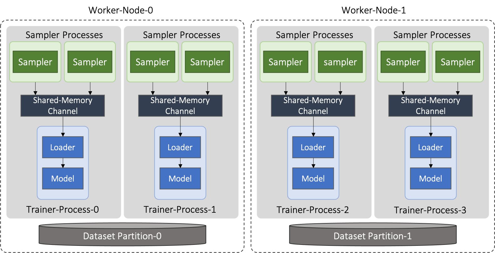

Distributed Training Using GraphLearn-for-Pytorch
=================================================

In many real-world applications, it's often infeasible to train GNNs on large graphs using a single machine.
`GraphLearn-for-Pytorch(GLT) <https://github.com/alibaba/graphlearn-for-pytorch>`__ is a Python library that supports efficient distributed GNN training across multiple machines based on the PyTorch.
GLT leverages GPUs to accelerate graph sampling and utilizes UVA and GPU caches to reduce the data conversion and transferring costs during graph sampling and model training.
Most of GLT's APIs are compatible with PyG, thus with only a few lines of modification, a single-node PyG training script can be scaled to distributed training using GLT.

GLT adopts PyTorch DDP for distributed parallel training and distributes the graph data and graph-based computations across a collection of workers to scale out the processes of sampling and training.
In GLT, the sampling and training processes are completely decoupled and can be flexibly deployed on different physical nodes, which allows users to achieve more efficient resource allocation and better load balancing, especially in the case that the required computing resources of sampling and training are not aligned.
GLT can accelerate neighbor sampling and feature collection with GPUs. 
To minimize the network overhead incurred by remote graph data, GLT implements an asynchronous RPC framework on top of PyTorch RPC to properly pipeline the sampling/training processes and hide the network latency.
RDMA is also supported in distributed training.

In the rest of this tutorial, we will go through the architecture and some key concepts in GLT, and use examples to illustrate how to use GLT to train PyG models in a distributed setting.

1. Preprocessing and data partitioning
--------------------------------------

To scale out the performance of batch sampling, GLT uses multiple nodes to store the graph data and perform distributed sampling.
The graph data needs to be partitioned before the training starts, and each partition is managed by a node in the cluster.
GLT provides a set of utility functions and partitioners to facilitate data preprocessing and partitioning.

As an example, we will use the ``ogbn-products`` dataset and demonstrate how to partition it into two parts for distributed training.
The complete script for partitioning ``ogbn-products`` dataset can be found `here <https://github.com/alibaba/graphlearn-for-pytorch/tree/main/examples/distributed/partition_ogbn_dataset.py>`__.

First, we use the following script to load the ``ogbn-products`` dataset:

.. code-block:: python

  import os.path as osp import torch from
  ogb.nodeproppred import PygNodePropPredDataset

  # The root directory for ogbn-products dataset and partitioned results.
  root_dir = '/tmp/ogbn-products'

  dataset = PygNodePropPredDataset('ogbn-products', root_dir) 
  data = dataset[0]
  node_num = len(data.x)
  edge_num = len(data.edge_index[0])

  # Save label data.
  label_dir = osp.join(root_dir, 'label')
  torch.save(data.y.squeeze(), osp.join(label_dir, 'label.pt'))

1.1 Partitioning the training input data
~~~~~~~~~~~~~~~~~~~~~~~~~~~~~~~~~~~~~~~~

The `ogbn-products` dataset splits its training input data into three parts: `train`, `val` and `test`.
In GLT, the training inputs are partitioned and disseminated among multiple training processes to facilitate distributed training.
We only use `train` and `test` in this example:

.. code-block:: python

   import torch

   split_idx = dataset.get_idx_split()
   num_partitions = 2

   train_idx = split_idx['train']
   train_idx = train_idx.split(train_idx.size(0) // num_partitions)
   train_idx_partitions_dir = osp.join(root_dir, 'train-idx-partitions')
   for pidx in range(num_partitions):
     torch.save(train_idx[pidx], osp.join(train_idx_partitions_dir, f'partition{pidx}.pt'))

   test_idx = split_idx['test']
   test_idx = test_idx.split(test_idx.size(0) // num_partitions)
   test_idx_partitions_dir = osp.join(root_dir, 'test-idx-partitions')
   for pidx in range(num_partitions):
     torch.save(test_idx[pidx], osp.join(test_idx_partitions_dir, f'partition{pidx}.pt'))

1.2 Partitioning the graph
~~~~~~~~~~~~~~~~~~~~~~~~~~

GLT adopts an edge-cut approach to partition the graph topology (nodes and edges).
Features of nodes and edges are partitioned according to the topology partitioning results and are stored together with each graph topology partition.
The mapping information from graph nodes and edges to partition IDs is also saved.
In general, the process of partitioning can be summarized into three steps:

-  
  (1) Run a partitioning algorithm to assign nodes to partitions.

-  
  (2) Construct the graph structure based on the node assignment for each partition.

-  
  (3) Split the node features and edge features based on the partitioning results.

GLT implements a simple `graphlearn_torch.partition.RandomPartitioner <graphlearn_torch.partition.random_partitioner.RandomPartitioner>`__ to partition graph data randomly and evenly:

.. code-block:: python 

  import graphlearn_torch as glt

  random_partitioner = glt.partition.RandomPartitioner(
    output_dir=osp.join(root_dir, 'graph-partitions'),
    num_parts=2,
    num_nodes=node_num,
    edge_index=data.edge_index,
    node_feat=data.x,
    edge_feat=None,
    edge_assign_strategy='by_src', # store graph edges with the src node.
    chunk_size=10000, # chunk size for node assignment
    device=torch.device(0) # device used for partitioning 
  )
  random_partitioner.partition()

Note that, the ``edge_assign_strategy`` decides that an edge is stored with its source node or destination node.
Thus out-bound sampling (sampling the out-going edges of a node) is bound with ``by_src``, and in-bound sampling should use ``by_dst``. 

1.3 Building feature cache
~~~~~~~~~~~~~~~~~~~~~~~~~~
GLT supports caching node/edge features in GPU to minimize the data transferring cost between host and device during feature collection.
To select the frequently accessed nodes/edges for cache, GLT provides another partitioner, `graphlearn_torch.partition.FrequencyPartitioner <graphlearn_torch.partition.frequency_partitioner.FrequencyPartitioner>`__.
``FrequencyPartitioner`` takes the probability of each node being sampled at a specific training workload as its input, and evenly assigns nodes to different partitions according to their 'hotness'.
The hottest graph nodes (divided by `cache_ratio`) will be selected for feature caches in GPUs at each partition.
We can use `graphlearn_torch.sampler.NeighborSampler <graphlearn_torch.sampler.neighbor_sampler.NeighborSampler>`__ to calculate the sampling probabilities.
But please **note**: the sampling parameters (num_neighbors, etc.) used in probability calculation must be identical to those used in training.

The following code shows how to calculate node hotness and how to partition graph data with ``FrequencyPartitioner``:

.. code-block:: python

   import graphlearn_torch as glt

   # Initialize the graph store for sampling.
   csr_topo = glt.data.Topology(edge_index=data.edge_index, layout='CSR')
   graph = glt.data.Graph(csr_topo, mode='ZERO_COPY')

   # Calculate the sampling probabilities.
   num_partitions = 2
   probs = []
   glt_sampler = glt.sampler.NeighborSampler(graph, num_neighbors=[15, 10, 5])
   for pidx in range(num_partitions):
     seeds = train_idx[pidx]
     prob = glt_sampler.sample_prob(seeds, node_num)
     probs.append(prob)

   # Partition graph data with the sampling probabilities.
   freq_partitioner = glt.partition.FrequencyPartitioner(
     output_dir=osp.join(root_dir, 'graph-partitions'),
     num_parts=2,
     num_nodes=node_num,
     edge_index=data.edge_index,
     probs=probs,
     node_feat=data.x,
     edge_feat=None,
     edge_assign_strategy='by_src', # assign graph edges by src node.
     chunk_size=10000, # chunk size for node assignment
     cache_ratio=0.2, # cache 20% hottest graph nodes
     device=torch.device(0) # device used for partitioning
   )
   freq_partitioner.partition()

GLT also supports partitioning the heterogeneous graph, where the graph and feature data should be organized as a ``dict``.
In addition, GLT provides an abstract `graphlearn_torch.partition.PartitionerBase <graphlearn_torch.partition.base.PartitionerBase>`__ class, based on which users can customize their own partitioner.

1.4 Loading a data partition
~~~~~~~~~~~~~~~~~~~~~~~~~~~~

GLT implements the `graphlearn_torch.distributed.DistDataset <graphlearn_torch.distributed.dist_dataset.DistDataset>`__ to manage a partitioned dataset along with its distributed information, including the partitioned graph topology data, partitioned feature data, partition books, and label data.

You can load a distributed dataset from the directory that stores dataset partitions:

.. code-block:: python

  import os.path as osp 
  import graphlearn_torch as glt

  root_dir = '/tmp/ogbn-products' 
  dist_dataset = glt.distributed.DistDataset() 
  dist_dataset.load(
    graph_dir=osp.join(root_dir, 'graph-partitions'),
    partition_idx=0, #load datat partition 0
    graph_mode='ZERO_COPY',
    whole_node_label_file=osp.join(root_dir, 'label', 'label.pt')
  )

2. Deployment Mode
------------------

GLT's distributed training has two basic roles: sampler and trainer:

- **Sampler Process** creates the distributed sampler for distributed neighbor sampling and feature collection.
  The sampled results will be sent to the sampling message channel to be consumed by trainers.

- **Trainer Process** corresponds to a participant of PyTorch's DDP training, loads sampled results from the sampling message channel, and conducts model training.

Sampler and trainer processes can be flexibly distributed across different machines.
When sampler and trainer processes are collocated in the same machine, physically isolating the computing resources of sampling and training, e.g., in different GPUs, usually results in better performance.

The `worker mode` is the basic deployment mode of GLT's distributed training.
In this mode, each physical node corresponds to a specific worker node, and trainer processes are distributed among worker nodes.
Each trainer process can spawn multiple sampler processes on the same worker node.
A shared-memory message channel will be created for transmitting sampled results from spawned sampler processes to the corresponding trainer process.
Each worker node will exclusively manage a dataset partition, which is shared by all the trainer processes and sampler processes in this node.

The figure below shows the architecture of the deployment mode:

GLT introduces the `graphlearn_torch.distributed.DistContext <graphlearn_torch.distributed.dist_context.DistContext>`__ to manage the distributed location and context information for each distributed process.
At the beginning of each trainer process, you should initialize the distributed process context with `graphlearn_torch.distributed.init_worker_group <graphlearn_torch.distributed.dist_context.init_worker_group>`__.
E.g, if there are 4 trainer processes, the following example shows how to initialize the worker group on trainer-0:

.. code-block:: python

  import graphlearn_torch as glt

  glt.distributed.init_worker_group(
    world_size=4,
    rank=0,
    group_name='distributed-trainer'
  )

After initialization, you can further check the distributed context:

.. code-block:: python 

  dist_ctx = glt.distributed.get_context() # The role type of the current worker group: WORKER 
  dist_ctx.role # The number of all distributed trainer processes dist_ctx.world_size # The rank of the current trainer process dist_ctx.rank # The group name of all distributed trainer processes dist_ctx.group_name # The worker name of the current trainer process dist_ctx.worker_name``

3. Distributed Sampling
---------------------------------------------------

During sampling, a sampler process can only access its local graph partition.
Therefore, some steps of the sampling tasks of an input batch may need to be executed on other machines.
Remote sampling operations will incur significant cross-machine network I/Os, thus it is inefficient to wait for the remote sampling operations in a blocking approach when processing each input batch.

GLT implements an asynchronous `graphlearn_torch.distributed.DistNeighborSampler <graphlearn_torch.distributed.dist_neighbor_sampler.DistNeighborSampler>`__ to pipeline the sampling tasks of different input batches and execute them concurrently. 
Each ``DistNeighborSampler`` maintains a `graphlearn_torch.distributed.ConcurrentEventLoop <graphlearn_torch.distributed.event_loop.ConcurrentEventLoop>`__, which is implemented on top of Python's ``asyncio``, and ships the remote sampling tasks of an input batch to other samplers with async RPC requests. 

Collecting features stored in the distributed cluster will also incur network I/Os.
Similar to asynchronous neighbor sampling, the ``DistNeighborSampler`` can also pipeline the operations of distributed feature lookup and execute them concurrently.

GLT implements a distributed neighbor loader, which provides a high-level abstraction and hides the details of creating and scheduling distributed samplers. 
The next section will show how to use the distributed neighbor loader.

4. Using Distributed Neighbor Loader
------------------------------------

Each trainer process launches a ``DistNeighborLoader``, which will also launch the sampler processes for neighbor sampling and feature collection, create a channel for sampled message passing and consume the messages for training.
GLT provides concise and easy-to-use APIs for loading sampled results with ``DistNeighborLoader``, you can simply use it as an iterator like PyTorch's dataloader.
The ``DistNeighborLoader`` is also fully compatible with PyG's training APIs, the format of the sampled results is exactly the same as PyG's.

GLT provides a standard option group `graphlearn_torch.distributed.MpDistSamplingWorkerOptions <graphlearn_torch.distributed.dist_options.MpDistSamplingWorkerOptions>`__ to determine how to launch sampler processes for ``DistNeighborLoader`` in the worker deployment mode.
The example below shows how to create a ``DistNeighborLoader`` on a worker process and use it for training:

.. code-block:: python

  import graphlearn_torch as glt

  mp_options = glt.distributed.MpDistSamplingWorkerOptions(
    # The number of sampler processes to launch. 
    num_workers=2, 
    # Devices assigned to the sampler processes. 
    worker_devices=[torch.device('cuda', i % torch.cuda.device_count() for i in range(2))], 
    # Max concurrency for async sampling of each distributed sampler. 
    worker_concurrency=4, 
    # The master address and port used for build connection across all sampler
    # processes, which should be same for each loader.
    master_addr='localhost',
    master_port=11112, 
    # The shared-memory size allocated to the channel. 
    channel_size='1GB',
    # Set to true to register the underlying shared memory for CUDA, which will
    # achieve better performance if you want to copy the loaded data from channel 
    # to CUDAmdevice. 
    pin_memory=True 
  )

  train_loader = glt.distributed.DistNeighborLoader( 
    # The distributed dataset managed by the current worker node. 
    data=dist_dataset,
    # The number of neighbors for each sampling hops.
    num_neighbors=[15, 10, 5], 
    # The partitioned training input data for the current trainer process.
    input_nodes=train_idx, 
    # Size of mini-batch.
    batch_size=1024, 
    # Set to true to collect node features for sampled subgraphs.
    collect_features=True,
    # All sampled results will be moved to this device.
    to_device=torch.device(0), 
    # Use ``MpDistSamplingWorkerOptions``. 
    worker_options=mp_options
  )

As shown in the above example, after creating the training loader with ``MpDistSamplingWorkerOptions``, the trainer process will spawn ``num_workers`` sampler processes, each with an assigned CUDA device.
Each sampler process will further create a distributed sampler with ``concurrency=4`` to perform asynchronous neighbor sampling and establish RPC connections with other samplers.
A shared-memory channel with ``channel_size='1GB'`` will be created for inter-process message passing.
The underlying CPU memory is pinned by setting ``pin_memory=True`` to enable zero-copy data access from GPU to CPU memory.

Once a ``DistNeighborLoader`` is created, you can simply load sampled results from it and perform model training, the format of sampled results is the same as PyG's `torch_geometric.data.Data`/`torch_geometric.data.HeteroData`.

.. code-block:: python

   import graphlearn_torch as glt
   import torch
   import torch.nn.functional as F
   from torch.nn.parallel import DistributedDataParallel
   from torch_geometric.nn import GraphSAGE

   # Define model and optimizer.
   model = GraphSAGE(
     in_channels=num_in_feats,
     hidden_channels=256,
     num_layers=3,
     out_channels=num_classes,
   )
   model = DistributedDataParallel(model, device_ids=[current_device.index])
   optimizer = torch.optim.Adam(model.parameters(), lr=0.01)

   # Train for 10 epochs
   for epoch in range(10):
     model.train()
     # load sampled subgraphs from `train_loader`.
     for batch in train_loader:
       optimizer.zero_grad()
       out = model(batch.x, batch.edge_index)[:batch.batch_size].log_softmax(dim=-1)
       loss = F.nll_loss(out, batch.y[:batch.batch_size])
       loss.backward()
       optimizer.step()

The complete example of distributed training in the worker mode can be found `here <https://github.com/alibaba/graphlearn-for-pytorch/blob/main/examples/distributed/dist_train_sage_supervised.py>`__.

In the worker deployment mode, GLT also provides another option group `graphlearn_torch.distributed.CollocatedDistSamplingWorkerOptions <graphlearn_torch.distributed.dist_options.CollocatedDistSamplingWorkerOptions>`__.
When using this option group, the ``DistNeighborLoader`` will not spawn new processes for sampling, but create samplers inside the trainer process.
The sampling and training will pipelined in a synchronous approach in this mode.
This option is generally **Not Recommended** in distributed training as it cannot hide network communication costs, except for some special cases,
e.g., if the sampling workload is very small, it might not be cost-effective to spawn new processes, as pickling the distributed dataset into a new process also incurs overheads. 
You can follow the example below to create a ``DistNeighborLoader`` with this option group:

.. code-block:: python

  import graphlearn_torch as glt

  collocated_options = glt.distributed.CollocatedDistSamplingWorkerOptions( 
    # Specifing master address and port is enough. 
    master_addr='localhost', 
    master_port=11112,
  )

  train_loader = glt.distributed.DistNeighborLoader(
    data=dist_dataset,
    num_neighbors=[15, 10, 5],
    input_nodes=train_idx,
    batch_size=1024,
    collect_features=True,
    to_device=torch.device(0), 
    worker_options=collocated_options
  )
