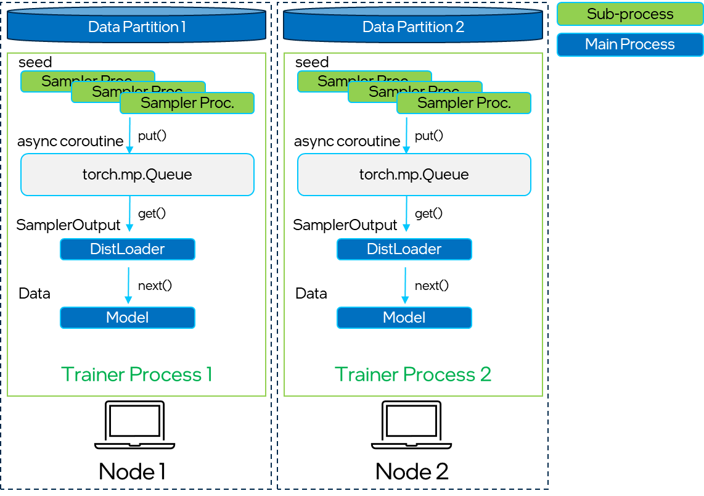
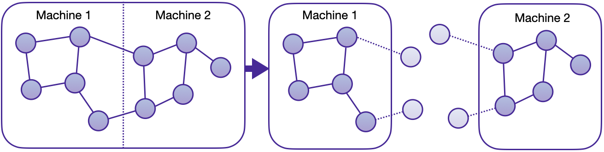
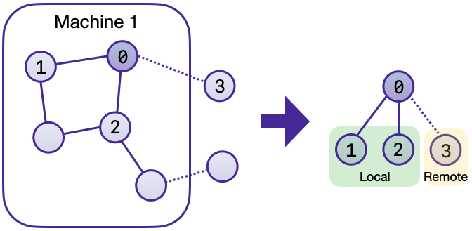

Distributed Training in PyG
===========================

.. warning::
    ``torch_geometric.distributed`` has been deprecated and will no longer be maintained.
    For distributed training with cuGraph, refer to `cuGraph examples <https://github.com/rapidsai/cugraph-gnn/tree/main/python/cugraph-pyg/cugraph_pyg/examples>`_.

.. note::
    We are thrilled to announce the first **in-house distributed training solution** for :pyg:`PyG` via :class:`torch_geometric.distributed`, available from version 2.5 onwards.
    Developers and researchers can now take full advantage of distributed training on large-scale datasets which cannot be fully loaded in memory of one machine at the same time.
    This implementation doesn't require any additional packages to be installed on top of the default :pyg:`PyG` stack.

In real life applications, graphs often consists of billions of nodes that cannot fit into a single system memory.
This is when distributed training of Graph Neural Networks comes in handy.
By allocating a number of partitions of the large graph into a cluster of CPUs, one can deploy synchronized model training on the whole dataset at once by making use of :pytorch:`PyTorch's` `Distributed Data Parallel (DDP) <https://pytorch.org/docs/stable/notes/ddp.html>`_ capabilities.
This architecture seamlessly distributes training of Graph Neural Networks across multiple nodes via `Remote Procedure Calls (RPCs) <https://pytorch.org/docs/stable/rpc.html>`_ for efficient sampling and retrieval of non-local features with traditional DDP for model training.
This new technique in :pyg:`PyG` was produced by engineers from `Intel <https://intel.com>`_ and `Kumo AI <https://kumo.ai/>`_.

Key Advantages
--------------

#. **Balanced graph partitioning** via METIS ensures minimal communication overhead when sampling subgraphs across compute nodes.
#. Utilizing **DDP for model training** in conjunction with **RPC for remote sampling and feature fetching routines** (with TCP/IP protocol and `gloo <https://github.com/facebookincubator/gloo>`_ communication backend) allows for data parallelism with distinct data partitions at each node.
#. The implementation via custom :class:`~torch_geometric.data.GraphStore` and :class:`~torch_geometric.data.FeatureStore` APIs provides a flexible and tailored interface for distributing large graph structure information and feature storage.
#. **Distributed neighbor sampling** is capable of sampling in both local and remote partitions through RPC communication channels.
   All advanced functionality of single-node sampling are also applicable for distributed training, *e.g.*, heterogeneous sampling, link-level sampling, temporal sampling, *etc*.
#. **Distributed data loaders** offer a high-level abstraction for managing sampler processes, ensuring simplicity and seamless integration with standard :pyg:`PyG`  data loaders.
#. Incorporating the Python `asyncio <https://docs.python.org/3/library/asyncio.html>`_ library for asynchronous processing on top of :pytorch:`PyTorch`-based RPCs further enhances the system's responsiveness and overall performance.

Architecture Components
-----------------------

.. note::
    The purpose of this tutorial is to guide you through the most important steps of deploying distributed training applications in :pyg:`PyG`.
    For code examples, please refer to `examples/distributed/pyg <https://github.com/pyg-team/pytorch_geometric/tree/master/examples/distributed/pyg>`_.

Overall, :class:`torch_geometric.distributed` is divided into the following components:

* :class:`~torch_geometric.distributed.Partitoner` partitions the graph into multiple parts, such that each node only needs to load its local data in memory.
* :class:`~torch_geometric.distributed.LocalGraphStore` and :class:`~torch_geometric.distributed.LocalFeatureStore` store the graph topology and features per partition, respectively.
  In addition, they maintain a mapping between local and global IDs for efficient assignment of nodes and feature lookup.
* :class:`~torch_geometric.distributed.DistNeighborSampler`  implements the distributed sampling algorithm, which includes local+remote sampling and the final merge between local/remote sampling results based on :pytorch:`PyTorch's` RPC mechanisms.
* :class:`~torch_geometric.distributed.DistNeighborLoader` manages the distributed neighbor sampling and feature fetching processes via multiple RPC workers.
  Finally, it takes care to form sampled nodes, edges, and their features into the classic :pyg:`PyG` data format.

   Schematic breakdown of the main components of :class:`torch_geometric.distributed`.

Graph Partitioning
~~~~~~~~~~~~~~~~~~

The first step for distributed training is to split the graph into multiple smaller portions,  which can then be loaded locally into nodes of the cluster.
Partitioning is built on top of :pyg:`null` :obj:`pyg-lib`'s `implementation <https://pyg-lib.readthedocs.io/en/latest/modules/partition.html#pyg_lib.partition.metis>`_ of the METIS algorithm, suitable to perform graph partitioning efficiently, even on large-scale graphs.
Note that METIS requires undirected, homogeneous graphs as input.
:class:`~torch_geometric.distributed.Partitoner` performs necessary processing steps to partition heterogeneous data objects with correct distribution and indexing.

By default, METIS tries to balance the number of nodes of each type in each partition while minimizing the number of edges between partitions.
This ensures that the resulting partitions provide maximal local access of neighbors, enabling samplers to perform local computations without the need for communication between different compute nodes.
Through this partitioning approach, every node receives a distinct assignment, while "halo nodes" (1-hop neighbors that fall into a different partition) are replicated.
Halo nodes ensure that neighbor sampling for a single node in a single layer stays purely local.

   Graph partitioning with halo nodes.

In our distributed training example, we prepared the `partition_graph.py <https://github.com/pyg-team/pytorch_geometric/blob/master/examples/distributed/pyg/partition_graph.py>`_ script to demonstrate how to apply partitioning on a selected subset of both homogeneous and heterogeneous graphs.
The :class:`~torch_geometric.distributed.Partitioner` can also preserve node features, edge features, and any temporal attributes at the level of nodes and edges.
Later on, each node in the cluster then owns a single partition of this graph.

.. warning::
    Partitioning via METIS is non-deterministic and as such may differ between iterations.
    However, all compute nodes should access the same partition data.
    Therefore, generate the partitions on one node and copy the data to all members of the cluster, or place the folder into a shared location.

The resulting structure of partitioning for a two-part split on the homogeneous :obj:`ogbn-products` is shown below:

.. code-block:: none

    partitions
    └─ obgn-products
       ├─ ogbn-products-partitions
       │  ├─ part_0
       │  ├─ part_1
       │  ├─ META.json
       │  ├─ node_map.pt
       │  └─ edge_map.pt
       ├─ ogbn-products-label
       │  └─ label.pt
       ├─ ogbn-products-test-partitions
       │  ├─ partition0.pt
       │  └─ partition1.pt
       └─ ogbn-products-train-partitions
          ├─ partition0.pt
          └─ partition1.pt

Distributed Data Storage
~~~~~~~~~~~~~~~~~~~~~~~~

To maintain distributed data partitions, we utilize instantiations of :pyg:`PyG's` :class:`~torch_geometric.data.GraphStore` and :class:`~torch_geometric.data.FeatureStore` remote interfaces.
Together with an integrated API for sending and receiving RPC requests, they provide a powerful tool for inter-connected distributed data storage.
Both stores can be filled with data in a number of ways, *e.g.*, from :class:`~torch_geometric.data.Data` and :class:`~torch_geometric.data.HeteroData` objects or initialized directly from generated partition files.

:class:`~torch_geometric.distributed.LocalGraphStore` is a class designed to act as a **container for graph topology information**.
It holds the edge indices that define relationships between nodes in a graph.
It offers methods that provide mapping information for nodes and edges to individual partitions and support both homogeneous and heterogeneous data formats.

**Key Features:**

* It only stores information about local graph connections and its halo nodes within a partition.
* Remote connectivity: The affiliation information of individual nodes and edges to partitions (both local and global) can be retrieved through node and edge "partition books", *i.e.* mappings of partition IDs to global node/edge IDs.
* It maintains global identifiers for nodes and edges, allowing for consistent mapping across partitions.

:class:`~torch_geometric.distributed.LocalFeatureStore` is a class that serves as both a **node-level and edge-level feature storage**.
It provides efficient :obj:`put` and :obj:`get` routines for attribute retrieval for both local and remote node/edge IDs.
The :class:`~torch_geometric.distributed.LocalFeatureStore` is responsible for retrieving and updating features across different partitions and machines during the training process.

**Key Features:**

* It provides functionalities for storing, retrieving, and distributing node and edge features.
  Within the managed partition of a machine, node and edge features are stored locally.
* Remote feature lookup: It implements mechanisms for looking up features in both local and remote nodes during distributed training processes through RPC requests.
  The class is designed to work seamlessly in distributed training scenarios, allowing for efficient feature handling across partitions.
* It maintains global identifiers for nodes and edges, allowing for consistent mapping across partitions.

Below is an example of how :class:`~torch_geometric.distributed.LocalFeatureStore` is used internally to retrieve both local+remote features:

.. code-block:: python

    import torch
    from torch_geometric.distributed import LocalFeatureStore
    from torch_geometric.distributed.event_loop import to_asyncio_future

    feature_store = LocalFeatureStore(...)

    async def get_node_features():
        # Create a `LocalFeatureStore` instance:

        # Retrieve node features for specific node IDs:
        node_id = torch.tensor([1])
        future = feature_store.lookup_features(node_id)

        return await to_asyncio_future(future)

Distributed Neighbor Sampling
~~~~~~~~~~~~~~~~~~~~~~~~~~~~~

:class:`~torch_geometric.distributed.DistNeighborSampler` is a class designed for efficient distributed training of Graph Neural Networks.
It addresses the challenges of sampling neighbors in a distributed environment, whereby graph data is partitioned across multiple machines or devices.
The sampler ensures that GNNs can effectively learn from large-scale graphs, maintaining scalability and performance.

**Asynchronous Neighbor Sampling and Feature Collection:**

Distributed neighbor sampling is implemented using asynchronous :class:`torch.distributed.rpc` calls.
It allows machines to independently sample neighbors without strict synchronization.
Each machine autonomously selects neighbors from its local graph partition, without waiting for others to complete their sampling processes.
This approach enhances parallelism, as machines can progress asynchronously, and leads to faster training.
In addition to asynchronous sampling, distributed neighbor sampling also provides asynchronous feature collection.

**Customizable Sampling Strategies:**

Users can customize neighbor sampling strategies based on their specific requirements.
The :class:`~torch_geometric.distributed.DistNeighborSampler` class provides full flexibility in defining sampling techniques, such as:

* Node sampling vs. edge sampling
* Homogeneous vs. heterogeneous sampling
* Temporal sampling vs. static sampling

**Distributed Neighbor Sampling Workflow:**

A batch of seed nodes follows three main steps before it is made available for the model's :meth:`forward` pass by the data loader:

#. **Distributed node sampling:** While the underlying principles of neighbor sampling holds for the distributed case as well, the implementation slightly diverges from single-machine sampling.
   In distributed training, seed nodes can belong to different partitions, leading to simultaneous sampling on multiple machines for a single batch.
   Consequently, synchronization of sampling results across machines is necessary to obtain seed nodes for the subsequent layer, requiring modifications to the basic algorithm.
   For nodes within a local partition, the sampling occurs on the local machine.
   Conversely, for nodes associated with a remote partition, the neighbor sampling is conducted on the machine responsible for storing the respective partition.
   Sampling then happens layer-wise, where sampled nodes act as seed nodes in follow-up layers.
#. **Distributed feature lookup:** Each partition stores an array of features of nodes and edges that are within that partition.
   Consequently, if the output of a sampler on a specific machine includes sampled nodes or edges which do not pertain in its partition, the machine initiates an RPC request to a remote server which these nodes (or edges) belong to.
#. **Data conversion:** Based on the sampler output and the acquired node (or edge) features, a :pyg:`PyG` :class:`~torch_geometric.data.Data` or :class:`~torch_geometric.data.HeteroData` object is created.
   This object forms a batch used in subsequent computational operations of the model.

   Local and remote neighbor sampling.

Distributed Data Loading
~~~~~~~~~~~~~~~~~~~~~~~~

Distributed data loaders such as :class:`~torch_geometric.distributed.DistNeighborLoader` and :class:`~torch_geometric.distributed.DistLinkNeighborLoader` provide a simple API for the sampling engine described above because they entirely wrap initialization and cleanup of sampler processes internally.
Notably, the distributed data loaders inherit from the standard :pyg:`PyG` single-node :class:`~torch_geometric.loader.NodeLoader` and :class:`~torch_geometric.loader.LinkLoader` loaders, making their application inside training scripts nearly identically.

Batch generation is slightly different from the single-node case in that the step of (local+remote) feature fetching happens within the sampler, rather than encapsulated into two separate steps (sampling->feature fetching).
This allows limiting the amount of RPCs.
Due to the asynchronous processing between all sampler sub-processes, the samplers then return their output to a :class:`torch.multiprocessing.Queue`.

Setting up Communication using DDP & RPC
~~~~~~~~~~~~~~~~~~~~~~~~~~~~~~~~~~~~~~~~

In this distributed training implementation two :class:`torch.distributed` communication technologies are used:

* :class:`torch.distributed.rpc` for remote sampling calls and distributed feature retrieval
* :class:`torch.distributed.ddp` for data parallel model training

Our solution opts for :class:`torch.distributed.rpc` over alternatives such as gRPC because :pytorch:`PyTorch` RPC inherently comprehends tensor-type data.
Unlike other RPC methods, which require the serialization or digitization of JSON or other user data into tensor types, using this method helps avoid additional serialization and digitization overhead.

The DDP group is initialzied in a standard way in the main training script:

.. code-block:: python

    torch.distributed.init_process_group(
        backend='gloo',
        rank=current_ctx.rank,
        world_size=current_ctx.world_size,
        init_method=f'tcp://{master_addr}:{ddp_port}',
    )

.. note::
    For CPU-based sampling we recommended the `gloo <https://github.com/facebookincubator/gloo>`_ communication backend.

RPC group initialization is more complicated because it happens in each sampler subprocess, which is achieved via the :meth:`~torch.utils.data.DataLoader.worker_init_fn` of the data loader, which is called by :pytorch:`PyTorch` directly at the initialization step of worker processes.
This function first defines a distributed context for each worker and assigns it a group and rank, subsequently initializes its own distributed neighbor sampler, and finally registers a new member in the RPC group.
This RPC connection remains open as long as the subprocess exists.
Additionally, we opted for the `atexit <https://docs.python.org/3/library/atexit.html>`_ module to register additional cleanup behaviors that are triggered when the process is terminated.

Results and Performance
-----------------------

We collected the benchmarking results on :pytorch:`PyTorch` 2.1 using the system configuration at the bottom of this blog.
The below table shows the scaling performance on the :obj:`ogbn-products` dataset of a :class:`~torch_geometric.nn.models.GraphSAGE` model under different partition configurations (1/2/4/8/16).

.. list-table::
   :widths: 15 15 15 15
   :header-rows: 1

   * - #Partitions
     - :obj:`batch_size=1024`
     - :obj:`batch_size=4096`
     - :obj:`batch_size=8192`
   * - 1
     - 98s
     - 47s
     - 38s
   * - 2
     - 45s
     - 30s
     - 24s
   * - 4
     - 38s
     - 21s
     - 16s
   * - 8
     - 29s
     - 14s
     - 10s
   * - 16
     - 22s
     - 13s
     - 9s

* **Hardware:** 2x Intel(R) Xeon(R) Platinum 8360Y CPU @ 2.40GHz, 36 cores, HT On, Turbo On, NUMA 2, Integrated Accelerators Available [used]: DLB 0 [0], DSA 0 [0], IAA 0 [0], QAT 0 [0], Total Memory 256GB (16x16GB DDR4 3200 MT/s [3200 MT/s]), BIOS SE5C620.86B.01.01.0003.2104260124, microcode 0xd000389, 2x Ethernet Controller X710 for 10GbE SFP+, 1x MT28908 Family [ConnectX-6], 1x 894.3G INTEL SSDSC2KG96, Rocky Linux 8.8 (Green Obsidian), 4.18.0-477.21.1.el8_8.x86_64
* **Software:** :python:`Python` 3.9, :pytorch:`PyTorch` 2.1, :pyg:`PyG` 2.5, :pyg:`null` :obj:`pyg-lib` 0.4.0
