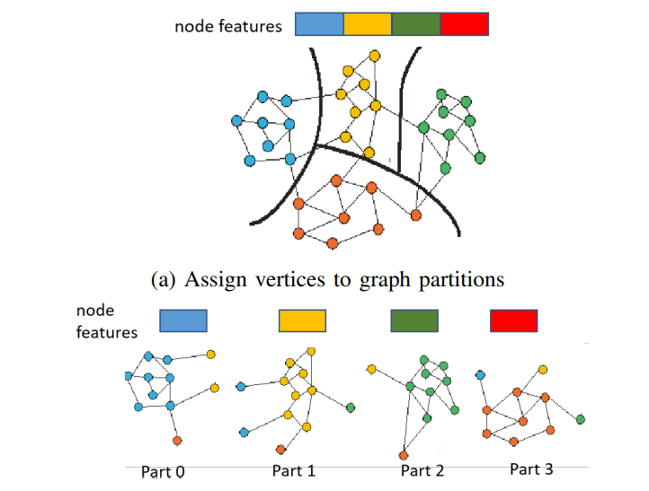
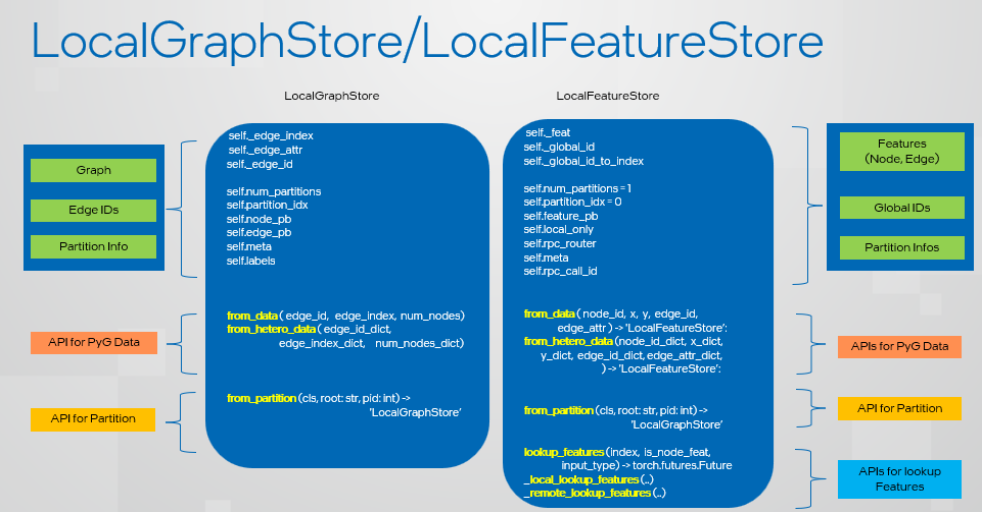
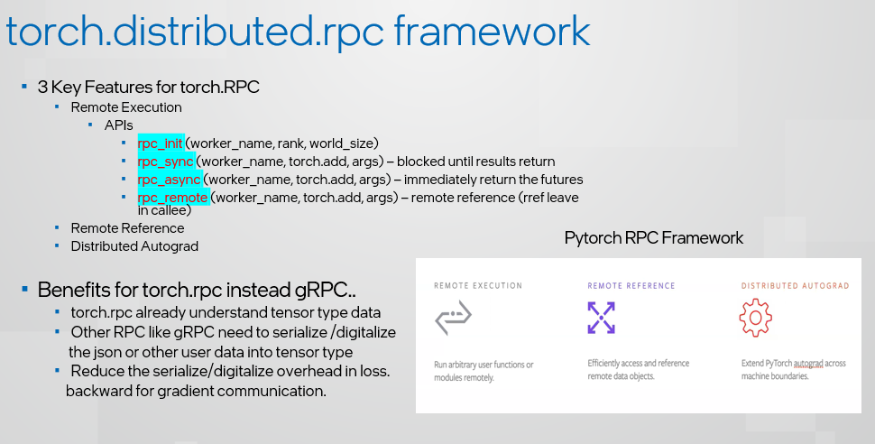
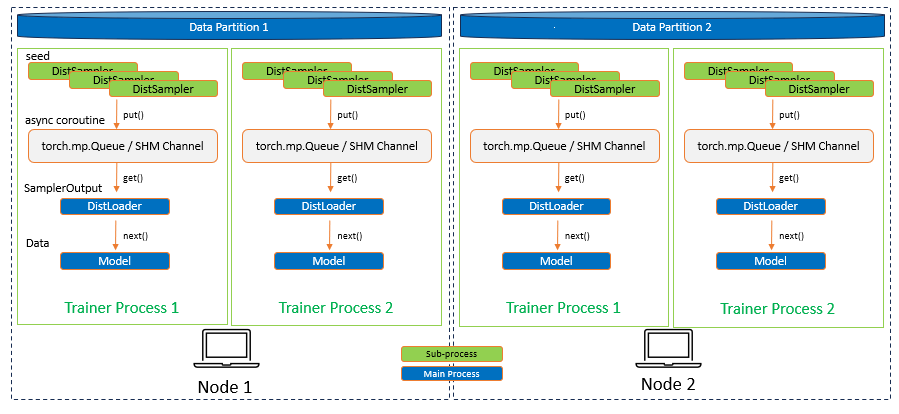
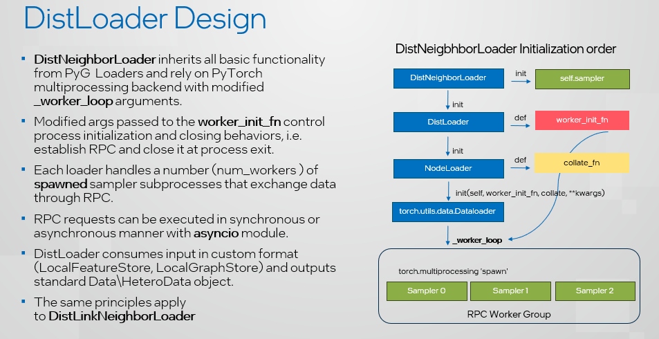
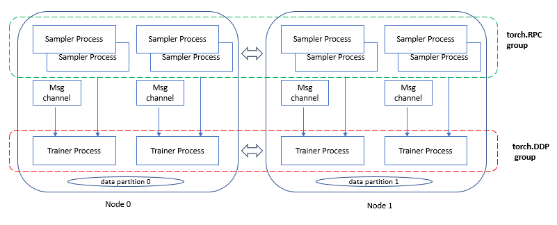
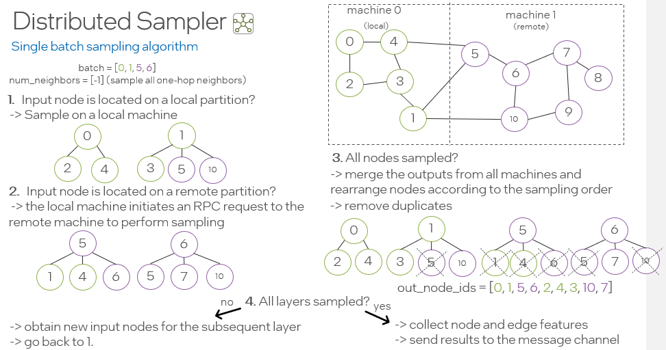
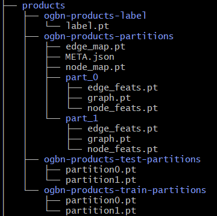
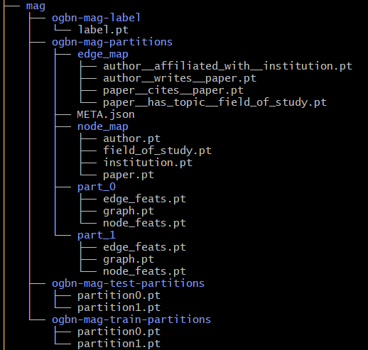

Distributed Training for PyG
=================================================

In real life applications graphs often consists of billions of nodes that can't be fitted into a single system memory. This is when the distributed training comes in handy. By allocating a number of partitions of the large graph into a cluster of CPUs one can deploy a synchronized model training on the whole database at once, by making use of `PyTorch Distributed Data Parallel (DDP) <https://pytorch.org/docs/stable/notes/ddp.html>`_ training. The architecture seamlessly distributes graph neural network training across multiple nodes by integrating `Remote Procedure Call (RPC) <https://pytorch.org/docs/stable/rpc.html>`_ for efficient sampling and retrieval of non-local features into standard DDP for model training. This distributed training implementation doesn't require any additonal packages to be installed on top of a default PyG stack. In the future the solution will also be available for Intel's GPUs.

Key Advantages
~~~~~~~~~~~~~~~~~~~~~~~~~~~~~~~
.. (TODO: add links)
#. Balanced graph partitioning with METIS for large graph databases, using ``Partitoner``
#. Utilizing DDP for model training in conjunction with RPC for remote sampling and feature calls, with TCP and the 'gloo' backend specifically tailored for CPU-based sampling, enhances the efficiency and scalability of the training process.
#. The implementation of a custom ``GraphStore``/``FeatureStore`` API provides a flexible and tailored interface for large graph structure information and feature storage.
#. ``DistNeighborSampler`` capable of node neighborhood sampling in both local and remote partitions, through RPC communication channel with other samplers, maintaining a consistent data structure ``Data``/``HeteroData`` at the output
#. The ``DistLoader``/``DistNeighborLoader``/``DistLinkLoader`` offers a high-level abstraction for managing sampler processes, ensuring simplicity and seamless integration with standard PyG Loaders. This facilitates easier development and harnesses the robustness of the torch dataloader
#. Incorporating Python's `asyncio` library for asynchronous processing on top of torch RPC further enhances the system's responsiveness and overall performance. This solution follows originally from the GLT distributed library.
#. Furthermore we provide homomgenous and heretogenous graph support with code examples, used in both edge and node-level prediction tasks.

The purpose of this manual is to guide you through the most important steps of deploying your distributed training application. For the code examples, please refer to:

* `partition_graph.py <https://github.com/pyg-team/pytorch_geometric/blob/master/examples/distributed/pyg/partition_graph.py>`_ for graph partitioning
* `distributed_cpu.py <https://github.com/pyg-team/pytorch_geometric/blob/master/examples/distributed/pyg/distributed_cpu.py>`_ for end-to-end GNN (GraphSAGE) model training with homogenous or heterogenous data

1. Graph Partitioning
--------------------------------------

The first step for distributed training is to split the graph into multiple smaller partitions, which can then be loaded into nodes of the cluster. This is a pre-processing step that can be done once as the resulting dataset ``.pt`` files can be reused. The ``Partitoner`` build on top of ``ClusterData``, uses pyg-lib implementation of METIS `pyg_lib.partition <https://pyg-lib.readthedocs.io/en/latest/modules/partition.html>`_ algorithm to perform graph partitioning in an efficient way, even on very large graphs. By default METIS always tries to balance the number of nodes of each type in each partition and minimize the amount of edges between the partitions. This guarantees that the partition provides accessibility to all neighboring local vertices, enabling samplers to perform local computations without the need for inter-communication. Through this partitioning approach, every edge receives a distinct assignment, although certain vertices may be replicated. The vertices shared between partitions are so called "halo nodes".
Please note that METIS requires undirected, homogenous graph as input, but ``Partitioner`` performs necessary processing steps to parition heterogenous data objects with correct distribution and indexing.

**Figure:** Generate graph partitions with HALO vertices (the vertices with different colors from majority of the vertices in the partition). Source: `DistDGL paper. <https://arxiv.org/pdf/2010.05337.pdf>`_
  
Provided example script `partition_graph.py <https://github.com/pyg-team/pytorch_geometric/blob/master/examples/distributed/pyg/partition_graph.py>`_ demonstrates the partitioning for homogenous ``ogbn-products``,``Reddit``, and heterogenous:``ogbn-mag``, ``Movielens`` datasets.
The ``Partitioner`` can also process temporal attributes of the nodes which is presented in the `Movielens`` dataset partitioning.
** Important note: **
As result of METIS is non-deterministic, the resulting partitions differ between iterations. To perform training, make sure that each node has an access to the same data partition. Use a shared drive or remote storage, i.e. a docker volume or manually copy the dataset to each node of the cluster!

The result of partitioning, for a two-part split of homogenous ``ogbn-products`` is as follows:

#. ogbn-products-labels:
    * label.pt:   target node/edge labels
#. ogbn-products-partitions:
    * edge_map.pt:   mapping (partition book) between edge_id and partition_id
    * node_map.pt:   mapping (partition book) between node_id and partition_id
    * META.json:  {"num_parts": 2, "is_hetero": false, "node_types": null, "edge_types": null, "is_sorted": true}
    * part0:      partition 0
        * graph.pt:     graph topo
        * node_feats.pt:   node features
        * edge_feats.pt:   edge features (if present)
    * part1:      partition 1
        * ...
#. ogbn-products-train-partitions:
    * partion0.pt:  training node indices for partition0
    * partion1.pt:  training node indices for partition1
#. ogbn-products-test-partitions:
    * partion0.pt:  test node indices for partition0
    * partion0.pt:  test node indices for partition1

In distributed training, each node in the cluster holds a partition of the graph. Before the training starts, we will need partition the graph dataset into multiple partitions, each of which corresponds to a specific training node.

2. LocalGraphStore and LocalFeatureStore
----------------------------------------

2.1 Architecture for LGS/LFS
~~~~~~~~~~~~~~~~~~~~~~~~~~~~~~~

1) LocalGraphStore

There are three parts for LocalGraphStore:

+ Graph Stores:

  - graph topology, edge IDs, and parition information like num_partitions, partition_idx, node_pb (node partition book), edge_pb (edge partition book), partition_meta, partition label

+ APIs for PyG Data:

  - API function ``from_data()`` is to creates a local graph store from a homogeneous PyG graph
  - API function ``from_hetero_data()`` is to creates a local graph store from a heterogeneous PyG graph

+ API for Partition:

  - API function ``from_partition()`` is to creates a local graph store from one PyG data partition.

2) LocalFeatureStore

There are four parts for LocalGraphStore:

+ Features Stores:

  - node/edge features, node IDs, and parition information like num_partitions, partition_idx, node_pb (node partition book), edge_pb (edge partition book), partition_meta, partition label

+ APIs for PyG Data:

  - API function ``from_data()`` is to creates a local feature store from homogeneous PyG tensors
  - API function ``from_hetero_data()`` is to creates a local feature store from heterogeneous PyG tensors

+ API for Partition:

  - API function ``from_partition()`` is to creates a local feature store from one PyG data partition.

+ API for feature lookup

  - API function ``lookup_features()`` is to lookup the features from local partition and remote partitions which will include the sub-apis of ``_remote_lookup_features()`` and ``_local_lookup_features()``.

2.2 Loading partition into Stores
~~~~~~~~~~~~~~~~~~~~~~~~~~~~~~~~~~~

Based on the above APIs from LFS/LGS you can load the partitions into graphstore/featurestore over the multiple nodes as below code:

.. code-block:: python

    # load partition into graph
    graph = LocalGraphStore.from_partition(
        osp.join(root_dir, f'{dataset_name}-partitions'), node_rank)
    edge_attrs = graph.get_all_edge_attrs()

    # load partition into feature
    feature = LocalFeatureStore.from_partition(
        osp.join(root_dir, f'{dataset_name}-partitions'), node_rank)

    # load partition information
    (meta, num_partitions, partition_idx, node_pb,
     edge_pb) = load_partition_info(
         osp.join(root_dir, f'{dataset_name}-partitions'), node_rank)

    # setup the partition information in graph
    graph.num_partitions = num_partitions
    graph.partition_idx = partition_idx
    graph.node_pb = node_pb
    graph.edge_pb = edge_pb
    graph.meta = meta

    # setup the partition information in feature
    feature.num_partitions = num_partitions
    feature.partition_idx = partition_idx
    feature.node_feat_pb = node_pb
    feature.edge_feat_pb = edge_pb
    feature.feature_pb = node_pb
    feature.meta = meta

    # load the label file and put into graph as labels
    if node_label_file is not None:
        if isinstance(node_label_file, dict):
            whole_node_labels = {}
            for ntype, file in node_label_file.items():
                whole_node_labels[ntype] = torch.load(file)
        else:
            whole_node_labels = torch.load(node_label_file)
    node_labels = whole_node_labels
    graph.labels = node_labels

    partition_data = (feature, graph)

At the same time we also store the partition information like num_partitions, partition_idx, node_pb (node partition book), edge_pb (edge partition book), partition_meta, partition label into graphstore/featurestore. Finally we construct one tuple structure to provide the input for the DistNeighborLoader/DistNeighborSampler like (featurestore, graphstore).

3. Torch RPC and dist Context
---------------------------------------------------

In the distributed pyg two torch.distributed parallel technologies are used:

+ ``torch.distributed.ddp`` used for data parallel on training side
+ ``torch.distributed.rpc`` for remote sampling over multiple nodes. there are two times to use RPC in distributed sampling:

  - Node sampling over different partitions belong to different nodes
  - Feature looking up over the different nodes

Here we used the torch.distributed.rpc instead of gRPC, etc because torch.distributed.rpc already understand tensor type data. Some other RPC like gRPC need to serialize /digitalize the json or other user data into tensor type which will put more serialize/digitalize overhead in loss backward for gradient communication.

.. code-block:: python

    # Initialize distributed context.
    current_ctx = DistContext(
        world_size=num_nodes * num_training_procs_per_node,
        rank=node_rank * num_training_procs_per_node + local_proc_rank,
        global_world_size=num_nodes * num_training_procs_per_node,
        global_rank=node_rank * num_training_procs_per_node + local_proc_rank,
        group_name='distributed-sage-supervised-trainer')
    current_device = torch.device('cpu')
    rpc_worker_names = {}

    # Initialize DDP training process group.
    torch.distributed.init_process_group(
        backend='gloo', rank=current_ctx.rank,
        world_size=current_ctx.world_size,
        init_method='tcp://{}:{}'.format(master_addr, training_pg_master_port))

Distributed class ``DistContext`` is used to contain the distributed information like world_size, rank, global_world_size, global_rank, group_name, etc which is easy for distributed communication.

In the ``torch.distributed.ddp`` communication we support all kinds of backend, like NCCL, Gloo, MPI, etc.

4. Distributed NeighborLoader
------------------------------------

Distributed class ``DistNeighborLoader`` is used to provide batch-sized data for distributed trainer. This class will have the input of data partition, num_neighbors, train_idx, batch_size, shuffle flag, device, number of sampler workers, master addr/port for ddp, context and rpc_worker_names, etc.

As the DistNeighborLoader architecture shown above there are the separate processes for sampler and trainer.

+ **Main process**:   cover the loading of data partition, distloader and model training, etc
+ **Sampler process**: cover the distNeighborSampler and message queue like here we used ``torch.mp.queue`` to send the sampler message from one process to another.

The working flow is from load partition into graphstore/featurestore, distNeighborSampler with local and remote sampling,  sampled nodes/features to be formed into PyG data for dataloader and finally into trainer for training.

Distributed class ``DistLoader`` is used to create distributed data loading routines like initializing the parameters of current_ctx, rpc_worker_names, master_addr/port, channel, num_rpc_threads, num_workers, etc and then at the same time will initialize the context/rpc for distributed sampling based on ``worker_init_fn``.

Distributed class ``NodeLoader`` is used to do the distributed node sampling and feature collection from local/remotely based on the function of ``collate_fn`` and ``filter_fn`` in ``NodeLoader`` and finally formed sampled results into PyG data for dataloader output.

There are several key features for ``DistNeighborLoader`` and  ``DistLoader``:

+ ``DistNeighborLoader`` inherits all basic functionality from PyG Loaders and rely on PyTorch multiprocessing backend with modified ``_worker_loop`` arguments.
+ Modified args passed to the ``worker_init_fn`` control process initialization and closing behaviors, i.e. establish RPC and close it at process exit.
+ Each loader handles a number (num_workers) of spawned sampler subprocesses that exchange data through RPC.
+ RPC requests can be executed in synchronous or asynchronous manner with asyncio module.
+ ``DistLoader`` consumes input in custom format (``LocalFeatureStore``, ``LocalGraphStore``) and outputs standard Data\HeteroData object.
+ The same principles apply to ``DistLinkNeighborLoader``

.. code-block:: python

    # setup the train seeds for the loader
    train_idx = train_idx.split(
        train_idx.size(0) // num_training_procs_per_node)[local_proc_rank]

    num_neighbors = [15, 10, 5]
    # Create distributed neighbor loader for training
    train_loader = pyg_dist.DistNeighborLoader(
        data=partition_data, num_neighbors=num_neighbors,
        input_nodes=train_idx, batch_size=batch_size, shuffle=True,
        device=torch.device('cpu'), num_workers=num_workers,
        concurrency=concurrency, master_addr=master_addr,
        master_port=train_loader_master_port, async_sampling=True,
        filter_per_worker=False, current_ctx=current_ctx,
        rpc_worker_names=rpc_worker_names)

    # setup the train seeds for the loader
    test_idx = test_idx.split(test_idx.size(0) //
                              num_training_procs_per_node)[local_proc_rank]

    # Create distributed neighbor loader for testing.
    test_loader = pyg_dist.DistNeighborLoader(
        data=partition_data, num_neighbors=num_neighbors, input_nodes=test_idx,
        batch_size=batch_size, shuffle=True, device=torch.device('cpu'),
        num_workers=num_workers, concurrency=concurrency,
        master_addr=master_addr, master_port=test_loader_master_port,
        async_sampling=True, filter_per_worker=False, current_ctx=current_ctx,
        rpc_worker_names=rpc_worker_names)

    # Define model and optimizer.
    model = GraphSAGE(
        in_channels=in_channels,
        hidden_channels=256,
        num_layers=3,
        out_channels=out_channels,
    ).to(current_device)
    model = DistributedDataParallel(model)
    optimizer = torch.optim.Adam(model.parameters(), lr=0.004)

    # Train and test.
    f = open(f'dist_train_sage_for_homo_rank{node_rank}.txt', 'a+')
    for epoch in range(0, epochs):
        model.train()
        pbar = tqdm(total=train_idx.size(0))
        start = time.time()
        for i, batch in enumerate(train_loader):
            if i == 0:
                pbar.set_description(f'Epoch {epoch:02d}')
            optimizer.zero_grad()
            out = model(
                batch.x,
                batch.edge_index)[:batch.batch_size].log_softmax(dim=-1)
            loss = F.nll_loss(out, batch.y[:batch.batch_size])
            loss.backward()
            optimizer.step()
            if i == len(train_loader) - 1:
                torch.distributed.barrier()
            pbar.update(batch_size)
        pbar.close()

5. Distributed Sampling
---------------------------------------------------

The figure below shows the architecture of the deployment mode:

There are two communication groups. One is ddp group used for distributed training. Another is rpc group used for distributed sampling including node sampling and feature collection over multiple partitions.

From this diagram there are two nodes and each node will load one partition in graphstore/featurestore for their respective partition.

distributed training in PyG has two basic roles: sampler and trainer:

- **Sampler Process** creates the distributed sampler for distributed neighbor sampling and feature collection based on torch.distributed.rpc.
  The sampled results will be sent to the sampling message channel to be consumed by trainers.

- **Trainer Process** corresponds to a participant of PyTorch's DDP training, loads sampled results from the sampling message channel, and conducts model training.

The working flow is -

+ **distributed node sampling**:  Based on training seeds (some seeds are in local and some are in remote nodes) the distributed node sampling will be performed. After the local sampling and remote sampling under these seeds the sampling results will be merged.

+ **distributed feature lookup**: Based on the sampled global node ids (some are in local and some are in remote nodes) the distributed feature lookup still will be performance. Finally the local/remote features will be merged also.

+ **form into PyG data format**:  Based on sampled nodes/features these sampled messages will be formed into PyG data as dataloader output for trainer input.

The key code structure of distributed class ``DistNeighborSampler`` shown as below.

The key steps for distributed node sampling -

+ ``node_sample()``:
  - Node sampling function based on layer-by-layer sampling, each layer of which is done by ``simple_one_hop()``.
  - After one layer sampled there will remove duplication in sampled results
  - Add with the sampled nodes from previous layers

+ ``simple_one_hop()``:
  - one layer sampling including the local sampling and remote node sampling
  - return the merged sampled results

+ ``_simple_one_hop()``:
  - meta sampling algorithm from ``pyg_lib`` based on graphstore/featurestore tuple input
  - c++ based implementation

.. code-block:: python

    def node_sample(
        self,
        inputs: Union[NodeSamplerInput, EdgeSamplerInput],..
        ):
        # ...
        # for homo ..
        # loop over the layers
        for i, one_hop_num in enumerate(self.num_neighbors):
            out = await self.sample_one_hop(src, one_hop_num, seed_time,
                                                src_batch)
            # remove duplicates
            src, node, src_batch, batch = remove_duplicates(
                    out, node, batch, self.disjoint)

            node_with_dupl.append(out.node)
            edge.append(out.edge)

        row, col = torch.ops.pyg.relabel_neighborhood(
                seed,
                torch.cat(node_with_dupl),
                sampled_nbrs_per_node,
                self._sampler.num_nodes,
                torch.cat(batch_with_dupl) if self.disjoint else None,
                self.csc,
                self.disjoint,
        )

        sampler_output = SamplerOutput(
                node=node,
                row=row,
                col=col,
                edge=torch.cat(edge),
                batch=batch if self.disjoint else None,
                num_sampled_nodes=num_sampled_nodes,
                num_sampled_edges=num_sampled_edges,
                metadata=metadata,
        )
        return sampler_output

    async def sample_one_hop(
        self,
        srcs: Tensor,
        one_hop_num: int,
        seed_time: Optional[Tensor] = None,
        src_batch: Optional[Tensor] = None,
        edge_type: Optional[EdgeType] = None,
    ) -> SamplerOutput:

        # ...
        for i in range(self.graph_store.num_partitions):
            if p_srcs.shape[0] > 0:
                if p_id == self.graph_store.partition_idx:
                    # Sample for one hop on a local machine:
                    p_nbr_out = self._sample_one_hop(p_srcs, one_hop_num,
                                                     p_seed_time, edge_type)
                    p_outputs.pop(p_id)
                    p_outputs.insert(p_id, p_nbr_out)

                else:  # Sample on a remote machine:
                    local_only = False
                    to_worker = self.rpc_router.get_to_worker(p_id)
                    futs.append(
                        rpc_async(
                            to_worker,
                            self.rpc_sample_callee_id,
                            args=(p_srcs, one_hop_num, p_seed_time, edge_type),
                        ))
        return self.merge_sampler_outputs(partition_ids, partition_orders,
                                          p_outputs, one_hop_num, src_batch)

    def _sample_one_hop(
        self,
        input_nodes: Tensor,
        num_neighbors: int,
        seed_time: Optional[Tensor] = None,
        edge_type: Optional[EdgeType] = None,
    ) -> SamplerOutput:
        # ...
        out = torch.ops.pyg.dist_neighbor_sample(
            colptr,
            row,
            input_nodes.to(colptr.dtype),
            num_neighbors,
            node_time,
            None,  # edge_time
            seed_time,
            None,  # TODO: edge_weight
            True,  # csc
            self.replace,
            self.subgraph_type != SubgraphType.induced,
            self.disjoint and node_time is not None,
            self.temporal_strategy,
        )
        node, edge, cumsum_neighbors_per_node = out

        # ...
        return SamplerOutput(
            node=node,
            row=None,
            col=None,
            edge=edge,
            batch=None,
            metadata=(cumsum_neighbors_per_node, ),
        )

One example based on the DistNeighborSampler is shown as below.

Key steps in this example as -

1) Input node is located on a local partition?
-> Sample on a local machine

2) Input node is located on a remote partition?
-> the local machine initiates an RPC request to the remote machine to perform sampling

3) All nodes sampled?
-> merge the outputs from all machines and rearrange nodes according to the sampling order
-> remove duplicates

4) All layers sampled?

+ yes -> collect node and edge features -> send results to the message channel

+ no -> obtain new input nodes for the subsequent layer -> go back to 1.

6. Edge Sampling
------------------------------------

7. Installation & Run for Homo/Hetero Example
---------------------------------------------

7.1 Installation
~~~~~~~~~~~~~~~~~~~~~~~~~~~~~~~~~~~~~~

Requirement:

- latest PyG
- environment
        (1) Password-less ssh needs to be set up on all the nodes that you are using.

        (2) A network file system (NFS) is set up for all the nodes to access.

        (3) To perform distributed sampling, files and codes need to be accessed across multiple machines. A distributed file system (i.e., NFS, SSHFS, Ceph, ...) is required to allow you for synchnonizing files such as partition information.

7.2 Run for Homo Example
~~~~~~~~~~~~~~~~~~~~~~~~~~~~~~~~~~~~~~

1) Prepare and partition the data

In distributed training, each node in the cluster holds a partition of the graph. Before the training starts, we partition the ``ogbn-products`` dataset into multiple partitions, each of which corresponds to a specific training node.

Here, we use ``ogbn-products`` and partition it into two partitions (in default) by the `[partition example] <https://github.com/pyg-team/pytorch_geometric/blob/master/examples/distributed/pyg/partition_graph.py>`__

.. code-block:: python

    python partition_graph.py --dataset=ogbn-products --root_dir=./data/products --num_partitions=2

The generated partition will have the folder below.

You can put/move the products partition folder into one public folder that each node can access this shared folder.

2) Run the example in each training node

For example, running the example in two nodes:

.. code-block:: python

    # Node 0:
    python dist_train_sage_for_homo.py \
      --dataset_root_dir=your partition folder \
      --num_nodes=2 --node_rank=0 --num_training_procs=1 \
      --master_addr= master ip

    # Node 1:
    python dist_train_sage_for_homo.py \
      --dataset_root_dir=your partition folder \
      --num_nodes=2 --node_rank=1 --num_training_procs=1 \
      --master_addr= master ip

**Notes:**

1. You should change the `master_addr` to the IP of `node#0`.
2. In default this example will use the num_workers = 2 for number of sampling workers and concurrency=2 for mp.queue. you can also add these argument to speed up the training like "--num_workers=8 --concurrency=8"
3. All nodes need to use the same partitioned data when running `dist_train_sage_for_homo.py`.

7.3 Run for Hetero Example
~~~~~~~~~~~~~~~~~~~~~~~~~~~~~~~~~~~~~~

1) Prepare and partition the data

Here, we use ``ogbn-mags`` and partition it into two partitions (in default) by the [`partition example <https://github.com/pyg-team/pytorch_geometric/blob/master/examples/distributed/pyg/partition_hetero_graph.py>`__] :

.. code-block:: python

    python partition_hetero_graph.py --dataset=ogbn-mag --root_dir=./data/mag --num_partitions=2

The generated partition will have the folder below.

You can put/move the products partition folder into one public folder that each node can access this shared folder.

2) Run the example in each training node

For example, running the example in two nodes:

.. code-block:: python

    # Node 0:
    python dist_train_sage_for_hetero.py \
      --dataset_root_dir=your partition folder \
      --dataset=ogbn-mags \
      --num_nodes=2 --node_rank=0 --num_training_procs=1 \
      --master_addr= master ip

    # Node 1:
    python dist_train_sage_for_hetero.py \
      --dataset_root_dir=your partition folder \
      --dataset=ogbn-mags \
      --num_nodes=2 --node_rank=1 --num_training_procs=1 \
      --master_addr= master ip

8. Run with Launch.py
------------------------------------

As you can see the run in previous paragraph we need run the script in separate nodes which is not easy for the case of big partition numbers. So in this chapter we will use one script to run just in one node for multiple partitions.

The requirement for this single-script run is that you still need multiple nodes with NFS supported & ssh with password-less.

In the followings we will show the files to run with single-scripts.

1) **ip_config.yaml**

There are the 2 ip and 2 ports list for 2 partitions inside this file as example below.

+ x.x.x.10 1234
+ x.x.x.12 1234

The node with first IP address will be the host node to run with launch.py as below.

2) **launch.py**

In the launch.py you need setup the parameters as below

+ workspace
+ parameters used in e2e example
+ part_config:  "partition config"
+ ip_config:  "ip_config.yaml"
+ remote cmd & "e2e_xxx.py" in remote nodes

.. code-block:: python

    python launch.py --workspace ./distributed_pyg/pytorch_geometric --num_nodes 2 --num_neighbors 15,10,5 --num_training_procs 1 --dataset_root_dir ./partition_ds/products --dataset ogbn-product --epochs 20 --batch_size 1024 --num_workers 2 --concurrency 2 --part_config ./partition_ds/products/ogbn-products-partitions/META.json --ip_config ./distributed_pyg/pytorch_geometric/ip_config.yaml 'cd /home/userXXX; source anaconda3/envs/PyGDistributed/bin/activate; cd /home/userXXX/distributed_pyg/pytorch_geometric; /home/userXXX/anaconda3/envs/PyGDistributed/bin/python /home/userXXX/distributed_pyg/pytorch_geometric/e2e_homo.py'

3) **run_dist.sh**

You also create one .sh file to run this distributed script with all parameters inside of this .sh file and if you need run another setting you just need change a little settting in this .sh file.

The below .sh example is assume that you have the anaconda virtual environment in all nodes.

.. code-block:: python

    #!/bin/bash

    CONDA_ENV=/home/userXXX/anaconda3/envs/PyGDistributed
    PYG_WORKSPACE=$PWD    #/home/userXXX/distributed_pyg/pytorch_geometric
    PY_EXEC=${CONDA_ENV}/bin/python
    EXEC_SCRIPT=${PYG_WORKSPACE}/e2e_homo.py

    # node number
    NUM_NODES=2

    # dataset folder
    DATASET_ROOT_DIR="/home/userXXX/partition_ds/products"

    # process number for training
    NUM_TRAINING_PROCS=1

    # dataset name
    DATASET=ogbn-product

    # num epochs to run for
    EPOCHS=20

    BATCH_SIZE=1024

    # number of workers for sampling
    NUM_WORKERS=2
    CONCURRENCY=2

    #partition data directory
    PART_CONFIG="/home/userXXX/partition_ds/products/ogbn-products-partitions/META.json"
    NUMPART=2

    # fanout per layer
    NUM_NEIGHBORS="15,10,5"

    #ip_config path
    IP_CONFIG=${PYG_WORKSPACE}/ip_config.yaml

    # Folder and filename where you want your logs.
    logdir="logs"
    mkdir -p "logs"
    logname=log_${DATASET}_${NUMPART}_$RANDOM
    echo $logname
    set -x

    # stdout stored in /logdir/logname.out
    python launch.py --workspace ${PYG_WORKSPACE} --num_nodes ${NUM_NODES} --num_neighbors ${NUM_NEIGHBORS} --num_training_procs ${NUM_TRAINING_PROCS} --dataset_root_dir ${DATASET_ROOT_DIR} --dataset ${DATASET} --epochs ${EPOCHS} --batch_size ${BATCH_SIZE} --num_workers ${NUM_WORKERS} --concurrency ${CONCURRENCY} --part_config ${PART_CONFIG} --ip_config ${IP_CONFIG} "cd /home/userXXX; source anaconda3/envs/PyGDistributed/bin/activate; cd ${PYG_WORKSPACE}; ${PY_EXEC} ${EXEC_SCRIPT}" |& tee ${logdir}/${logname}.txt
    set +x
