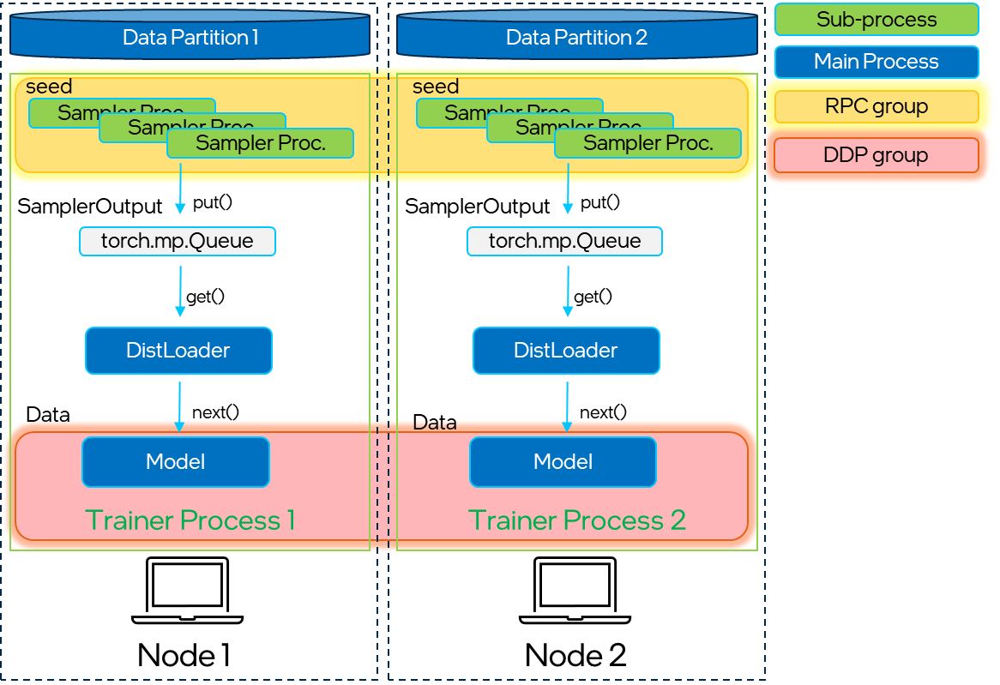

==============================
Distributed Training for PyG
==============================

In real life applications graphs often consists of billions of nodes that can't be fitted into a single system memory. This is when the distributed training comes in handy. By allocating a number of partitions of the large graph into a cluster of CPUs one can deploy a synchronized model training on the whole database at once, by making use of `PyTorch Distributed Data Parallel (DDP) <https://pytorch.org/docs/stable/notes/ddp.html>`_ training. The architecture seamlessly distributes graph neural network training across multiple nodes by integrating `Remote Procedure Call (RPC) <https://pytorch.org/docs/stable/rpc.html>`_ for efficient sampling and retrieval of non-local features into standard DDP for model training. This distributed training implementation doesn't require any additonal packages to be installed on top of a default  :pyg:`PyG` stack. In the future the solution will also be available for Intel's GPUs.

**Key Advantages:**

#. Balanced graph partitioning with METIS for large graph databases, using :class:`~torch_geometric.distributed.Partitoner`
#. Utilizing DDP for model training in conjunction with RPC for remote sampling and feature calls, with TCP/IP protocol and `gloo <https://github.com/facebookincubator/gloo>`_ communication library for CPU-based sampling, allows for data parallelism with distinct data partitions at each node.
#. The implementation of a custom :class:`~torch_geometric.distributed.GraphStore` / :class:`~torch_geometric.distributed.FeatureStore` API provides a flexible and tailored interface for distributing any large graph structure information and feature storage.
#. :class:`~torch_geometric.distributed.DistNeighborSampler` capable of node neighborhood sampling in both local and remote partitions, through RPC communication channel with other samplers, maintaining a consistent data structure :class:`~torch_geometric.data.Data` / :class:`~torch_geometric.data.HeteroData` at the output.
#. :class:`~torch_geometric.distributed.DistLoader` , :class:`~torch_geometric.distributed.DistNeighborLoader` , :class:`~torch_geometric.distributed.DistLinkLoader` offers a high-level abstraction for managing sampler processes, ensuring simplicity and seamless integration with standard  :pyg:`PyG` loaders. This facilitates easier development and harnesses the robustness of the torch dataloader.
#. Incorporating Python's ``asyncio`` library for asynchronous processing on top of torch RPC further enhances the system's responsiveness and overall performance. This solution follows originally from the GLT distributed library.
#. Furthermore we provide homomgenous and heretogenous graph support with code examples, used in both edge and node-level prediction tasks.

The purpose of this manual is to guide you through the most important steps of deploying your distributed training application. For the code examples, please refer to:

* `partition_graph.py <https://github.com/pyg-team/pytorch_geometric/blob/master/examples/distributed/pyg/partition_graph.py>`_ for graph partitioning,
* `distributed_cpu.py <https://github.com/pyg-team/pytorch_geometric/blob/master/examples/distributed/pyg/distributed_cpu.py>`_ for end-to-end GNN(GraphSAGE) model training with homogenous or heterogenous data.

**Figure 1:** Schematic breakdown of the main components.

Graph Partitioning
~~~~~~~~~~~~~~~~~~
The first step for distributed training is to split a graph into multiple smaller portions, which then can be fitted in the memory of nodes in a cluster. This is a pre-processing step that needs to be done only once, as the resulting parition files are saved in ``.pt`` format and can be reused. :class:`~torch_geometric.distributed.Partitoner` build on top of :class:`~torch_geometric.loader.ClusterData`, uses ``pyg-lib`` implementation of METIS `pyg_lib.partition <https://pyg-lib.readthedocs.io/en/latest/modules/partition.html>`_ algorithm to perform graph partitioning in an efficient way, even on very large graphs. By default METIS always tries to balance the number of nodes of each type in each partition and minimize the amount of edges between the partitions. This guarantees that the partitioning algorithm prioritizes locality of vertices, enabling samplers to perform local computations without need for remote data calls. Through this partitioning approach, every edge receives a distinct assignment, although certain vertices may be replicated to mark the boundaries between partitions (so called "halo nodes").
Please note that METIS requires undirected, homogenous graph as input, but :class:`~torch_geometric.distributed.Partitoner` performs necessary processing steps to parition heterogenous data objects with correct distribution and indexing.

.. figure:: ../_figures/DGL_metis.png
  :align: center
  :width: 60%
  :alt: Example of graph partitioning with METIS algorithm.

**Figure 2:** Generate graph partitions with HALO vertices (the vertices with different colors from majority of the vertices in the partition). Source: `DistDGL paper. <https://arxiv.org/pdf/2010.05337.pdf>`_

Provided example script `partition_graph.py <https://github.com/pyg-team/pytorch_geometric/blob/master/examples/distributed/pyg/partition_graph.py>`_ demonstrates the partitioning for homogenous ``ogbn-products``, ``Reddit`` , and heterogenous: ``ogbn-mag``, ``Movielens`` datasets.
The :class:`~torch_geometric.distributed.Partitoner` can also process temporal attributes of the nodes which is presented in the ``Movielens`` dataset partitioning.
.. warning::
    As result of METIS is non-deterministic, the resulting partitions differ between iterations. To perform training, make sure that each node has an access to the same data partition. Use a shared drive or remote storage, i.e. a docker volume or manually copy the dataset to each node of the cluster!

As a reuslt of running `partition_graph.py` with ``num_partitions=2`` for  homogenous ``ogbn-products``, in the folder specified in ``root_dir`` you may find following files:

* ogbn-products-labels:
    * label.pt - target node/edge labels
* ogbn-products-partitions:
    * edge_map.pt - mapping (partition book) between edge_id and partition_id
    * node_map.pt - mapping (partition book) between node_id and partition_id
    * META.json - graph metadata, i.e. : {"num_parts": 2, "is_hetero": false, "node_types": null, "edge_types": null, "is_sorted": true}
    * part0:
        * graph.pt - graph topology information
        * node_feats.pt - node features
        * edge_feats.pt - edge features (if present)
    * part1:
        * ...
* ogbn-products-train-partitions:
    * partion0.pt - training node indices for partition0
    * partion1.pt - training node indices for partition1
* ogbn-products-test-partitions:
    * partion0.pt - test node indices for partition0
    * partion0.pt - test node indices for partition1

In case of a heterogenous graph partition, in main paritition foler node and edge maps, become a collection of ``.pt`` files separated for each node and edge type, i.e. :

* ogbn-mag-partitions:
    * edge-map:
        * author_writes_paper.pt
        * ...
    * node-map:
        * author.pt
        * paper.pt
        * ...
    
In distributed training, each node in the cluster holds a partition of the graph. Before the training starts, we will need partition the graph dataset into multiple partitions, each of which corresponds to a specific training node.

Distributed data storage
~~~~~~~~~~~~~~~~~~

To maintain distirbuted data partitions at we propose a modified remote interface of :class:`~torch_geometric.data.GraphStore` \ :class:`~torch_geometric.data.FeatureStore` that together with integrated API for seding and receiving RPC requests provide a powerful tool for interconnected distributed data storage. Both stores can be filled with data in a number of ways, i.e. from Data or HeteroData objects or initialized directly from partition files. 

LocalGraphStore
-------------

:class:`~torch_geometric.distributed.LocalGraphStore` is a class designed to act as a container for graph topology information. It holds the edge indices that define relationships between nodes in a graph. Implemented on top of :class:`~torch_geometric.data.GraphStore` interface, it provides methods for efficient sampling from nodes, according to a sampling algorithm of the developer's choice and support for both homogeneous and heterogeneous :pyg:`PyG` graphs.

**Key Features:**

#. **Local partition Edge Index storage:** Stores information about local graph connections within partition.

#. **Remote partitions connectivity:** Connectivity information, as location of remote edges and nodes can be retrieved through node and edge "partition books" - binary parition ID to node/edge ID mappings.

#. **Global identifiers:** Maintains global identifiers for nodes and edges, allowing for consistent mapping across partitions.

#. **Edge attribute storage:** Stores unique edge identifiers of type :class:`~torch_geomeric.data.EdgeAttr` per each edge type. 

#. **Homogeneous and Heterogeneous graph support:** Supports both homogeneous and heterogeneous :pyg:`PyG` graphs.

LocalFeatureStore
-------------

:class:`~torch_geometric.distributed.LocalFeatureStore` is a class that serves as a node and edge feature storage. It hold node and edge attributes of the graph. Implemented on top of :class:`~torch_geometric.data.FeatureStore` interface it provides efficient `put` and `get` routines for attribute vector retrieval for both local and remote node/edge IDs. The local feature store is responsible for retreving and updating features across different partitions and machines during the training process.

**Key Features:**

#. **Node and edge feature storage:** It extends the :class:`~torch_geometric.data.FeatureStore` class and provides functionalities for storing, retrieving, and distributing node and edge features. Within the partition managed by each machine or device, node and edge features are stored locally.

#. **Remote feature lookup:** Implements mechanisms for looking up features in both local and remote nodes during distributed training through RPC requests and evaluating PyTorch Futures. The class is designed to work seamlessly in distributed training scenarios, allowing for efficient feature handling across partitions.

#. **Global identifiers:** Maintains global identifiers for nodes and edges, allowing for consistent mapping across partitions.

#. **Homogeneous and Heterogeneous Graph Support:** Supports both homogeneous and heterogeneous :pyg:`PyG` graphs.

Initialization and Usage
-------------
Both :class:`~torch_geometric.distributed.LocalFeatureStore` and :class:`~torch_geometric.distributed.LocalGraphStore` support flexible initialization methods:

1. **(Preferred method)** Objects can be initalized from previously saved paritition files :func:`~torch_geometric.distributed.*.from_parition()`

.. code-block:: python

    # Load partition into graph:
    graph_store = LocalGraphStore.from_partition(
        osp.join(root_dir, f'{dataset_name}-partitions'), node_rank)

    # Load partition into feature:
    feature_store = LocalFeatureStore.from_partition(
        osp.join(root_dir, f'{dataset_name}-partitions'), node_rank)

    node_labels = torch.load(node_label_file)
    partition_data = (feature_store, graph_store)

2. Objects can be initalized from standard :pyg:`PyG` Data objects using :func:`~torch_geometric.distributed.*.from_data()`

Example data for homogeneous graph:

.. code-block:: python

    import torch
    from torch_geometric.distributed import LocalGraphStore, LocalFeatureStore

    edge_id = torch.tensor([0, 1, 2, 3])
    edge_index = torch.tensor([[0, 1, 1, 2], [1, 0, 2, 1]])
    num_nodes = 3

    # Create a LocalGraphStore from homogeneous data:
    graph_store = LocalGraphStore.from_data(edge_id, edge_index, num_nodes)

    node_id = torch.tensor([0, 1, 2])
    x = torch.rand((3, 4))
    y = torch.tensor([1, 0, 1])
    edge_id = torch.tensor([0, 1, 2])
    edge_attr = torch.rand((3, 5))

    # Create a LocalFeatureStore from homogeneous data:
    feature_store = LocalFeatureStore.from_data(
        node_id=node_id,
        x=x,
        y=y,
        edge_id=edge_id,
        edge_attr=edge_attr
    )

Example data for heterogeneous graph:

.. code-block:: python

    import torch
    from torch_geometric.distributed import LocalGraphStore, LocalFeatureStore

    edge_id_dict = {
        ('v0', 'e0', 'v1'): torch.tensor([0, 1, 2, 3]),
    }
    edge_index_dict = {
        ('v0', 'e0', 'v1'): torch.tensor([[0, 1, 1, 2], [1, 0, 2, 1]]),
    }
    num_nodes_dict = {'v0': 2, 'v1': 2}

    # Create a LocalGraphStore from heterogeneous data:
    graph_store = LocalGraphStore.from_hetero_data(edge_id_dict, edge_index_dict, num_nodes_dict)

    node_id_dict = {
        'v0': torch.tensor([0, 1]),
        'v1': torch.tensor([2, 3, 4]),
    }
    x_dict = {
        'v0': torch.rand((2, 4)),
        'v1': torch.rand((3, 4)),
    }
    y_dict = {
        'v0': torch.tensor([1, 0]),
        'v1': torch.tensor([1, 0, 1]),
    }
    edge_id_dict = {
        ('v0', 'e0', 'v1'): torch.tensor([0, 1, 2]),
    }
    edge_attr_dict = {
        ('v0', 'e0', 'v1'): torch.rand((3, 5)),
    }
    # Create a LocalFeatureStore from heterogeneous data:
    feature_store = LocalFeatureStore.from_hetero_data(
        node_id_dict=node_id_dict,
        x_dict=x_dict,
        y_dict=y_dict,
        edge_id_dict=edge_id_dict,
        edge_attr_dict=edge_attr_dict
    )

3. Edge indices, edge attributes, edge ids and other relevant information can be added or retrieved using the provided methods.
Below is an example of creating an instance of :class:`~torch_geometric.distributed.LocalGraphStore` and using it for distributed training:

.. code-block:: python

    import torch
    from torch_geometric.distributed import LocalGraphStore

    # Create an instance of LocalGraphStore
    graph_store = LocalGraphStore()

    edge_id = torch.tensor([0, 1, 2, 3])
    edge_index = torch.tensor([[0, 1, 1, 2], [1, 0, 2, 1]])

    # Access or modify attributes
    graph_store.num_partitions = 2
    graph_store.partition_idx = 1

    # Store edge information
    graph_store.put_edge_index(
        edge_index,
        edge_type=None,
        layout='coo',
        size=(100, 100),
    )
    graph_store.put_edge_id(
        edge_id,
        edge_type=None,
        layout='coo',
        size=(100, 100),
    )

    # Retrieve edge information
    edge_attr = graph_store.get_all_edge_attrs()[0]
    retrieved_edge_index = graph_store.get_edge_index(edge_attr)
    retrieved_edge_id = graph_store.get_edge_id(edge_attr)

    # Remove edge information
    graph_store.remove_edge_index(edge_attr)
    graph_store.remove_edge_id(edge_attr)

Remote Feature Request Example
-------------

Below is an example of creating an instance of :class:`~torch_geometric.distributed.LocalFeatureStore` and using it for distributed training:

.. code-block:: python

    import torch
    from torch_geometric.distributed import LocalFeatureStore
    from torch_geometric.distributed.event_loop import to_asyncio_future

    async def get_node_features():
        # Create a LocalFeatureStore instance:
        feature_store = LocalFeatureStore()

        # Add global node identifiers and node features:
        node_ids = torch.tensor([0, 1, 2])
        node_features = torch.randn((3, 64))  # Assuming 64-dimensional node features
        feature_store.put_global_id(node_ids, group_name=None)
        feature_store.put_tensor(node_features, group_name=None, attr_name='x')

        feature_store.num_partitions = 2
        feature_store.node_feat_pb = torch.tensor([0, 0, 1])
        feature_store.meta = {'is_hetero': False}

        # Retrieve node features for a specific node ID:
        node_id_to_lookup = torch.tensor([1])
        future = feature_store.lookup_features(node_id_to_lookup)

        nfeat = await to_asyncio_future(future)

        return nfeat

    # Use the retrieved features in the GNN training process
    # ...

.. _rpc_section:

Setting up communication using DDP & RPC
~~~~~~~~~~~~~~~~~~~~~~~~~~~~~~~~

In this distributed training implementation two `torch.distributed` communication technologies are used:

* ``torch.distributed.ddp`` for data parallel model training
* ``torch.distributed.rpc`` for remote sampling calls & feature retrieval from distributed database

In this context, we opted for ``torch.distributed.rpc`` over alternatives such as gRPC because PyTorch RPC inherently comprehends tensor-type data. Unlike some other RPC methods like gRPC, which require the serialization or digitization of JSON or other user data into tensor types, using this method helps avoid additional serialization/digitization overhead during loss backward for gradient communication.

The DDP group is initialzied in a standard way in the main training script. 

.. code-block:: python

    # Initialize DDP training process group.
    torch.distributed.init_process_group(
        backend='gloo', rank=current_ctx.rank,
        world_size=current_ctx.world_size,
        init_method='tcp://{}:{}'.format(master_addr, ddp_port))

**Note:** For CPU-based sampling the recommended backend is `gloo`.

RPC group initialization is more complicated as it needs to happen in each sampler subprocess. This can be done my modifying :func:`~torch_geometric.distributed.DistLoader.worker_init_fn` that is called at the initialization step of worker processes by a PyTorch base class :class:`torch.utils.data._MultiProcessingDataLoaderIter`. Here we provide a customized init function:

.. code-block:: python

    def worker_init_fn(self, worker_id: int):
        try:
            num_sampler_proc = self.num_workers if self.num_workers > 0 else 1
            self.current_ctx_worker = DistContext(
                world_size=self.current_ctx.world_size * num_sampler_proc,
                rank=self.current_ctx.rank * num_sampler_proc + worker_id,
                global_world_size=self.current_ctx.world_size *
                num_sampler_proc,
                global_rank=self.current_ctx.rank * num_sampler_proc +
                worker_id,
                group_name='mp_sampling_worker',
            )

            init_rpc(
                current_ctx=self.current_ctx_worker,
                master_addr=self.master_addr,
                master_port=self.master_port,
                num_rpc_threads=self.num_rpc_threads,
                rpc_timeout=self.rpc_timeout,
            )
            logging.info(
                f"RPC initiated in worker-{worker_id} "
                f"(current_ctx_worker={self.current_ctx_worker.worker_name})")
            self.dist_sampler.init_sampler_instance()
            self.dist_sampler.register_sampler_rpc()
            global_barrier(timeout=10)  # Wait for all workers to initialize.

            # close RPC & worker group at exit:
            atexit.register(shutdown_rpc, self.current_ctx_worker.worker_name)

        except RuntimeError:
            raise RuntimeError(f"`{self}.init_fn()` could not initialize the "
                               f"worker loop of the neighbor sampler")

This functions first sets a unique :class:`~torch_geomeric.distribued.DistContext` for each worker and assigns it a group and rank, subsequently it initializes a standard :class:`~torch_geomeric.sampler.NeighborSampler` that provides basic functionality also for distributed data processing, and finally registers a new member in an RPC group `mp_sampling_worker`. This RPC connection remains open as long as the sub-process exists. Additonally, we opt for using ``atexit`` module to register additonal cleanup behaviors that are triggered when the process is terminated.

Distributed Sampling
~~~~~~~~~~~~~~~~~~~~~~~~~~~~~~~~

:class:`~torch_geometric.distributed.DistNeighborSampler` is a module designed for efficient distributed training of Graph Neural Networks. It addresses the challenges of sampling neighbors in a distributed environment, where graph data is partitioned across multiple machines or devices. The sampler ensures that GNNs can effectively learn from large-scale graphs, maintaining scalability and performance.

Asynchronous Neighbor Sampling and Feature Collection:
----------------

* Asynchronous neighbor sampling: Asynchronous sampling is implemented using asynchronous ``torch.distributed.RPC`` calls. It allows machines to independently sample neighbors without strict synchronization. Each machine autonomously selects neighbors from its local graph partition, without waiting for others to complete their sampling processes. This approach enhances parallelism, as machines can progress asynchronously leading to faster training. In addition to asynchronous sampling, Distributed Neighbor Sampler also provides asynchronous feature collection.

Customizable Sampling Strategies:
----------------

Users can customize neighbor sampling strategies based on their specific requirements. The module provides flexibility in defining sampling techniques, such as:

* Node sampling
* Edge sampling
* Disjoint sampling
* Node-based temporal sampling
* Edge-based temporal sampling

Additionally, each of these methods is supported for both homogeneous and heterogeneous graph sampling.

Distributed Neighbor Sampling Workflow Key Steps:
-----------------

Each batch of seed indices is passed to the :class:`~torch_geometric.distributed.DistNeighborSampler` and follows three main steps before its made available for the model's forward pass by the data loader:

#. **Distributed node sampling:** Utilizing the training seeds provided by the loader, the neighbor sampling procedure is executed. These training seeds may originate from either local or remote partitions. For nodes within a local partition, the sampling occurs on the local machine. Conversely, for nodes associated with a remote partition, the neighbor sampling is conducted on the machine responsible for storing the respective partition.

#. **Distributed feature lookup:** Each partition stores an array of features of nodes and edges that are within that partition. Consequently, if the output of a sampler on a specific machine includes sampled nodes or edges, that do not pertain in its partition, the machine must initiate an RPC request to a remote server which these nodes (or edges) belong to.

#. **Form :class:`~torch_geometric.sampler.SamplerOutput` into :class:`~torch_geometric.data.Data` format (or its heterogenous counterpart):** Based on the sampler output and the acquired node (or edge) features, a Data/HeteroData object is created. This object forms a batch used in subsequent computational operations of the model. Note that this step occurs within the loader :func:`filter_fn`.

Algorithm Overview:
-------------------

This section outlines the Distributed Neighbor Sampling Algorithm. The algorithm focuses on efficiently sampling neighbors across distributed nodes to facilitate effective learning on large-scale graph-structured data.

.. figure:: ../_figures/dist_sampler.png
  :align: center
  :width: 100%
  :alt: Distributed sampling illustration.
**Figure 3:** Schematic illustration of the Distributed Neighbor Sampling Algorithm.

While the underlying priciples of neighborhood aggregation hold for the distributed sampling process, the method diverges from single-machine sampling on CPU, conventionally performed with :func:`torch.ops.pyg.neighbor_sample`. In distributed training, seed nodes can belong to different partitions, leading to simultaneous sampling on multiple machines for a single batch. Consequently, synchronization of sampling results across machines is necessary to obtain seed nodes for the subsequent layer, requiring modifications to the basic algorithm.

The accompanying image illustrates a graph divided into two partitions, each associated with a distinct machine. For nodes `[0, 1, 5, 6]` in the batch, the objective is to sample all neighbors within a single layer. The process unfolds as follows:

1) In the initial step, the algorithm checks whether the seed nodes belong to the local partition. If affirmative, sampling is executed on the local machine.

2) If the seed nodes belong to a remote partition, an RPC request is dispatched from the local machine to the remote machine to initiate sampling.

3) Upon completion of the neighbor sampling process, results from remote machines are transmitted to the local machine, where they are merged and arranged based on the sampling order (seed nodes first, followed by sampled neighbors in the order of individual seed node sampling). The final step involves removing duplicate nodes.

4)
  * If all layers have been sampled, as is the case in this example, the features of the sampled nodes (or edges in the case of edge sampling) are obtained, and the results are passed to the message channel.

  * If not, new input nodes for the next layer are acquired. In the context of the image example, these nodes would be `[2, 4, 3, 10, 7]`, and the entire process starts from the beginning.

Distributed Neighbor Sampler Code Structure:
-----------------------
# MOVE TO A SEPARATE DOCUMENT?

This section provides an overview of the key elements of Distributed Neighbor Sampler code.

* :func:`~torch_geomeric.distribued.DistNeighborSampler.node_sample`:

  * :func:`~torch_geomeric.distribued.DistNeighborSampler.node_sample`, is responsible for performing layer-by-layer distributed sampling from either a :class:`~torch_geomeric.sampler.NodeSamplerInput` or :class:`~torch_geomeric.distributed.utils.DistEdgeHeteroSamplerInput` object.

  * It supports both homogeneous and heterogeneous graphs, adapting its behavior accordingly.

  * The sampling procedure takes into account temporal aspects.

  * Following the sampling of a single layer, the :func:`~torch_geometric.distributed.utils.remove_duplicates` function is utilized to remove duplicates among the sampled nodes in the result.

  * Upon completion of the sampling process, the :func:`torch.ops.pyg.relabel_neighborhood` (or in the case of hetero graphs: :func:`torch.ops.pyg.hetero_relabel_neighborhood`) function is employed to perform mappings from global to local node indices.

  * The output of the sampling procedure is returned, encapsulated in either a :class:`~torch_geomeric.sampler.SamplerOutput` or :class:`~torch_geomeric.sampler.HeteroSamplerOutput` object.

.. code-block:: python

    async def node_sample(
        self,
        inputs: Union[NodeSamplerInput, DistEdgeHeteroSamplerInput],
    ) -> Union[SamplerOutput, HeteroSamplerOutput]:
        # ...
        # Loop over the layers and perform sampling:
        for i, one_hop_num in enumerate(self.num_neighbors):
            out = await self.sample_one_hop(src, one_hop_num,
                                                src_seed_time, src_batch)
            # Remove duplicates:
            src, node, src_batch, batch = remove_duplicates(
                out, node, batch, self.disjoint)
        # ...
        row, col = torch.ops.pyg.relabel_neighborhood(
                seed,
                torch.cat(node_with_dupl),
                sampled_nbrs_per_node,
                self._sampler.num_nodes,
                torch.cat(batch_with_dupl) if self.disjoint else None,
                self.csc,
                self.disjoint,
        )

        sampler_output = SamplerOutput(
                node=node,
                row=row,
                col=col,
                edge=torch.cat(edge),
                batch=batch if self.disjoint else None,
                num_sampled_nodes=num_sampled_nodes,
                num_sampled_edges=num_sampled_edges,
                metadata=metadata,
        )
        return sampler_output

* :func:`~torch_geometric.distributed.DistNeighborSampler.sample_one_hop`:

  * This function is designed to sample one-hop neighbors for a given set of source nodes (:obj:`srcs`).

  * Using the input data, which consists of the indices of the source nodes :obj:`srcs` and their node type :obj:`src_node_type`, the assignment of these nodes to specific partitions is determined by invoking the :func:`~torch_geometric.distributed.LocalGraphStore.get_partition_ids_from_nids` function.

  * Based on the :obj:`partition_ids` values produced by :func:`~torch_geometric.distributed.LocalGraphStore.get_partition_ids_from_nids` it handles scenarios where the source nodes may be located on either local or remote partitions and executes the sampling accordingly using :func:`~torch_geomeric.distributed.DistNeighborSampler._sample_one_hop` function.

  * In scenarios where nodes are associated with a local partition, sampling occurs on the local machine. Conversely, if the nodes belong to a remote partition, the local machine, utilizing ``torch.disributed.RPC``, sends a request to the remote machine for conducting sampling. The outcome of this sampling procedure is stored in the `torch.Futures` object.

  * The results from local and remote machines are merged in a :func:`~torch_geometric.distributed.DistNeighborSampler.merge_sampler_outputs` to provide a comprehensive output.

.. code-block:: python

    async def sample_one_hop(
        self,
        srcs: Tensor,
        one_hop_num: int,
        seed_time: Optional[Tensor] = None,
        src_batch: Optional[Tensor] = None,
        edge_type: Optional[EdgeType] = None,
    ) -> SamplerOutput:

        # ...
        partition_ids = self.graph_store.get_partition_ids_from_nids(
            srcs, src_node_type)
        # ...
        for i in range(self.graph_store.num_partitions):
            p_id = (self.graph_store.partition_idx +
                    i) % self.graph_store.num_partitions
            p_mask = partition_ids == p_id
            p_srcs = torch.masked_select(srcs, p_mask)
            # ...
            if p_srcs.shape[0] > 0:
                if p_id == self.graph_store.partition_idx:
                    # Sample for one hop on a local machine:
                    p_nbr_out = self._sample_one_hop(p_srcs, one_hop_num,
                                                     p_seed_time, edge_type)
                    p_outputs.pop(p_id)
                    p_outputs.insert(p_id, p_nbr_out)

                else:  # Sample on a remote machine:
                    local_only = False
                    to_worker = self.rpc_router.get_to_worker(p_id)
                    futs.append(
                        rpc_async(
                            to_worker,
                            self.rpc_sample_callee_id,
                            args=(p_srcs, one_hop_num, p_seed_time, edge_type),
                        ))
        # ...
        return self.merge_sampler_outputs(partition_ids, partition_orders,
                                          p_outputs, one_hop_num, src_batch)

* :func:`~torch_geometric.distributed.DistNeighborSampler._sample_one_hop`

  * The primary objective of this function is to invoke the :pyg:`PyG` native neighbor sampling function :func:`torch.ops.pyg.neighbor_sample`, using a :func:`torch.ops.pyg.dist_neighbor_sample` wrapper specifically tailored for distributed behavior.

  * The function is designed to perform one-hop neighbor sampling.

  * The function produces a :class:`~torch_geomeric.sampler.SamplerOutput`` as its output, encapsulating three key pieces of information: the identifiers of the sampled nodes (:obj:`node`), the identifiers of the sampled edges (:obj:`edge`), and the cumulative sum of neighbors per node (:obj:`cumsum_neighbors_per_node`). :obj:`cumsum_neighbors_per_node` stores information about the cumulated sum of the sampled neighbors by each sorce node, that is further needed to relabel global nodes indices into local within a subgraph. This argument is specific for distributed training.

.. code-block:: python

    def _sample_one_hop(
        self,
        input_nodes: Tensor,
        num_neighbors: int,
        seed_time: Optional[Tensor] = None,
        edge_type: Optional[EdgeType] = None,
    ) -> SamplerOutput:
        # ...
        out = torch.ops.pyg.dist_neighbor_sample(
            colptr,
            row,
            input_nodes.to(colptr.dtype),
            num_neighbors,
            node_time,
            None,  # edge_time
            seed_time,
            None,  # TODO: edge_weight
            True,  # csc
            self.replace,
            self.subgraph_type != SubgraphType.induced,
            self.disjoint and node_time is not None,
            self.temporal_strategy,
        )
        node, edge, cumsum_neighbors_per_node = out

        # ...
        return SamplerOutput(
            node=node,
            row=None,
            col=None,
            edge=edge,
            batch=None,
            metadata=(cumsum_neighbors_per_node, ),
        )

Edge Sampling
------------------

* Edge sampling in the context of distributed training closely mirrors the methodology employed on a single machine. This process is facilitated by invoking the :func:`~torch_geometric.distributed.edge_sample` function, a mechanism designed for distributed asynchronous sampling from an edge sampler input. Similarly to the single machine case, the :func:`~torch_geometric.distributed.edge_sample` function invokes the :func:`~torch_geometric.distributed.node_sample` function (but from the distributed package).

* The :class:`~torch_geometric.distributed.utils.DistEdgeHeteroSamplerInput` class has been designed to hold the input parameters required for the distributed heterogeneous link sampling process within the :func:`~torch_geometric.distributed.DistNeighborSampler.node_sample` method. This scenario specifically applies when dealing with edges where the source and target node types are distinct. In other cases, the :class:`~torch_geomeric.sampler.NodeSamplerInput` objetc is used as input to the :func:`~torch_geometric.distributed.DistNeighborSampler.node_sample` function.

.. code-block:: python

        async def edge_sample(
        self,
        inputs: EdgeSamplerInput,
        sample_fn: Callable,
        num_nodes: Union[int, Dict[NodeType, int]],
        disjoint: bool,
        node_time: Optional[Union[Tensor, Dict[str, Tensor]]] = None,
        neg_sampling: Optional[NegativeSampling] = None,
    ) -> Union[SamplerOutput, HeteroSamplerOutput]:
        # ...

        # Heterogeneus Neighborhood Sampling ##################################

        if input_type is not None:
            if input_type[0] != input_type[-1]:  # Two distinct node types:

            # ...
                out = await sample_fn(
                    DistEdgeHeteroSamplerInput(
                        input_id=inputs.input_id,
                        node_dict=seed_dict,
                        time_dict=seed_time_dict,
                        input_type=input_type,
                    ))

            else:
                # Only a single node type: Merge both source and destination.
                # ...

                out = await sample_fn(
                    NodeSamplerInput(
                        input_id=inputs.input_id,
                        node=seed,
                        time=seed_time,
                        input_type=input_type[0],  # csc
                    ))
        # ...

        # Homogeneus Neighborhood Sampling ####################################

        else:
        # ...

            out = await sample_fn(
                NodeSamplerInput(
                    input_id=inputs.input_id,
                    node=seed,
                    time=seed_time,
                    input_type=None,
                ))

Distributed Data Loading
~~~~~~~~~~~~~~~~~~~~~~~~~~~~~~~~

Distributed loader class :class:`~torch_geometric.distributed.DistLoader` is used to provide a simple API for the sampling engine described above. It wraps initialization and cleanup of sampler processes with the modified :func:`~torch_geometric.distributed.DistLoader.worker_init_fn`, which is described in detail in :ref:`rpc_section`.
The distributed class is integrated with standard :pyg:`PyG` :class:`~torch_geometric.loader.NodeLoader` through inhertance in top-level class :class:`~torch_geometric.distribued.DistNeighborLoader` and :pyg:`PyG` :class:`~torch_geometric.loader.LinkLoader` through :class:`~torch_geometric.loader.DistLinkNeighborLoader`.

What makes batch generation slightly different from the single-node case is the step of local and remote feature fetching that follows node sampling. In a traditional workflow the output of iterator is passed directly to the loader, where :class:`~torch_geometric.data.Data` object is created using :func:`~torch_geometric.NodeLoader.filter_fn`. Normally in this step node/edge attributes are assigned by performing lookup on input data object held in the loader. In distributed case, the output node indices need to pass through sampler's internal :func:`~torch_geometric.distributed.DistNeighborSampler._collate_fn` that requests all parititions to return attribute values. Due to asynchronous processing of this step between all sampler sub-processes, the samplers may be forced to return output to :class:`torch.multiprocessing.Queue`, rather than directly to the output. Therefore at loader's initializaton we specify:

.. code-block:: python

        channel = torch.multiprocessing.Queue() if async_sampling else None
        
        transform_sampler_output=self.channel_get if channel else None

Running the Example
~~~~~~~~~~~~~~~~~~~~~~~~~~~~~~~~
The instructions to generate partition data from ``OGB`` datasets and run end-to-end examples are provided here: `examples/distributed/pyg/README.md <https://github.com/pyg-team/pytorch_geometric/tree/master/examples/distributed/pyg/README.md>`_
