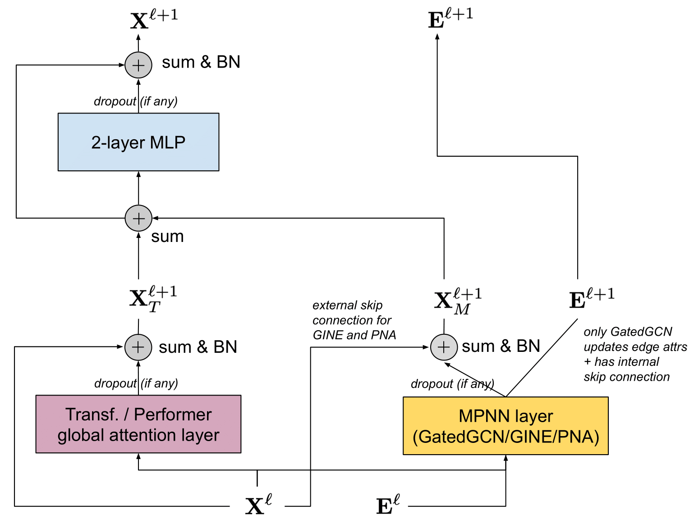

Graph Transformer
=================

`Transformer <https://arxiv.org/abs/1706.03762>`_ is an effictive architecture in `natural language processing <https://arxiv.org/abs/1810.04805>`_ and `computer vision <https://arxiv.org/abs/2010.11929>`_.
Recently, there have been some applications(`Grover <https://arxiv.org/abs/2007.02835>`_, `GraphGPS <https://arxiv.org/abs/2205.12454>`_, etc) that combine transformers on graphs.
In this tutorial, we will present how to build a graph transformer model via :pyg:`PyG`. See `our webinar <https://youtu.be/wAYryx3GjLw?si=2vB7imfenP5tUvqd>`_ for in-depth learning on this topic.

.. note::
    Click `here <https://github.com/pyg-team/pytorch_geometric/blob/master/examples/graph_gps.py>`_ to download the full example code

Transformers on Graphs
------------------------------

Compared to Graph Transformers, MPNNs have several drawbacks: (1) WL test: 1-order MPNNs have limited expressivity; (2) Over-smoothing: the features tend to
converge to the same value while increasing the number of GNN layers; (3) Over-squashing: Losing information when trying to aggregate messages from many neighbors into a single vector;
(4) Cannot capture long-range dependencies.

Feeding the whole graph into the Transformer also brings several pros and cons

**Pros**

* Computation graph structure is decoupled from the input graph structure.
* Long-range connections can be handled as all nodes are connected to each other.

**Cons**

* Loss of inductive bias that enables GNNs to work so well on graphs with pronounced locality. Particularly in graphs where edges represent relatedness/closeness.
* Language input is squential, but graphs are permutation invariant to node ordering.
* Square computational complexity :math:`O(N^2)` in the number of nodes whereas message passing GNNs are linear in the number of edges :math:`O(E)`. Graphs are often sparse :math:`N \approx E`.

Attention
+++++++++

.. math::
    Q = XW_Q, K = XW_K, V = XW_V
.. math::
    Attention(Q, K, V) = softmax(\frac{QK^T}{\sqrt{d_k}})V

In Transformer, attention can be multi-head, which consists of multiple attention weights.

Positional and Structural Encodings
+++++++++++++++++++++++++++++++++++

We organized PE/SE into 3 categories based on their locality: (1) Local, (2) Global, (3) Relative.
Positional encodings (PE) provides an idea of the position in space of a given node within the graph. When two nodes are close to each other within a graph or subgraph, their PE should also be close.
Structure encodings (SE) provides an embedding of the structure of graphs or subgraphs to help increasing the expressivity and the generalizability of GNNs.
When two nodes share similar subgraphs, or when two graphs are similar, their SE should also be close.

.. list-table::
   :widths: 10 20 20
   :header-rows: 1

   * - Encoding type
     - Positional encodings (PE)
     - Structure encodings (SE)
   * - Local (node)
     - (1)Distance to cluster center; (2)Sum of non-diagonal elements in m-step random walk.
     - (1)Node degree; (2)Random walk diagonals; (3) Enumerate substructures(triangles, rings).
   * - Global (node)
     - (1)Eigenvectors of A/L or distance matrix; (2)Distance to graph's centroid; (3)Unique ID for each node.
     - (1)Eigenvalues of A/L; (2) Graph diameter, girth, degree, etc.
   * - Relative (edge)
     - (1)Pair-wise distance from: Heat Kernels, Random Walks, Graph geodesic, etc; (2)Gradient of eigenvectors
     - (1)Gradient of any Local SE; (2)Gradient of sub-structure enumeration

GPS Layer and GraphGPS Model
--------------------------------------

Firstly, we introduce the GPS layer, which is combined with local MPNN and global Transformer, and then followed by 2-layer MLP and skip-connecttions.
Local MPNN can provide locality bias that is difficult or expensive to achieve in Transformer.
In addition, features of edges can be updated and encoded into the node features(`GatedGCN <https://arxiv.org/abs/1711.07553>`_, `GINE <https://arxiv.org/abs/1905.12265>`_).
Transformer can utilize positional and structural encodings. As we don't need to consider edge features, We can use the existing linear Transformer architecture to reduce the time complexity from :math:`O(N^2)` to :math:`O(N + E)`, like `Performer <https://arxiv.org/abs/2009.14794>`_ and `BigBird <https://arxiv.org/abs/2007.14062>`_.

.. warning::
    `BigBird <https://arxiv.org/abs/2007.14062>`_ currently is not supported, will be added in the future.

The update function of each layer is described by the equations below.

Local MPNN
++++++++++

.. math::
    \hat{X}_M^{l + 1}, E^{l + 1} = MPNN_e^l(X^l, E^l, A)
.. math::
    X_M^{l + 1} = BatchNorm(Dropout(\hat{X}_M^{l + 1}) + X^l)

.. code-block:: python

    h = self.conv(x, edge_index, **kwargs)
    h = F.dropout(h, p=self.dropout, training=self.training)
    h = h + x
    if self.norm1 is not None:
        if self.norm_with_batch:
            h = self.norm1(h, batch=batch)
        else:
            h = self.norm1(h)
    hs.append(h)

Global Attention
++++++++++++++++

.. math::
    \hat{X}_T^{l + 1} = GlobalAttn^l(X^l)
.. math::
    X_T^{l + 1} = BatchNorm(Dropout(\hat{X}_T^{l + 1}) + X^l)

.. code-block:: python

    h, mask = to_dense_batch(x, batch)

    if isinstance(self.attn, torch.nn.MultiheadAttention):
        h, _ = self.attn(h, h, h, key_padding_mask=~mask,
                        need_weights=False)
    elif isinstance(self.attn, PerformerAttention):
        h = self.attn(h, mask=mask)

    h = h[mask]
    h = F.dropout(h, p=self.dropout, training=self.training)
    h = h + x  # Residual connection.
    if self.norm2 is not None:
        if self.norm_with_batch:
            h = self.norm2(h, batch=batch)
        else:
            h = self.norm2(h)
    hs.append(h)

Combine local and global outputs
++++++++++++++++++++++++++++++++

.. math::
    X^{l + 1} = MLP^l(X_M^{l + 1} + X_T^{l + 1})

.. code-block:: python

    out = sum(hs)

    out = out + self.mlp(out)
    if self.norm3 is not None:
        if self.norm_with_batch:
            out = self.norm3(out, batch=batch)
        else:
            out = self.norm3(out)

Next, we introduce GraphGPS architecture. The difference between `GraphGPS <https://arxiv.org/abs/2205.12454>`_ and `GraphTrans <https://arxiv.org/abs/2201.08821>`_ is the organization of MPNN and transformer.
In GraphTrans, a few layers of MPNNs are comprised before the Transformer, which may be limited by problems of over-smoothing, over-squashing and low expressivity against the WL test.
These layers could irreparably fail to keep some information in the early stage. The design of GraphGPS is a stacking of MPNN + transformer hybrid, which resolves
the local expressivity bottlenecks by allowing information to spread across the graph via full-connectivity.

Train GraphGPS on graph-structured data
--------------------------------------------------

In this part, we'll show how to train a :class:`~torch_geometric.nn.GPSConv` GNN model on the :class:`~torch_geometric.datasets.ZINC` dataset.

Load dataset
++++++++++++

.. code-block:: python

    transform = T.AddRandomWalkPE(walk_length=20, attr_name='pe')
    train_dataset = ZINC(path, subset=True, split='train', pre_transform=transform)
    val_dataset = ZINC(path, subset=True, split='val', pre_transform=transform)
    test_dataset = ZINC(path, subset=True, split='test', pre_transform=transform)

    train_loader = DataLoader(train_dataset, batch_size=32, shuffle=True)
    val_loader = DataLoader(val_dataset, batch_size=64)
    test_loader = DataLoader(test_dataset, batch_size=64)

Define model
++++++++++++

.. code-block:: python

    class RedrawProjection:
        def __init__(self, model: torch.nn.Module,
                    redraw_interval: Optional[int] = None):
            self.model = model
            self.redraw_interval = redraw_interval
            self.num_last_redraw = 0

        def redraw_projections(self):
            if not self.model.training or self.redraw_interval is None:
                return
            if self.num_last_redraw >= self.redraw_interval:
                fast_attentions = [
                    module for module in self.model.modules()
                    if isinstance(module, PerformerAttention)
                ]
                for fast_attention in fast_attentions:
                    fast_attention.redraw_projection_matrix()
                self.num_last_redraw = 0
                return
            self.num_last_redraw += 1

    class GPS(torch.nn.Module):
        def __init__(self, channels: int, pe_dim: int, num_layers: int,
                    attn_type: str, attn_kwargs: Dict[str, Any]):
            super().__init__()

            self.node_emb = Embedding(28, channels - pe_dim)
            self.pe_lin = Linear(20, pe_dim)
            self.pe_norm = BatchNorm1d(20)
            self.edge_emb = Embedding(4, channels)

            self.convs = ModuleList()
            for _ in range(num_layers):
                nn = Sequential(
                    Linear(channels, channels),
                    ReLU(),
                    Linear(channels, channels),
                )
                conv = GPSConv(channels, GINEConv(nn), heads=4,
                            attn_type=attn_type, attn_kwargs=attn_kwargs)
                self.convs.append(conv)

            self.mlp = Sequential(
                Linear(channels, channels // 2),
                ReLU(),
                Linear(channels // 2, channels // 4),
                ReLU(),
                Linear(channels // 4, 1),
            )
            self.redraw_projection = RedrawProjection(
                self.convs,
                redraw_interval=1000 if attn_type == 'performer' else None)

        def forward(self, x, pe, edge_index, edge_attr, batch):
            x_pe = self.pe_norm(pe)
            x = torch.cat((self.node_emb(x.squeeze(-1)), self.pe_lin(x_pe)), 1)
            edge_attr = self.edge_emb(edge_attr)

            for conv in self.convs:
                x = conv(x, edge_index, batch, edge_attr=edge_attr)
            x = global_add_pool(x, batch)
            return self.mlp(x)

Train and evaluate
+++++++++++++++++++

.. code-block:: python

    device = torch.device('cuda' if torch.cuda.is_available() else 'cpu')
    attn_kwargs = {'dropout': 0.5}
    model = GPS(channels=64, pe_dim=8, num_layers=10, attn_type=args.attn_type,
                attn_kwargs=attn_kwargs).to(device)
    optimizer = torch.optim.Adam(model.parameters(), lr=0.001, weight_decay=1e-5)
    scheduler = ReduceLROnPlateau(optimizer, mode='min', factor=0.5, patience=20,
                                min_lr=0.00001)

    def train():
        model.train()

        total_loss = 0
        for data in train_loader:
            data = data.to(device)
            optimizer.zero_grad()
            model.redraw_projection.redraw_projections()
            out = model(data.x, data.pe, data.edge_index, data.edge_attr,
                        data.batch)
            loss = (out.squeeze() - data.y).abs().mean()
            loss.backward()
            total_loss += loss.item() * data.num_graphs
            optimizer.step()
        return total_loss / len(train_loader.dataset)

    @torch.no_grad()
    def test(loader):
        model.eval()

        total_error = 0
        for data in loader:
            data = data.to(device)
            out = model(data.x, data.pe, data.edge_index, data.edge_attr,
                        data.batch)
            total_error += (out.squeeze() - data.y).abs().sum().item()
        return total_error / len(loader.dataset)

    for epoch in range(1, 101):
        loss = train()
        val_mae = test(val_loader)
        test_mae = test(test_loader)
        scheduler.step(val_mae)
        print(f'Epoch: {epoch:02d}, Loss: {loss:.4f}, Val: {val_mae:.4f}, '
            f'Test: {test_mae:.4f}')

.. code-block:: text

    Epoch: 01, Loss: 0.7216, Val: 0.5316, Test: 0.5454
    Epoch: 02, Loss: 0.5519, Val: 0.5895, Test: 0.6288
    Epoch: 03, Loss: 0.5009, Val: 0.5029, Test: 0.4924
    Epoch: 04, Loss: 0.4751, Val: 0.4801, Test: 0.4786
    Epoch: 05, Loss: 0.4363, Val: 0.4438, Test: 0.4352
    Epoch: 06, Loss: 0.4276, Val: 0.4931, Test: 0.4994
    Epoch: 07, Loss: 0.3956, Val: 0.3502, Test: 0.3439
    Epoch: 08, Loss: 0.4021, Val: 0.3143, Test: 0.3296
    Epoch: 09, Loss: 0.3761, Val: 0.4012, Test: 0.3858
    Epoch: 10, Loss: 0.3739, Val: 0.3343, Test: 0.3032
    Epoch: 11, Loss: 0.3532, Val: 0.3679, Test: 0.3334
    Epoch: 12, Loss: 0.3683, Val: 0.3094, Test: 0.2754
    Epoch: 13, Loss: 0.3457, Val: 0.4007, Test: 0.4023
    Epoch: 14, Loss: 0.3460, Val: 0.3986, Test: 0.3589
    Epoch: 15, Loss: 0.3369, Val: 0.3478, Test: 0.3124
    Epoch: 16, Loss: 0.3222, Val: 0.3043, Test: 0.2651
    Epoch: 17, Loss: 0.3190, Val: 0.4496, Test: 0.4070
    Epoch: 18, Loss: 0.3317, Val: 0.3803, Test: 0.3450
    Epoch: 19, Loss: 0.3179, Val: 0.2671, Test: 0.2408
    Epoch: 20, Loss: 0.3143, Val: 0.4168, Test: 0.3901
    Epoch: 21, Loss: 0.3238, Val: 0.3183, Test: 0.2926
    Epoch: 22, Loss: 0.3132, Val: 0.9534, Test: 1.0879
    Epoch: 23, Loss: 0.3088, Val: 0.3705, Test: 0.3360
    Epoch: 24, Loss: 0.3032, Val: 0.3051, Test: 0.2692
    Epoch: 25, Loss: 0.2968, Val: 0.2829, Test: 0.2571
    Epoch: 26, Loss: 0.2915, Val: 0.3145, Test: 0.2820
    Epoch: 27, Loss: 0.2871, Val: 0.3127, Test: 0.2965
    Epoch: 28, Loss: 0.2953, Val: 0.4415, Test: 0.4144
    Epoch: 29, Loss: 0.2916, Val: 0.3118, Test: 0.2733
    Epoch: 30, Loss: 0.3074, Val: 0.4497, Test: 0.4418
