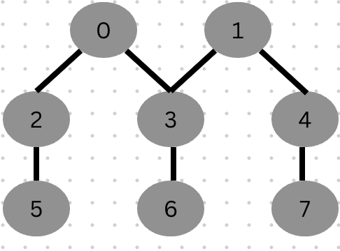

NeighborLoader
=====================================
``NeighborLoader`` is a data loader that performs neighbor sampling as introduced in the “Inductive Representation Learning on Large Graphs” paper.
This loader allows for mini-batch training of GNNs on large-scale graphs where full-batch training leads to out of memory problem.

In the paper, they uniformly sample a fixed-size set of neighbors, in order to keep the computational footprint of each batch fixed.
Without this sampling the memory and expected runtime of a single batch is unpredictable and can grow linearly with the number of nodes in the graph.
Therefore, this sampling is crucial for training GNNs on large-scale graphs.

Here's a simplified step-by-step process:

Node Selection: Given a large graph, NeighborLoader batchsize = 1, you start with a node you want to compute representations for. This node is referred to as the "target" node.

Sampling: This neighborhood consists of nodes directly connected to the target node (its neighbors). Instead of considering all neighbors, which can be computationally expensive for large graphs, you perform random sampling. You select a fixed number of neighbors from the neighborhood. This subset is known as the "sampled neighbors."

Aggregation: The information from these sampled neighbors is then aggregated in some way, like GraphSAGE Layer in the following example.

Representation Update: The aggregated information is used to update the representation of the target node. This updated representation incorporates information from a limited set of neighbors.

Small graph example
--------------------

To start off, we can create a small graph to know the computation graph:

The NeighborLoader will return a ``batch``, which contains the following attributes:
``batch.y`` is the label of the nodes in the batch.
``batch.x`` is the feature of the nodes in the batch.
``batch.edge_index`` is the edge index of the subgraph.
``batch.batch_size`` is the number of nodes which we need to compute their embedding. Note: ``batch.x.shape[0]`` is the number of nodes of subgraph.
``batch.n_id`` is the global node index of the nodes in the batch.

.. code-block:: python

    in_channels = 1
    node_num = 8
    features = [[i for j in range(in_channels)] for i in range(node_num)]
    edge_index = torch.tensor([[2, 3, 3, 4, 5, 6, 7], [0, 0, 1, 1, 2, 3, 4]],
                              dtype=torch.long)
    data = Data(torch.tensor(features), edge_index)
    loader = NeighborLoader(data, hop, batch_size=1)
    batch = next(iter(loader))

    batch.edge_index  #  Note it will relabel in the subgraph.
    >>> tensor([[1, 2, 3, 4],
        [0, 0, 1, 2]])

    batch.x
    >>> tensor([[0],
        [2],
        [3],
        [5],
        [6]])

    batch.n_id
    >>> tensor([0, 2, 3, 5, 6])

    # the global id of target node is 0, the neighborloader sample first layer of 0, get 0, 2,3 . Then the neighborloader sample second layer from these three nodes, get 0,2,3,5,6

In the computation, first layer will do the aggregation to update the embedding of node in the second row of ``batch.edge_index``.

``[2,3]->[0],[5] ->[2], [6] ->[3]``

The second layer will also do the aggregation

``[2,3]->[0],[5] ->[2], [6] ->[3]``

Then we will use ``[:batch.batch_size]`` take the embedding of the target node ``[0]``  as ``y_hat`` to calculate the loss.

In the next iteration, we will get the subgraph of the target node ``[1]``

To use it in prctice, we can take a look at the `Reddit <https://github.com/pyg-team/pytorch_geometric/blob/master/examples/reddit.py>`__ example from PyG:

Defining our NeighborLoader
---------------------------

.. code-block:: python

    train_loader = NeighborLoader(data, input_nodes=data.train_mask,
                                num_neighbors=[25, 10], shuffle=True, **kwargs)

    subgraph_loader = NeighborLoader(copy.copy(data), input_nodes=None,
                                    num_neighbors=[-1], shuffle=False, **kwargs)

    # No need to maintain these features during evaluation:
    del subgraph_loader.data.x, subgraph_loader.data.y
    # Add global node index information.
    subgraph_loader.data.num_nodes = data.num_nodes
    subgraph_loader.data.n_id = torch.arange(data.num_nodes)

Note ``data`` has the ``train_mask``, ``val_mask``, and ``test_mask`` attributes, which we use to define our training and evaluation sets.
``num_neighbors`` means we define a two-layer GNN, where the first layer samples 25 neighbors and the second layer samples 10 neighbors.
``input_nodes`` is a list of nodes. We need to compute their embedding.
``shuffle`` means that we train nodes in a different order for each epoch.

We also create a single-hop evaluation neighbor loader: ``subgraph_loader`` is used for evaluation, where we do not need to maintain the features.
We also add global node index information to the subgraph loader. The global node index is used for index features in the CPU and sends features to the GPU for computation,
refer line: ``x = x_all[batch.n_id.to(x_all.device)].to(device)``

Define Model
--------------

.. code-block:: python

    class SAGE(torch.nn.Module):
        def __init__(self, in_channels, hidden_channels, out_channels):
            super().__init__()
            self.convs = torch.nn.ModuleList()
            self.convs.append(SAGEConv(in_channels, hidden_channels))
            self.convs.append(SAGEConv(hidden_channels, out_channels))

        def forward(self, x, edge_index):
            for i, conv in enumerate(self.convs):
                x = conv(x, edge_index)
                if i < len(self.convs) - 1:
                    x = x.relu_()
                    x = F.dropout(x, p=0.5, training=self.training)
            return x

        @torch.no_grad()
        def inference(self, x_all, subgraph_loader):
            for i, conv in enumerate(self.convs):
                xs = []
                for batch in subgraph_loader:
                    x = x_all[batch.n_id.to(x_all.device)].to(device)
                    x = conv(x, batch.edge_index.to(device))
                    if i < len(self.convs) - 1:
                        x = x.relu_()
                    xs.append(x[:batch.batch_size].cpu()) # we only need the representations of the target nodes
                x_all = torch.cat(xs, dim=0)
            return x_all

The number of SAGE layers in a GNN model is the same as the depth K in the GraphSAGE algorithm.

Note: We implement layer-wise approach in ``inference`` function.
The layer-wise approach avoids neighbor explosion by conducting computation layer by layer in GNN models.
To fit the memory of GPU, evaluation is conducted in small batch.
Target nodes in different batches compute intermediate embeddings for their common neighbors multiple times,
resulting in repetitive computation. Neighbor explosion is prominent for model evaluation
because it usually uses the full neighborhood as opposed to the neighbor sampling in training
You can refer to `DGI <https://dl.acm.org/doi/pdf/10.1145/3580305.3599805>`__ figure 3 to learn the difference in detail.

Train
-----------

.. code-block:: python

    def train(epoch):
        model.train()

        pbar = tqdm(total=int(len(train_loader.dataset)))
        pbar.set_description(f'Epoch {epoch:02d}')

        total_loss = total_correct = total_examples = 0
        for batch in train_loader:
            optimizer.zero_grad()
            y = batch.y[:batch.batch_size]
            y_hat = model(batch.x, batch.edge_index.to(device))[:batch.batch_size]
            loss = F.cross_entropy(y_hat, y)
            loss.backward()
            optimizer.step()

            total_loss += float(loss) * batch.batch_size
            total_correct += int((y_hat.argmax(dim=-1) == y).sum())
            total_examples += batch.batch_size
            pbar.update(batch.batch_size)
        pbar.close()

        return total_loss / total_examples, total_correct / total_examples

Ensuring to only make use of the first batch_size many nodes for loss/metric computation

Extension
----------

A drawback of Neighborloader is it iteratively builds representations for *all* nodes at *all* depths of the network.
However, nodes sampled in later hops no longer contribute to the node representations of seed nodes in later GNN layers, thus performing useless computation.
NeighborLoader will be marginally slower since we are computing node embeddings for nodes we no longer need. This is a trade-off we make to obtain a cleaner GNN design.
This example shows how to eliminate this overhead and speed up training and inference in mini-batch GNNs
`Hierarchical Neighborhood Sampling <https://pytorch-geometric.readthedocs.io/en/latest/advanced/hgam.html>`__ to improve its efficiency.
