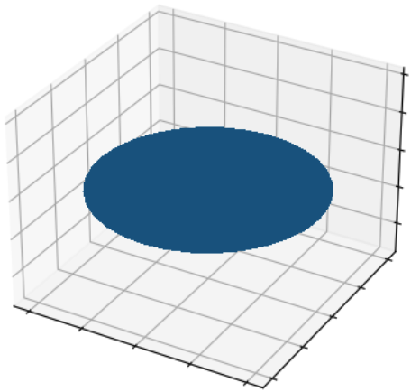
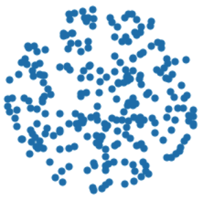
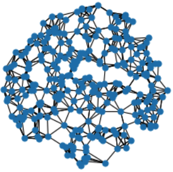
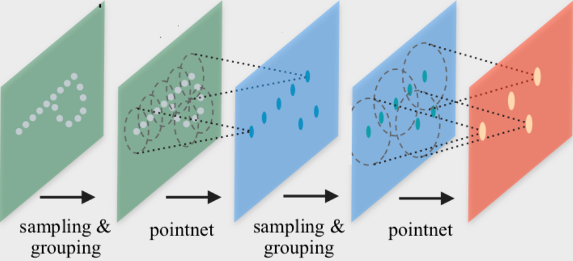

Point Cloud Processing
======================

This tutorial explains how to leverage Graph Neural Networks (GNNs) for operating and training on point cloud data.
Although point clouds do not come with a graph structure by default, we can utilize :pyg:`PyG` transformations to make them applicable for the full suite of GNNs available in :pyg:`PyG`.
The key idea is to create a synthetic graph from point clouds, from which we can learn meaningful local geometric structures via a GNN's message passing scheme.
These point representations can then be used to, *e.g.*, perform point cloud classification or segmentation.

3D Point Cloud Datasets
-----------------------

:pyg:`PyG` provides several point cloud datasets, such as the :class:`~torch_geometric.datasets.PCPNetDataset`, :class:`~torch_geometric.datasets.S3DIS` and :class:`~torch_geometric.datasets.ShapeNet` datasets.
To get started, we also provide the :class:`~torch_geometric.datasets.GeometricShapes` dataset, which is a toy dataset that contains various geometric shapes such cubes, spheres or pyramids.
Notably, the :class:`~torch_geometric.datasets.GeometricShapes` dataset contains meshes instead of point clouds by default, represented via :obj:`pos` and :obj:`face` attributes, which hold the information of vertices and their triangular connectivity, respectively:

.. code-block:: python

    from torch_geometric.datasets import GeometricShapes

    dataset = GeometricShapes(root='data/GeometricShapes')
    print(dataset)
    >>> GeometricShapes(40)

    data = dataset[0]
    print(data)
    >>> Data(pos=[32, 3], face=[3, 30], y=[1])

When visualizing the first mesh in the dataset, we can see that it represents a circle:

|

Since we are interested in point clouds, we can transform our meshes into points via the usage of :class:`torch_geometric.transforms`.
In particular, :pyg:`PyG` provides the :class:`~torch_geometric.transforms.SamplePoints` transformation, which will uniformly sample a fixed number of points on the mesh faces according to their face area.

We can add this transformation to the dataset by simply setting it via :obj:`dataset.transform = SamplePoints(num=...)`.
Each time an example is accessed from the dataset, the transformation procedure will get called, converting our mesh into a point cloud.
Note that sampling points is stochastic, and so you will receive a new point cloud upon every access:

.. code-block:: python

    import torch_geometric.transforms as T

    dataset.transform = T.SamplePoints(num=256)

    data = dataset[0]
    print(data)
    >>> Data(pos=[256, 3], y=[1])

Note that we now have :obj:`256` points in our example, and the triangular connectivity stored in :obj:`face` has been removed.
Visualizing the points now shows that we have correctly sampled points on the surface of the initial mesh:

|

Finally, let's convert our point cloud into a graph.
Since we are interested in learning local geometric structures, we want to construct a graph in such a way that nearby points are connected.
Typically, this is either done via :math:`k`-nearest neighbor search or via ball queries (which connect all points that are within a certain radius to the query point).
:pyg:`PyG` provides utilities for such graph generation via the :class:`~torch_geometric.transforms.KNNGraph` and :class:`~torch_geometric.transforms.RadiusGraph` transformations, respectively.

.. code-block:: python

    from torch_geometric.transforms import SamplePoints, KNNGraph

    dataset.transform = T.Compose([SamplePoints(num=256), KNNGraph(k=6)])

    data = dataset[0]
    print(data)
    >>> Data(pos=[256, 3], edge_index=[2, 1536], y=[1])

You can see that the :obj:`data` object now also contains an :obj:`edge_index` representation, holding :obj:`1536` edges in total, 6 edges for every of the 256 points.
We can confirm that our graph looks good via the following visualization:

|

PointNet++ Implementation
-------------------------

`PointNet++ <https://arxiv.org/abs/1706.02413>`_ is a pioneering work that proposes a Graph Neural Network architecture for point cloud classification and segmentation.
PointNet++ processes point clouds iteratively by following a simple grouping, neighborhood aggregation and downsampling scheme:

|

1. The **grouping phase** constructs a graph :math:`k`-nearest neighbor search or via ball queries as described above.

2. The **neighborhood aggregation** phase executes a GNN layer that, for each point, aggregates information from its direct neighbors (given by the graph constructed in the previous phase).
   This allows PointNet++ to capture local context at different scales.

3. The **downsampling phase** implements a pooling scheme suitable for point clouds with potentially different sizes.
   Due to simplicity, we will ignore this phase for now.
   We recommend to take a look at `examples/pointnet2_classification.py <https://github.com/pyg-team/pytorch_geometric/blob/master/examples/pointnet2_classification.py>`_ on guidance to how to implement this step.

Neighborhood Aggregation
~~~~~~~~~~~~~~~~~~~~~~~~

The PointNet++ layer follows a simple neural message passing scheme defined via

.. math::

    \mathbf{h}^{(\ell + 1)}_i = \max_{j \in \mathcal{N}(i)} \textrm{MLP} \left( \mathbf{h}_j^{(\ell)}, \mathbf{p}_j - \mathbf{p}_i \right)

where

    * :math:`\mathbf{h}_i^{(\ell)} \in \mathbb{R}^d` denotes the hidden features of point :math:`i` in layer :math:`\ell`, and
    * :math:`\mathbf{p}_i \in \mathbf{R}^3$` denotes the position of point :math:`i`.

We can make use of the :class:`~torch_geometric.nn.conv.MessagePassing` interface in :pyg:`PyG` to implement this layer from scratch.
The :class:`~torch_geometric.nn.conv.MessagePassing` interface helps us in **creating message passing graph neural networks** by automatically taking care of message propagation.
Here, we only need to define its :meth:`~torch_geometric.nn.conv.MessagePassing.message` function and which aggregation scheme we want to use, *e.g.*, :obj:`aggr="max"` (see `here <https://pytorch-geometric.readthedocs.io/en/latest/tutorial/create_gnn.html>`_ for the accompanying tutorial):

.. code-block:: python

    from torch import Tensor
    from torch.nn import Sequential, Linear, ReLU

    from torch_geometric.nn import MessagePassing

    class PointNetLayer(MessagePassing):
        def __init__(self, in_channels: int, out_channels: int):
            # Message passing with "max" aggregation.
            super().__init__(aggr='max')

            # Initialization of the MLP:
            # Here, the number of input features correspond to the hidden
            # node dimensionality plus point dimensionality (=3).
            self.mlp = Sequential(
                Linear(in_channels + 3, out_channels),
                ReLU(),
                Linear(out_channels, out_channels),
            )

        def forward(self,
            h: Tensor,
            pos: Tensor,
            edge_index: Tensor,
        ) -> Tensor:
            # Start propagating messages.
            return self.propagate(edge_index, h=h, pos=pos)

        def message(self,
            h_j: Tensor,
            pos_j: Tensor,
            pos_i: Tensor,
        ) -> Tensor:
            # h_j: The features of neighbors as shape [num_edges, in_channels]
            # pos_j: The position of neighbors as shape [num_edges, 3]
            # pos_i: The central node position as shape [num_edges, 3]

            edge_feat = torch.cat([h_j, pos_j - pos_i], dim=-1)
            return self.mlp(edge_feat)

As one can see, implementing the PointNet++ layer is quite straightforward in :pyg:`PyG`.
In the :meth:`__init__` function, we first define that we want to apply **max aggregation**, and afterwards initialize an MLP that takes care of transforming node features of neighbors and the spatial relation between source and destination nodes to a (trainable) message.

In the :meth:`forward` function, we can start **propagating messages** based on :obj:`edge_index`, and pass in everything needed in order to create messages.
In the :meth:`message` function, we can now access neighbor and central node information via :obj:`*_j` and :obj:`*_i` suffixes, respectively, and return a message for each edge.

Network Architecture
~~~~~~~~~~~~~~~~~~~~

We can make use of above :class:`PointNetLayer` to define our network architecture (or use its equivalent :class:`torch_geometric.nn.conv.PointNetConv` directly integrated in :pyg:`PyG`).
With this, our overall :class:`PointNet` architecture looks as follows:

.. code-block:: python

    from torch_geometric.nn import global_max_pool

    class PointNet(torch.nn.Module):
        def __init__(self):
            super().__init__()

            self.conv1 = PointNetLayer(3, 32)
            self.conv2 = PointNetLayer(32, 32)
            self.classifier = Linear(32, dataset.num_classes)

        def forward(self,
            pos: Tensor,
            edge_index: Tensor,
            batch: Tensor,
        ) -> Tensor:

            # Perform two-layers of message passing:
            h = self.conv1(h=pos, pos=pos, edge_index=edge_index)
            h = h.relu()
            h = self.conv2(h=h, pos=pos, edge_index=edge_index)
            h = h.relu()

            # Global Pooling:
            h = global_max_pool(h, batch)  # [num_examples, hidden_channels]

            # Classifier:
            return self.classifier(h)

    model = PointNet()

If we inspect the model, we can see the everything is initialized correctly:

.. code-block:: python

    print(model)
    >>> PointNet(
    ...   (conv1): PointNetLayer()
    ...   (conv2): PointNetLayer()
    ...   (classifier): Linear(in_features=32, out_features=40, bias=True)
    ... )

Here, we create our network architecture by inheriting from :class:`torch.nn.Module` and initialize **two** :class:`PointNetLayer` **modules** and a **final linear classifier** in its constructor.

In the :meth:`forward` method, we apply two graph-based convolutional operators and enhance them by ReLU non-linearities.
The first operator takes in 3 input features (the positions of nodes) and maps them to 32 output features.
After that, each point holds information about its 2-hop neighborhood, and should already be able to distinguish between simple local shapes.

Next, we apply a global graph readout function, *i.e.*, :meth:`~torch_geometric.nn.pool.global_max_pool`, which takes the maximum value along the node dimension for each example.
In order to map the different nodes to their corresponding examples, we use the :obj:`batch` vector which will be automatically created for use when using the mini-batch :class:`torch_geometric.loader.DataLoader`.
Last, we apply a linear classifier to map the global 32 features per point cloud to one of the 40 classes.

Training Procedure
~~~~~~~~~~~~~~~~~~

We are now ready to write two simple procedures to train and test our model on the training and test datasets, respectively.
If you are not new to :pytorch:`PyTorch`, this scheme should appear familiar to you.
Otherwise, the :pytorch:`PyTorch` documentation provide a `good introduction on how to train a neural network in PyTorch <https://pytorch.org/tutorials/beginner/blitz/cifar10_tutorial.html#define-a-loss-function-and-optimizer>`_:

.. code-block:: python

    from torch_geometric.loader import DataLoader

    train_dataset = GeometricShapes(root='data/GeometricShapes', train=True)
    train_dataset.transform = T.Compose([SamplePoints(num=256), KNNGraph(k=6)])
    test_dataset = GeometricShapes(root='data/GeometricShapes', train=False)
    test_dataset.transform = T.Compose([SamplePoints(num=256), KNNGraph(k=6)])

    train_loader = DataLoader(train_dataset, batch_size=10, shuffle=True)
    test_loader = DataLoader(test_dataset, batch_size=10)

    model = PointNet()
    optimizer = torch.optim.Adam(model.parameters(), lr=0.01)
    criterion = torch.nn.CrossEntropyLoss()

    def train():
        model.train()

        total_loss = 0
        for data in train_loader:
            optimizer.zero_grad()
            logits = model(data.pos, data.edge_index, data.batch)
            loss = criterion(logits, data.y)
            loss.backward()
            optimizer.step()
            total_loss += float(loss) * data.num_graphs

        return total_loss / len(train_loader.dataset)

    @torch.no_grad()
    def test():
        model.eval()

        total_correct = 0
        for data in test_loader:
            logits = model(data.pos, data.edge_index, data.batch)
            pred = logits.argmax(dim=-1)
            total_correct += int((pred == data.y).sum())

        return total_correct / len(test_loader.dataset)

    for epoch in range(1, 51):
        loss = train()
        test_acc = test()
        print(f'Epoch: {epoch:02d}, Loss: {loss:.4f}, Test Acc: {test_acc:.4f}')

Using this setup, you should get around **75%-80% test set accuracy**, even when training only on a single example per class.
