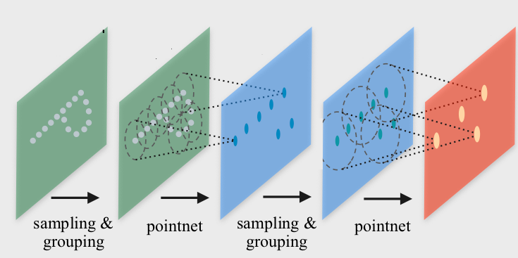
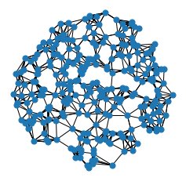

Point Cloud Classification with Graph Neural Networks
======================================================

This tutorial guides you through how we can use Graph Neural Networks (GNNs) to perform node classification on point clouds, and introduces the :pyg:`PyG` layers and pipelines for this task. In point cloud classification and segmentation, we have a dataset of objects or point sets, and we want to embed those objects in such a way so that they are linearly separable given a task at hand. We can do this through graph neural networks (GNN), in which the raw point cloud is used as input into GNN and the training process will help us to capture meaningful local structures in order to classify the entire point set.

3D Point Cloud Dataset
-----------------------------

:pyg:`PyG` provides several point cloud datasets from the dataset module, such as the `PCPNetDataset <https://pytorch-geometric.readthedocs.io/en/latest/generated/torch_geometric.datasets.PCPNetDataset.html#torch_geometric.datasets.PCPNetDataset>`_ , `S3DIS <https://pytorch-geometric.readthedocs.io/en/latest/generated/torch_geometric.datasets.S3DIS.html#torch_geometric.datasets.S3DIS>`_ and `GeometricShapes <https://pytorch-geometric.readthedocs.io/en/latest/generated/torch_geometric.datasets.GeometricShapes.html#torch_geometric.datasets.GeometricShapes>`_ datasets. For simplicity, in this tutorial, we will use the ``Geometric Shapes`` dataset, which is a synthetic dataset of various geometric shapes like cubes, spheres or pyramids. In this dataset, each ``Data`` object is represented as a mesh, holding information about the vertices in ``pos`` attribute and the triangular connectivity of vertices in the ``face`` attribute (with shape ``[3, num_faces]``).

First, we set up some common code to visualise the dataset

.. code-block:: python

    import matplotlib.pyplot as plt
    from mpl_toolkits.mplot3d import Axes3D

    def visualize_mesh(pos, face):
        fig = plt.figure()
        ax = fig.add_subplot(projection='3d')
        ax.axes.xaxis.set_ticklabels([])
        ax.axes.yaxis.set_ticklabels([])
        ax.axes.zaxis.set_ticklabels([])
        ax.plot_trisurf(pos[:, 0], pos[:, 1], pos[:, 2], triangles=data.face.t(), antialiased=False)
        plt.show()

    def visualize_points(pos, edge_index=None, index=None):
        fig = plt.figure(figsize=(4, 4))
        if edge_index is not None:
            for (src, dst) in edge_index.t().tolist():
                 src = pos[src].tolist()
                 dst = pos[dst].tolist()
                 plt.plot([src[0], dst[0]], [src[1], dst[1]], linewidth=1, color='black')
        if index is None:
            plt.scatter(pos[:, 0], pos[:, 1], s=50, zorder=1000)
        else:
           mask = torch.zeros(pos.size(0), dtype=torch.bool)
           mask[index] = True
           plt.scatter(pos[~mask, 0], pos[~mask, 1], s=50, color='lightgray', zorder=1000)
           plt.scatter(pos[mask, 0], pos[mask, 1], s=50, zorder=1000)
        plt.axis('off')
        plt.show()

We can inspect the dataset using the following code:

.. code-block:: python

    from torch_geometric.datasets import GeometricShapes

    dataset = GeometricShapes(root='data/GeometricShapes')
    print(dataset)

    data = dataset[0]
    print(data)
    visualize_mesh(data.pos, data.face)

.. figure:: ../_figures/pointnet_tutorial_fig1.png
  :align: center
  :width: 60%

Point Cloud Generation
-----------------------------

Since we are interested in point cloud classification, we can transform our meshes into points via the usage of "transforms". Here, PyTorch Geometric provides the torch_geometric.transforms.SamplePoints transformation, which will uniformly sample a fixed number of points on the mesh faces according to their face area.

We can add this transformation to the dataset by simply setting it via :obj:`dataset.transform = SamplePoints(num=...)`. Each time an example is accessed from the dataset, the transformation procedure will get called. You can view a sample point cloud using the following code:

.. code-block:: python

    import torch
    from torch_geometric.transforms import SamplePoints

    torch.manual_seed(42)

    dataset.transform = SamplePoints(num=256)

    data = dataset[4]
    print(data)
    visualize_points(data.pos)

.. figure:: ../_figures/pointnet_tutorial_fig2.png
  :align: center
  :width: 60%

PointNet++
-----------------------------

`PointNet++ <https://arxiv.org/abs/1706.02413>`_ is a pioneering work that proposes a graph neural network architecture for point cloud classification and segmentation.

PointNet++ processes point clouds iteratively by following a simple grouping, neighborhood aggregation and downsampling scheme:

1. The **grouping phase** constructs a graph in which nearby points are connected. Typically, this is either done via  k-nearest neighbor search or via ball queries (which connects all points that are within a radius to the query point).

2. The **neighborhood aggregation** phase executes a Graph Neural Network layer that, for each point, aggregates information from its direct neighbors (given by the graph constructed in the previous phase). This allows PointNet++ to capture local context at different scales.

3. The **downsampling phase** implements a pooling scheme suitable for point clouds with potentially different sizes. We will ignore this phase for now and will come back later to it.

In the following code, we will reconstruct PointNet++ using :pyg:`PyG` layers to illustrate how you can reuse the functionality to build new models for point cloud classification and segmentation

Phase 1: Grouping via Dynamic Graph Generation
-----------------------------------------------
:pyg:`PyG` provides utilities for dynamic graph generation via the :class:`~torch_geometric.nn.pool.knn_graph` and :class:`~torch_geometric.nn.pool.radius_graph` functions for  k-nearest neighbor and ball query graph generation, respectively.

First, let's see the ``knn_graph`` functionality in action:

.. code-block:: python

    from torch_geometric.nn import knn_graph

    data = dataset[0]
    data.edge_index = knn_graph(data.pos, k=6)
    print(data.edge_index.shape)
    visualize_points(data.pos, edge_index=data.edge_index)

    data = dataset[4]
    data.edge_index = knn_graph(data.pos, k=6)
    print(data.edge_index.shape)
    visualize_points(data.pos, edge_index=data.edge_index)

Here, we import the ``knn_graph`` function  and call it by passing in the input points ``pos`` and the number of nearest neighbors ``k`` . As output, we will receive an ``edge_index``  tensor of shape ``[2, num_edges]``, which will hold the information of source and target node indices in each column (known as the sparse matrix ``COO`` format).

Phase 2: Neighborhood Aggregation
-------------------------------------------
The `PointNet++ <https://arxiv.org/abs/1706.02413>`_  layer follows a simple neural message passing scheme defined via

.. math::
    \mathbf{h}^{(\ell + 1)}_i = \max_{j \in \mathcal{N}(i)} \textrm{MLP} \left( \mathbf{h}_j^{(\ell)}, \mathbf{p}_j - \mathbf{p}_i \right)

where
    * :math:`\mathbf{h}_i^{(\ell)} \in \mathbb{R}^d` denotes the hidden features of point :math:`i` in layer :math:`\ell`
    * :math:`\mathbf{p}_i \in \mathbf{R}^3$` denotes the position of point :math:`i`.

We can make use of the :class:`~torch_geometric.nn.conv.message_passing.MessagePassing` interface to implement this layer. The MessagePassing interface helps us in **creating message passing graph neural networks** by automatically taking care of message propagation. Here, we only need to define its `message` function as well as which aggregation scheme to use, e.g., ``aggr="max"`` (see `here <https://pytorch-geometric.readthedocs.io/en/latest/notes/create_gnn.html>`_ for the accompanying tutorial):

.. code-block:: python

    from torch.nn import Sequential, Linear, ReLU
    from torch_geometric.nn import MessagePassing

    class PointNetLayer(MessagePassing):
        def __init__(self, in_channels, out_channels):
            # Message passing with "max" aggregation.
            super().__init__(aggr='max')

            # Initialization of the MLP:
            # Here, the number of input features correspond to the hidden node
            # dimensionality plus point dimensionality (=3).
            self.mlp = Sequential(Linear(in_channels + 3, out_channels),
                                  ReLU(),
                                  Linear(out_channels, out_channels))

        def forward(self, h, pos, edge_index):
            # Start propagating messages.
            return self.propagate(edge_index, h=h, pos=pos)

        def message(self, h_j, pos_j, pos_i):
            # h_j defines the features of neighboring nodes as shape [num_edges, in_channels]
            # pos_j defines the position of neighboring nodes as shape [num_edges, 3]
            # pos_i defines the position of central nodes as shape [num_edges, 3]

            input = pos_j - pos_i  # Compute spatial relation.

            if h_j is not None:
                # In the first layer, we may not have any hidden node features,
                # so we only combine them in case they are present.
                input = torch.cat([h_j, input], dim=-1)

            return self.mlp(input)  # Apply our final MLP.

As one can see, implementing the PointNet++ layer is quite straightforward in PyTorch Geometric. In the ``__init__`` function, we first define that we want to apply **max aggregation**, and afterwards initialize an MLP that takes care of transforming neighboring node features and the spatial relation between source and destination nodes to a (trainable) message.

In the `forward` function, we can start **propagating messages** based on ``edge_index``, and pass in everything needed in order to create messages. In the message function, we can now access neighboring and central node information via ``*_j`` and ``*_i``, respectively, and return a message for each edge.

Network Architecture
-----------------------------

We can make use of ``knn_graph`` and the above ``PointNetLayer`` to define our network architecture. Here, we are interested in an architecture that is able to operate on point clouds in a mini-batch fashion. PyTorch Geometric achieves parallelization over mini-batches by creating sparse block diagonal adjacency matrices (defined by edge_index) and concatenating feature matrices in the node dimension (such as pos). For distinguishing examples in a mini-batch, there exists a special vector named `batch <https://pytorch-geometric.readthedocs.io/en/latest/notes/introduction.html#mini-batches>`_ of shape ``[num_nodes]``, which maps each node to its respective graph in the batch:

.. math::
    \mathbf{batch}=[0⋯0,1⋯n−2n−1⋯n−1]^{T}

We need to make use of this batch vector for the ``knn_graph`` generation since we do not want to connect nodes from different examples.

With this, our overall ``PointNet`` architecture looks as follows:

.. code-block::python
    import torch
    import torch.nn.functional as F
    from torch_geometric.nn import global_max_pool, knn_graph

    class PointNet(torch.nn.Module):
        def __init__(self):
            super().__init__()

            torch.manual_seed(12345)
            self.conv1 = PointNetLayer(3, 32)
            self.conv2 = PointNetLayer(32, 32)
            self.classifier = Linear(32, dataset.num_classes)

        def forward(self, pos, batch):
            # Compute the kNN graph:
            # Here, we need to pass the batch vector to the function call in order
            # to prevent creating edges between points of different examples.
            # We also add `loop=True` which will add self-loops to the graph in
            # order to preserve central point information.
            edge_index = knn_graph(pos, k=16, batch=batch, loop=True)

            # 3. Start bipartite message passing.
            h = self.conv1(h=pos, pos=pos, edge_index=edge_index)
            h = h.relu()
            h = self.conv2(h=h, pos=pos, edge_index=edge_index)
            h = h.relu()

            # 4. Global Pooling.
            h = global_max_pool(h, batch)  # [num_examples, hidden_channels]

            # 5. Classifier.
            return self.classifier(h)

    model = PointNet()

If we inspect the model, we can see the layers::

    PointNet(
        (conv1): PointNetLayer()
        (conv2): PointNetLayer()
        (classifier): Linear(in_features=32, out_features=40, bias=True)
    )

Here, we create our network architecture by inheriting from ``torch.nn.Module`` and initialize **two PointNetLayer modules** and a **final linear classifier** (torch.nn.Linear) in its constructor.

In the forward method, we first dynamically generate a 16-nearest neighbor graph based on the position pos of nodes. Based on the resulting graph connectivity, we apply two graph-based convolutional operators and enhance them by ReLU non-linearities. The first operator takes in 3 input features (the positions of nodes) and maps them to 32 output features.

After that, each point holds information about its 2-hop neighborhood, and should already be able to distinguish between simple local shapes.

Next, we apply a global graph readout function, i.e., ``global_max_pool``, which takes the maximum value along the node dimension for each example. Last, we apply a linear classifier to map the remaining 32 features to one of the 40 classes.

Training Procedure
-----------------------------
We are now ready to write two simple procedures to train and test our model on the training and test dataset, respectively. If you are not new to PyTorch, this scheme should appear familiar to you. Otherwise, the PyTorch docs provide a `good introduction on how to train a neural network in PyTorch <https://pytorch.org/tutorials/beginner/blitz/cifar10_tutorial.html#define-a-loss-function-and-optimizer>`_.

.. code-block::python
    from torch_geometric.loader import DataLoader

    train_dataset = GeometricShapes(root='data/GeometricShapes', train=True,
                                    transform=SamplePoints(128))
    test_dataset = GeometricShapes(root='data/GeometricShapes', train=False,
                                   transform=SamplePoints(128))

    train_loader = DataLoader(train_dataset, batch_size=10, shuffle=True)
    test_loader = DataLoader(test_dataset, batch_size=10)

    model = PointNet()
    optimizer = torch.optim.Adam(model.parameters(), lr=0.01)
    criterion = torch.nn.CrossEntropyLoss()  # Define loss criterion.

    def train(model, optimizer, loader):
        model.train()

        total_loss = 0
        for data in loader:
            optimizer.zero_grad()  # Clear gradients.
            logits = model(data.pos, data.batch)  # Forward pass.
            loss = criterion(logits, data.y)  # Loss computation.
            loss.backward()  # Backward pass.
            optimizer.step()  # Update model parameters.
            total_loss += loss.item() * data.num_graphs

        return total_loss / len(train_loader.dataset)

    @torch.no_grad()
    def test(model, loader):
        model.eval()

        total_correct = 0
        for data in loader:
            logits = model(data.pos, data.batch)
            pred = logits.argmax(dim=-1)
            total_correct += int((pred == data.y).sum())

        return total_correct / len(loader.dataset)

    for epoch in range(1, 51):
        loss = train(model, optimizer, train_loader)
        test_acc = test(model, test_loader)
        print(f'Epoch: {epoch:02d}, Loss: {loss:.4f}, Test Accuracy: {test_acc:.4f}')

Using this setup, you should get around **75%-80% test set accuracy**, even when training only on a single example per class (note that we can certainly increase performance by training longer and make use of deeper neural networks).

However, there is one caveat: Since our model takes in node positions as input features, and uses relational Cartesian coordinates for creating messages, i.e.  :math:`\mathbf{p}_j − \mathbf{p}_i` , it does not generalize across different rotations applied to the input point cloud.

For example, if we apply random rotations to the test data by adding :class:`~torch_geometric.transforms.RandomRotate` transforms along different axis as shown below:

.. code-block::python
    from torch_geometric.transforms import Compose, RandomRotate

    torch.manual_seed(123)

    random_rotate = Compose([
        RandomRotate(degrees=180, axis=0),
        RandomRotate(degrees=180, axis=1),
        RandomRotate(degrees=180, axis=2),
    ])

    transform = Compose([
        random_rotate,
        SamplePoints(num=128),
    ])

    test_dataset = GeometricShapes(root='data/GeometricShapes', train=False,
                                   transform=transform)

    test_loader = DataLoader(test_dataset, batch_size=10)
    test_acc = test(model, test_loader)

Running this will give you a test accuracy of **~15%**. However, there is a good way to fix this by using rotation-invariant point cloud processing. This is left as a guided exercise below.

(Optional) Exercises
-----------------------------

1. Rotation-invariant PointNet Layer

The `PPFNet <https://arxiv.org/abs/1802.02669>`_ is an extension to the PointNet++ architecture that makes it rotation-invariant. More specifically, PPF stands for Point Pair Feature, which describes the relation between two points by a rotation-invariant 4D descriptor

.. math::
    (||\mathbf{p}_j - \mathbf{p}_i||_{2}, ∠(\mathbf{n}_i,\mathbf{p}_j - \mathbf{p}_i),∠(\mathbf{n}_j,\mathbf{p}_j - \mathbf{p}_i),∠(\mathbf{ni} - \mathbf{nj}))

based on:
1. the distance between points  :math:`||\mathbf{p}_j - \mathbf{p}_i||_{2}`

2. the angles between  :math:`\mathbf{p}_j - \mathbf{p}_i`  and the normal vectors  :math:`\mathbf{n}_i`  and  :math:`\mathbf{n}_j`   of points  i  and  j , respectively.

Luckily, in addition to the PointConv, PyTorch Geometric also provides an implementation of the PointConv based on the Point Pair Feature descriptor, see PPFConv. Furthermore, the SamplePoints transformation does also provide **normal** vectors in `data.normal` for each sampled point when called via `SamplePoints(num_points, include_normals=True)`.

As an exercise, can you extend the example code below in order to instantiate the `PPFConv` modules?

Tip:

The ``PPFConv`` expects an MLP as first argument, which is similar to the one created earlier in the PointNetLayer. Note that in ``PPFConv``, we now have a 4D discriptor instead of a 3D one.

.. code-block:: python

    from torch_geometric.nn import PPFConv
    from torch_cluster import fps

    class PPFNet(torch.nn.Module):
        def __init__(self):
            super().__init__()

            torch.manual_seed(12345)
            mlp1 = ...  # TODO
            self.conv1 = PPFConv(...)  # TODO
            mlp2 = ...  # TODO
            self.conv2 = PPFConv(...)  # TODO
            self.classifier = Linear(32, dataset.num_classes)

        def forward(self, pos, normal, batch):
            edge_index = knn_graph(pos, k=16, batch=batch, loop=False)

            x = self.conv1(x=None, pos=pos, normal=normal, edge_index=edge_index)
            x = x.relu()
            x = self.conv2(x=x, pos=pos, normal=normal, edge_index=edge_index)
            x = x.relu()

            x = global_max_pool(x, batch)  # [num_examples, hidden_channels]
            return self.classifier(x)

    test_transform = Compose([
        random_rotate,
        SamplePoints(num=128, include_normals=True),
    ])

    train_dataset = GeometricShapes(root='data/GeometricShapes', train=False,
                                   transform=SamplePoints(128, include_normals=True))
    test_dataset = GeometricShapes(root='data/GeometricShapes', train=False,
                                   transform=test_transform)

    train_loader = DataLoader(train_dataset, batch_size=10, shuffle=True)
    test_loader = DataLoader(test_dataset, batch_size=10)

    model = PPFNet()
    optimizer = torch.optim.Adam(model.parameters(), lr=0.01)
    criterion = torch.nn.CrossEntropyLoss()  # Define loss criterion.

    def train(model, optimizer, loader):
        model.train()

        total_loss = 0
        for data in loader:
            optimizer.zero_grad()  # Clear gradients.
            logits = model(data.pos, data.normal, data.batch)
            loss = criterion(logits, data.y)
            loss.backward()
            optimizer.step()
            total_loss += loss.item() * data.num_graphs

        return total_loss / len(train_loader.dataset)

    @torch.no_grad()
    def test(model, loader):
        model.eval()

        total_correct = 0
        for data in loader:
            logits = model(data.pos, data.normal, data.batch)
            pred = logits.argmax(dim=-1)
            total_correct += int((pred == data.y).sum())

        return total_correct / len(loader.dataset)

    for epoch in range(1, 101):
        loss = train(model, optimizer, train_loader)
        test_acc = test(model, test_loader)
        print(f'Epoch: {epoch:02d}, Loss: {loss:.4f}, Test Accuracy: {test_acc:.4f}')

2. Downsampling Phase via Farthest Point Sampling

So far, we haven't made use of downsampling/pooling the point cloud. In the PointNet++ architecture, downsampling of a point clouds is achieved via the **Farthest Point Sampling (FPS)** procedure, which, in return, allows the network to extract more and more global features. Given an input point set  :math:`\mathbf{p}_1, ... \mathbf{p}_n` , FPS iteratively selects a subset of points such that the sampled points are furthest apart. Specifically, compared with random sampling, this procedure is known to have better coverage of the entire point set.

PyTorch Geometric provides a ready-to-use implementation of :func:`~torch_geometric.nn.pool.fps`, which takes in the position of nodes and a sampling ratio, and returns the indices of nodes that have been sampled.

With this, can you modify the ``PPFNet`` model to include a farthest point sampling step (``ratio=0.5``) in between the two convolution operators?

**Tip:**

For ``fps``, you also need to pass in the ``batch`` vector, so that points in different examples are sampled independently from each other:

.. code-block:: python

    index = fps(pos, batch, ratio=0.5)

You can now pool the points, their normals, the features and the batch vector via:

.. code-block:: python

    pos = pos[index]
    normal = normal[index]
    h = h[index]
    batch = batch[index]

This will just keep the points sampled by ``fps``.

Note that you also need to create a new ``k-NN`` graph after applying the pooling operation.
