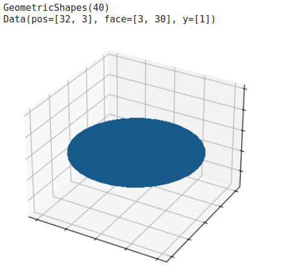
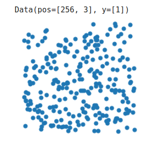

Point Cloud Classification with Graph Neural Networks
================================

This tutorial guides you through how we can use Graph Neural Networks (GNNs) to perform node classification on point clouds, and introduces the PyG layers and pipelines for this task. In point cloud classification and segmentation, we have a dataset of objects or point sets, and we want to embed those objects in such a way so that they are linearly separable given a task at hand. We can do this through graph neural networks (GNN), in which the raw point cloud is used as input into GNN and the training process will help us to capture meaningful local structures in order to classify the entire point set.

3D Point Cloud Dataset
---------------------
PyG provides several point cloud datasets from the dataset module, such as the `PCPNetDataset <https://pytorch-geometric.readthedocs.io/en/latest/generated/torch_geometric.datasets.PCPNetDataset.html#torch_geometric.datasets.PCPNetDataset>`_ , `S3DIS <https://pytorch-geometric.readthedocs.io/en/latest/generated/torch_geometric.datasets.S3DIS.html#torch_geometric.datasets.S3DIS>`_ and `GeometricShapes <https://pytorch-geometric.readthedocs.io/en/latest/generated/torch_geometric.datasets.GeometricShapes.html#torch_geometric.datasets.GeometricShapes>`_ datasets. For simplicity, in this tutorial, we will use the `Geometric Shapes` dataset, which is a synthetic dataset of various geometric shapes like cubes, spheres or pyramids. In this dataset, each `Data` object is represented as a mesh, holding information about the vertices in `pos` attribute and the triangular connectivity of vertices in the `face` attribute (with shape [3, num_faces]).

First, we set up some common code to visualise the dataset

.. code-block:: python
    import matplotlib.pyplot as plt
    from mpl_toolkits.mplot3d import Axes3D

    def visualize_mesh(pos, face):
        fig = plt.figure()
        ax = fig.add_subplot(projection='3d')
        ax.axes.xaxis.set_ticklabels([])
        ax.axes.yaxis.set_ticklabels([])
        ax.axes.zaxis.set_ticklabels([])
        ax.plot_trisurf(pos[:, 0], pos[:, 1], pos[:, 2], triangles=data.face.t(), antialiased=False)
        plt.show()

    def visualize_points(pos, edge_index=None, index=None):
        fig = plt.figure(figsize=(4, 4))
        if edge_index is not None:
            for (src, dst) in edge_index.t().tolist():
                 src = pos[src].tolist()
                 dst = pos[dst].tolist()
                 plt.plot([src[0], dst[0]], [src[1], dst[1]], linewidth=1, color='black')
        if index is None:
            plt.scatter(pos[:, 0], pos[:, 1], s=50, zorder=1000)
        else:
           mask = torch.zeros(pos.size(0), dtype=torch.bool)
           mask[index] = True
           plt.scatter(pos[~mask, 0], pos[~mask, 1], s=50, color='lightgray', zorder=1000)
           plt.scatter(pos[mask, 0], pos[mask, 1], s=50, zorder=1000)
        plt.axis('off')
        plt.show()

We can inspect the dataset using the following code:

.. code-block:: python
    from torch_geometric.datasets import GeometricShapes

    dataset = GeometricShapes(root='data/GeometricShapes')
    print(dataset)

    data = dataset[0]
    print(data)
    visualize_mesh(data.pos, data.face)

Point Cloud Generation
----------------------
Since we are interested in point cloud classification, we can transform our meshes into points via the usage of "transforms". Here, PyTorch Geometric provides the torch_geometric.transforms.SamplePoints transformation, which will uniformly sample a fixed number of points on the mesh faces according to their face area.

We can add this transformation to the dataset by simply setting it via :obj:`dataset.transform = SamplePoints(num=...)`. Each time an example is accessed from the dataset, the transformation procedure will get called. You can view a sample point cloud using the following code:

.. code-block:: python
    import torch
    from torch_geometric.transforms import SamplePoints

    torch.manual_seed(42)

    dataset.transform = SamplePoints(num=256)

    data = dataset[4]
    print(data)
    visualize_points(data.pos)

PointNet++
-------------------------
`PointNet++ <https://arxiv.org/abs/1706.02413>`_ is a pioneering work that proposes a graph neural network architecture for point cloud classification and segmentation.

PointNet++ processes point clouds iteratively by following a simple grouping, neighborhood aggregation and downsampling scheme:

1. The **grouping phase** constructs a graph in which nearby points are connected. Typically, this is either done via  k-nearest neighbor search or via ball queries (which connects all points that are within a radius to the query point).

2. The **neighborhood aggregation** phase executes a Graph Neural Network layer that, for each point, aggregates information from its direct neighbors (given by the graph constructed in the previous phase). This allows PointNet++ to capture local context at different scales.

3. The **downsampling phase** implements a pooling scheme suitable for point clouds with potentially different sizes.

In the following code, we will reconstruct PointNet++ using :pyg:`PyG` layers to illustrate how you can reuse the functionality to build new models for point cloud classification and segmentation

Phase 1: Grouping via Dynamic Graph Generation
-------------------------------------------
:pyg:`PyG` provides utilities for dynamic graph generation via its helper package `torch_cluster <https://github.com/rusty1s/pytorch_cluster>`_, in particular via the knn_graph and radius_graph functions for  k-nearest neighbor and ball query graph generation, respectively.

.. code-block:: python

    import torch
    from torch.nn import Linear, Parameter
    from torch_geometric.nn import MessagePassing
    from torch_geometric.utils import add_self_loops, degree

Some more notes

Exercises
---------

1. Rotation-invariant PointNet Layer

The `PPFNet <https://arxiv.org/abs/1802.02669>`_ is an extension to the PointNet++ architecture that makes it rotation-invariant. More specifically, PPF stands for Point Pair Feature, which describes the relation between two points by a rotation-invariant 4D descriptor

.. math::
    (||\mathbf{p}_j - \mathbf{p}_i||_{2}, ∠(\mathbf{n}_i,\mathbf{p}_j - \mathbf{p}_i),∠(\mathbf{n}_j,\mathbf{p}_j - \mathbf{p}_i),∠(\mathbf{ni} - \mathbf{nj}))

based on:
1. the distance between points  :math:`||\mathbf{p}_j - \mathbf{p}_i||_{2}`

2. the angles between  pj−pi  and the normal vectors  ni  and  nj  of points  i  and  j , respectively.

Luckily, in addition to the PointConv, PyTorch Geometric also provides an implementation of the PointConv based on the Point Pair Feature descriptor, see PPFConv. Furthermore, the SamplePoints transformation does also provide normal vectors in data.normal for each sampled point when called via SamplePoints(num_points, include_normals=True).

As an exercise, can you extend the example code below in order to instantiate the PPFConv modules?

Tip:

The PPFConv expects an MLP as first argument, which is similar to the one created earlier in the PointNetLayer. Note that in PPFConv, we now have a 4D discriptor instead of a 3D one.

Consider the following :class:`~torch_geometric.data.InMemoryDataset` constructed from a list of :obj:`~torch_geometric.data.Data` objects:

.. code-block:: python
