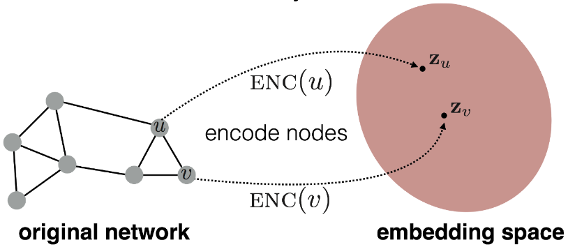

Shallow Node Embeddings
=======================

In this tutorial, we will take a closer look at how to learn *shallow node embeddings* in an unsupervised fashion via :pyg:`PyG`.

Introduction
------------

The key difference between *shallow* node embeddings (*e.g.,* :class:`~torch_geometric.nn.models.Node2Vec`) and *deep* node embeddings (*e.g.,* GNNs) is the choice of the encoder :math:`\textrm{ENC}(v, \mathcal{G}) = \mathbf{z}_v \in \mathbb{R}^d`.
Specifically, shallow node embedding techniques rely on embedding nodes into low-dimensional vectorial representations :math:`\mathbf{z}_v` via a *shallow embedding lookup table* such that the likelihood of preserving neighborhoods is maximized, *i.e.* nearby nodes should receive similar embeddings while distant nodes should receive distinct embedding.
These techniques generalize the famous `SkipGram <https://arxiv.org/abs/1310.4546>`_ model for obtaining low-dimensional word embeddings, in which sequences of words are now interpreted as sequences of nodes, *e.g.*, given via randomly-generated walks:

|

Specifically, given a *random walk* :math:`\mathcal{W} = (v_{\pi(1)}, \ldots, v_{\pi_(k)})` of length :math:`k` starting at node :math:`v \in \mathcal{V}`, the objective is to maximize the likelihood of observing node :math:`v_{\pi(i)}` given node :math:`v`.
This objective can be efficiently trained via stochastic gradient descent in a contrastive learning scenario

.. math::
    \mathcal{L} = \sum_{w \in \mathcal{W}} - \log \left(\sigma(\mathbf{z}_v^{\top} \mathbf{z}_w) \right) + \sum_{w \sim \mathcal{V} \setminus \mathcal{W}} - \log \left( 1 - \sigma(\mathbf{z}_v^{\top} \mathbf{z}_w) \right),

in which non-existent walks (so called *negative examples*) are sampled and trained jointly, and :math:`\sigma` denotes the :math:`\textrm{sigmoid}` function.
Noteworthy, the dot-product :math:`\mathbf{z}_v^{\top} \mathbf{z}_w` between the embeddings is usually used to measure similarity, but other similarity measures are applicable as well.

Importantly, shallow node embeddings are trained in an unsupervised fashion, and can eventually be used as input for a given down-stream task, *e.g.*, in node-level tasks :math:`\mathbf{z}_v` can directly be used as input to a final classifier.
For edge-level tasks, edge-level representations can be obtained via averaging :math:`\frac{1}{2} (\mathbf{z}_v + \mathbf{z}_w)` or via the Hadamard product :math:`\mathbf{z}_v \odot \mathbf{z}_w`.

Despite the simplicity of node embedding techniques, they are also subject to certain shortcomings.
In particular, they fail to incorporate rich feature information attached to nodes and edges, and cannot be trivially applied to unseen
graphs as learnable parameters are fixed to the nodes of a particular graph (making this approach transductive by nature and hard-to-scale due to the :math:`\mathcal{O}(|\mathcal{V}| \cdot d)` parameter complexity).
However, it is still a commonly used technique to preserve structural graph information into fixed-size vectors, and is often times also used to generate inputs to GNNs for further processing in case the initial set of node features is not rich.

Node2Vec
--------

.. note::

    In this section of the tutorial, we will learn node embeddings for **homogenous graphs** using the :class:`~torch_geometric.nn.models.Node2Vec` module of :pyg:`PyG`.
    The code is available in `examples/node2vec.py <https://github.com/pyg-team/pytorch_geometric/blob/master/examples/node2vec.py>`_ and as a `Google Colab tutorial notebook <https://colab.research.google.com/github/AntonioLonga/PytorchGeometricTutorial/blob/main/Tutorial11/Tutorial11.ipynb>`_.

:class:`~torch_geometric.nn.models.Node2Vec` is a method for learning shallow node embeddings, which allows for flexible
control of random walk procedures based on breadth-first or depth-first samplers.
In particular, its parameter :obj:`p` dictates the likelihood of immediately revisiting a node in the walk, while its parameter :obj:`q` interpolates between breadth-first and depth-first strategies.

To begin the example, let us load in the needed packages and the data that we will be working with:

.. code-block:: python

    from torch_geometric.nn import Node2Vec

    data = Planetoid('./data/Planetoid', name='Cora')[0]

We are now ready to initialize our :class:`~torch_geometric.nn.module.Node2Vec` module:

.. code-block:: python

    import torch
    from torch_geometric.nn import Node2Vec

    device = 'cuda' if torch.cuda.is_available() else 'cpu'

    model = Node2Vec(
        data.edge_index,
        embedding_dim=128,
        walks_per_node=10,
        walk_length=20,
        context_size=10,
        p=1.0,
        q=1.0,
        num_negative_samples=1,
    ).to(device)

    optimizer = torch.optim.Adam(model.parameters(), lr=0.01)

:class:`~torch_geometric.nn.models.Node2Vec` takes the graph structure :obj:`edge_index` as input (but none of its feature information), the :obj:`embedding_dim` of the shallow embeddings, and additional parameters to control the random walk and negative sampling procedures.
In particular, :obj:`walks_per_node` and :obj:`walk_length` specify the number of walks to perform for each node and their length, respectively.
The :obj:`context_size` then denotes how many nodes in the walk are actually used for gradient optimization, *i.e* :class:`~torch_geometric.nn.models.Node2Vec` slides over each sampled walk and splits them into windows of size :obj:`context_size`.
As previously mentioned, :obj:`p` and :obj:`q` denote how random walks are generated.
Finally, :obj:`num_negative_samples` specifies how many negative walks we want to generate for each positive walk.

After initializing, we can go ahead and train our :class:`~torch_geometric.nn.models.Node2Vec` model right away.
We start this by creating a data loader that will generate positive and negative random walks for us:

.. code-block:: python

    loader = model.loader(batch_size=128, shuffle=True, num_workers=4)

To generate random walks, we can simply iterate over the data loader, *e.g.*:

.. code-block:: python

    pos_rw, neg_rw = next(iter(loader))

Here, :obj:`pos_rw` will contain the node indices of positive random walks and :obj:`neg_rw` will contain the node indices of negative walks.
In particular, :obj:`pos_rw` is a two-dimensional matrix of shape :obj:`[batch_size * walks_per_node * (2 + walk_length - context_size), context_size]`, and :obj:`neg_rw` is a two-dimensional matrix of shape :obj:`[num_negative_samples * pos_rw.size(0), context_size]`.

Using this :obj:`loader` and the built-in constrastive :meth:`~torch_geometric.nn.models.Node2Vec.loss` function, we can define our :meth:`train` function as follows:

.. code-block:: python

    def train():
        model.train()
        total_loss = 0
        for pos_rw, neg_rw in loader:
            optimizer.zero_grad()
            loss = model.loss(pos_rw.to(device), neg_rw.to(device))
            loss.backward()
            optimizer.step()
            total_loss += loss.item()
        return total_loss / len(loader)

After finishing training, we can obtain the final node embeddings from the model as follows:

.. code-block:: python

    z = model()  # Full node-level embeddings.
    z = model(torch.tensor([0, 1, 2]))  # Embeddings of first three nodes.

MetaPath2Vec
------------

.. note::

   In this section of the tutorial, we will learn node embeddings for **heterogenous graphs** using the :class:`~torch_geometric.nn.models.MetaPath2Vec` module of :pyg:`PyG`.
   The code is available as `examples/hetero/metapath2vec.py <https://github.com/pyg-team/pytorch_geometric/blob/master/examples/hetero/metapath2vec.py>`_ and as a `Google Colab tutorial notebook <https://colab.research.google.com/github/AntonioLonga/PytorchGeometricTutorial/blob/main/Tutorial11/Tutorial11.ipynb>`_.

An extension of :class:`~torch_geometric.nn.models.Node2Vec` to *heterogeneous graphs* is the :class:`~torch_geometric.nn.models.MetaPath2Vec` model.
:class:`~torch_geometric.nn.models.MetaPath2Vec` works similar to :class:`~torch_geometric.nn.models.Node2Vec` but expects a dictionary of edge indices as input (holding the :obj:`edge_index` for each edge type in the graph), and samples random walks based on a given :obj:`metapath` formulation, *e.g.*,

.. code-block:: python

    metapath = [
        ('author', 'writes', 'paper'),
        ('paper', 'published_in', 'venue'),
        ('venue', 'publishes', 'paper'),
        ('paper', 'written_by', 'author'),
    ]

denotes that random walk sampling is performed from author nodes to paper nodes to venue nodes back to paper nodes and author nodes.
Otherwise, initialization and training of the model stays the same as in the :class:`~torch_geometric.nn.models.Node2Vec` case.
